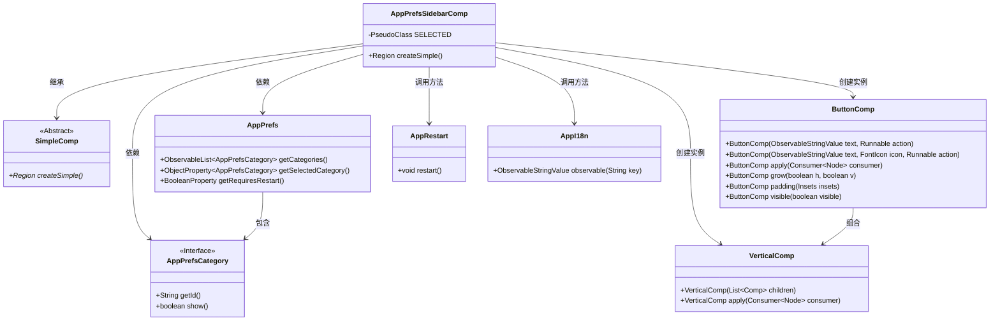
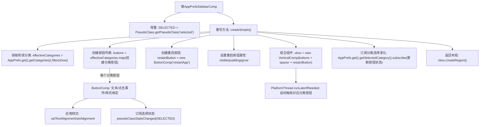

# 基础信息

|      |      |
|------|------|
| 名称 | AppPrefsSidebarComp |
| 编码语言 | .java |
| 代码路径 | xpipe/app/src/main/java/io/xpipe/app/prefs/AppPrefsSidebarComp.java |
| 包名 | io.xpipe.app.prefs |
| 依赖项 | ['io.xpipe.app.comp.Comp', 'io.xpipe.app.comp.SimpleComp', 'io.xpipe.app.comp.base.ButtonComp', 'io.xpipe.app.comp.base.VerticalComp', 'io.xpipe.app.core.AppI18n', 'io.xpipe.app.core.AppRestart', 'io.xpipe.app.util.PlatformThread', 'javafx.css.PseudoClass', 'javafx.geometry.Insets', 'javafx.geometry.Pos', 'javafx.scene.control.Button', 'javafx.scene.layout.Region', 'javafx.scene.text.TextAlignment', 'org.kordamp.ikonli.javafx.FontIcon', 'java.util.ArrayList', 'java.util.stream.Collectors'] |
| 概述说明 | 应用偏好侧边栏组件，包含分类按钮和重启按钮，动态更新选中状态。 |

# 说明

该代码定义了一个名为AppPrefsSidebarComp的Java类，继承自SimpleComp，用于创建应用程序偏好设置侧边栏组件。主要功能包括：筛选并显示可用的偏好设置类别按钮，每个按钮点击后会设置对应的选中类别，并通过伪类状态变化高亮显示当前选中项。侧边栏底部包含一个重启应用按钮，仅在需要重启时显示。所有按钮采用左对齐布局，整体结构为垂直排列的VBox容器，并实时响应类别选择变化自动触发对应按钮事件。

# 类列表 Class Summary

| 名称   | 类型  | 说明 |
|-------|------|-------------|
| AppPrefsSidebarComp | class | 应用偏好设置侧边栏组件，包含分类按钮和重启按钮，动态更新选中状态。 |

## 类 AppPrefsSidebarComp

|      |      |
|------|------|
| 访问范围 | public |
| 类型 | class |
| 名称 | AppPrefsSidebarComp |
| 说明 | 应用偏好设置侧边栏组件，包含分类按钮和重启按钮，动态更新选中状态。 |

### UML类图

这段代码描述了一个应用偏好设置侧边栏组件(AppPrefsSidebarComp)，它继承自SimpleComp抽象类。该组件主要功能是创建包含分类按钮和重启按钮的垂直布局，其中分类按钮通过AppPrefs获取可显示的类别(AppPrefsCategory)，并实现选中状态管理。当用户点击分类按钮时会更新AppPrefs中的选中状态，点击重启按钮则调用AppRestart.restart()方法。组件使用ButtonComp构建按钮，VerticalComp组织布局，并通过AppI18n实现国际化文本显示。整个设计采用响应式编程模式，通过订阅机制实现状态同步。

### 内部方法调用关系图

该流程图描述了AppPrefsSidebarComp类的核心逻辑，主要展示偏好设置侧边栏的构建过程。首先过滤出需要显示的分类，为每个分类创建带状态绑定的按钮，然后添加重启应用按钮和间隔组件。所有按钮被垂直布局，并订阅分类选择变化事件以实现自动高亮和按钮触发。最终返回组装好的界面区域，形成一个动态响应偏好设置变化的侧边栏组件。

### 字段列表 Field List

| 名称  | 类型  | 说明 |
|-------|-------|------|
| SELECTED = PseudoClass.getPseudoClass("selected") | PseudoClass | 定义静态常量SELECTED，表示伪类"selected"。 |

### 方法列表 Method List

| 名称  | 类型  | 说明 |
|-------|-------|------|
| createSimple | Region | 创建侧边栏，包含分类按钮和重启应用按钮，动态响应选中状态。 |

