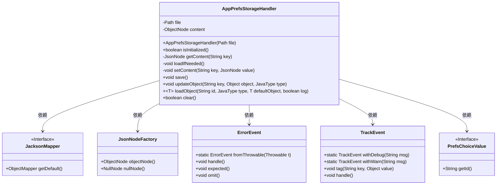
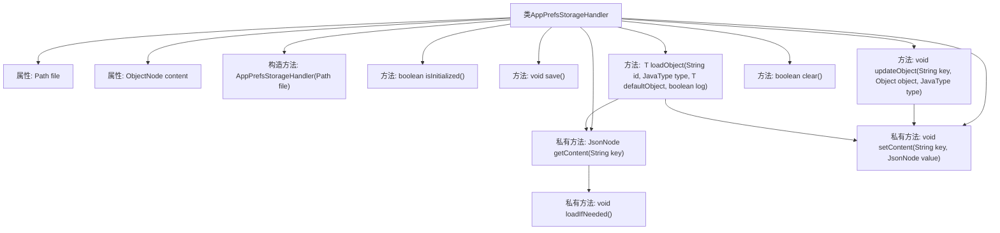
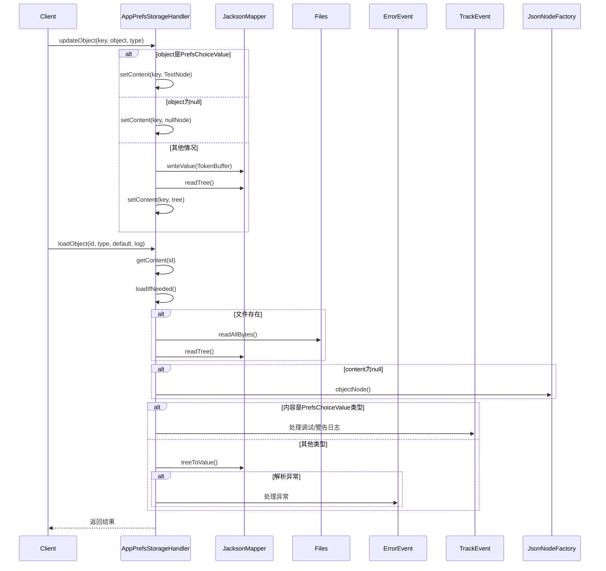

# 基础信息

|      |      |
|------|------|
| 名称 | AppPrefsStorageHandler |
| 编码语言 | .java |
| 代码路径 | xpipe/app/src/main/java/io/xpipe/app/prefs/AppPrefsStorageHandler.java |
| 包名 | io.xpipe.app.prefs |
| 依赖项 | ['io.xpipe.app.ext.PrefsChoiceValue', 'io.xpipe.app.issue.ErrorEvent', 'io.xpipe.app.issue.TrackEvent', 'io.xpipe.core.util.JacksonMapper', 'com.fasterxml.jackson.databind.JavaType', 'com.fasterxml.jackson.databind.JsonNode', 'com.fasterxml.jackson.databind.ObjectMapper', 'com.fasterxml.jackson.databind.node.JsonNodeFactory', 'com.fasterxml.jackson.databind.node.ObjectNode', 'com.fasterxml.jackson.databind.node.TextNode', 'com.fasterxml.jackson.databind.util.TokenBuffer', 'lombok.SneakyThrows', 'org.apache.commons.io.FileUtils', 'java.io.IOException', 'java.nio.file.Files', 'java.nio.file.Path', 'java.util.ArrayList', 'java.util.List', 'java.util.stream.Collectors', 'io.xpipe.app.ext.PrefsChoiceValue.getAll', 'io.xpipe.app.ext.PrefsChoiceValue.getSupported'] |
| 概述说明 | 应用偏好存储处理器，管理JSON文件读写与对象序列化。 |

# 说明

AppPrefsStorageHandler是一个用于管理应用偏好设置的类，通过文件存储JSON格式数据。主要功能包括初始化检查、按需加载文件内容、读取和更新键值对、保存修改到文件。支持处理PrefsChoiceValue类型和空值，提供默认值回退机制，包含错误处理和日志记录。可清除存储文件，使用Jackson库进行JSON序列化和反序列化。

# 类列表 Class Summary

| 名称   | 类型  | 说明 |
|-------|------|-------------|
| AppPrefsStorageHandler | class | 应用偏好存储处理器，管理JSON文件读写，支持对象更新与加载。 |

## 类 AppPrefsStorageHandler

|      |      |
|------|------|
| 访问范围 | public |
| 类型 | class |
| 名称 | AppPrefsStorageHandler |
| 说明 | 应用偏好存储处理器，管理JSON文件读写，支持对象更新与加载。 |

### UML类图

类图描述：
AppPrefsStorageHandler 是一个处理应用偏好设置存储的类，负责读取、更新和保存JSON格式的配置数据。它依赖于JacksonMapper进行JSON序列化/反序列化，使用JsonNodeFactory创建JSON节点，通过ErrorEvent和TrackEvent处理错误和跟踪事件。该类支持泛型对象操作，特别处理PrefsChoiceValue接口的实现类，提供初始化检查、内容加载、数据更新和存储清理等功能。

### 内部方法调用关系图

该流程图展示了AppPrefsStorageHandler类的核心结构和调用关系。类主要负责应用偏好设置的存储管理，包含文件读写、JSON序列化/反序列化、类型校验等功能。时序图重点描述了updateObject和loadObject两个核心方法的执行流程，涉及条件分支、异常处理和第三方工具调用。整体设计采用懒加载机制，通过Jackson库实现对象与JSON的转换，并集成事件跟踪和错误处理机制。

### 字段列表 Field List

| 名称  | 类型  | 说明 |
|-------|-------|------|
| content | ObjectNode | 私有对象节点内容 |
| file | Path | 私有文件路径变量 |

### 方法列表 Method List

| 名称  | 类型  | 说明 |
|-------|-------|------|
| isInitialized | boolean | 检查内容是否已初始化。 |
| setContent | void | 私有方法：设置键值对到JSON内容。 |
| updateObject | void | 更新对象方法：处理PrefsChoiceValue、null及普通对象，转换为JsonNode并存储。 |
| save | void | 保存内容到文件，创建目录并处理异常。 |
| getContent | JsonNode | 获取指定键的内容，先加载再返回。 |
| loadObject | T | 加载对象方法：根据ID和类型获取内容，处理默认值和日志，支持选择值验证和异常处理。 |
| loadIfNeeded | void | 检查并加载JSON文件内容，若不存在则创建空对象。 |
| clear | boolean | 删除文件并返回操作结果。 |

