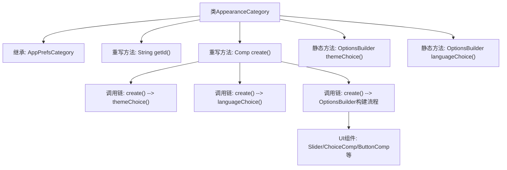
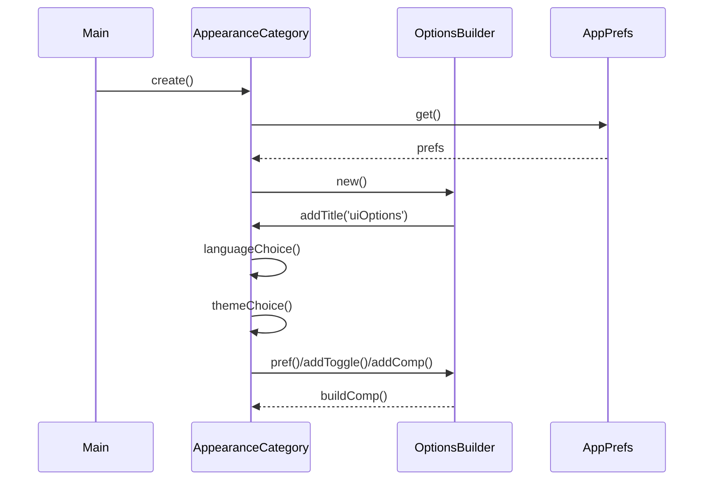

# 基础信息

|      |      |
|------|------|
| 名称 | AppearanceCategory |
| 编码语言 | .java |
| 代码路径 | xpipe/app/src/main/java/io/xpipe/app/prefs/AppearanceCategory.java |
| 包名 | io.xpipe.app.prefs |
| 依赖项 | ['io.xpipe.app.comp.Comp', 'io.xpipe.app.comp.base.ButtonComp', 'io.xpipe.app.comp.base.ChoiceComp', 'io.xpipe.app.comp.base.HorizontalComp', 'io.xpipe.app.comp.base.IntFieldComp', 'io.xpipe.app.core.AppI18n', 'io.xpipe.app.core.AppTheme', 'io.xpipe.app.util.Hyperlinks', 'io.xpipe.app.util.OptionsBuilder', 'io.xpipe.core.process.OsType', 'javafx.beans.property.SimpleBooleanProperty', 'javafx.geometry.Pos', 'javafx.scene.control.ListCell', 'javafx.scene.control.Slider', 'javafx.scene.layout.StackPane', 'javafx.scene.paint.Color', 'javafx.scene.shape.Circle', 'atlantafx.base.controls.ProgressSliderSkin', 'atlantafx.base.theme.Styles', 'org.kordamp.ikonli.javafx.FontIcon', 'java.util.Arrays', 'java.util.List', 'java.util.function.Supplier'] |
| 概述说明 | 外观设置类，包含主题、语言、性能模式等UI选项配置。 |

# 说明

AppearanceCategory类继承自AppPrefsCategory，用于管理应用程序外观相关的用户偏好设置。该类重写了getId方法返回标识符"appearance"，并通过create方法构建用户界面选项。界面包含多个子选项组，第一组包括语言选择、主题选择、性能模式开关、UI缩放比例输入框（带提示文本）、系统字体开关和审查模式开关，其中部分选项在MacOS系统上隐藏。第二组包含窗口透明度滑块（范围0.3到1.0）和保存窗口位置开关。themeChoice方法创建主题选择组件，显示带颜色圆点的主题名称，并设置最小宽度。languageChoice方法创建语言选择组件和翻译按钮，按钮可打开翻译链接。所有选项都与AppPrefs中的相应偏好设置绑定。

# 类列表 Class Summary

| 名称   | 类型  | 说明 |
|-------|------|-------------|
| AppearanceCategory | class | 外观设置类，包含主题、语言、性能模式等UI选项配置。 |


## 类 AppearanceCategory

|      |      |
|------|------|
| 访问范围 | public |
| 类型 | class |
| 名称 | AppearanceCategory |
| 说明 | 外观设置类，包含主题、语言、性能模式等UI选项配置。 |


### UML类图

```mermaid
classDiagram
    class AppPrefsCategory {
        <<abstract>>
        +String getId()
        +Comp~?~ create()
    }

    class AppearanceCategory {
        +Comp~?~ create()
        +static OptionsBuilder themeChoice()
        +static OptionsBuilder languageChoice()
    }

    class OptionsBuilder {
        +addTitle(String title) OptionsBuilder
        +sub(OptionsBuilder sub) OptionsBuilder
        +pref(Property~?~ pref) OptionsBuilder
        +addToggle(Property~Boolean~ pref) OptionsBuilder
        +addComp(Comp~?~ comp, Property~?~ pref) OptionsBuilder
        +hide(Property~Boolean~ hide) OptionsBuilder
        +buildComp() Comp~?~
    }

    class AppPrefs {
        <<Singleton>>
        +Property~AppTheme.Theme~ theme
        +Property~SupportedLocale~ language
        +Property~Boolean~ performanceMode
        +Property~Double~ uiScale
        +Property~Boolean~ useSystemFont
        +Property~Boolean~ censorMode
        +Property~Double~ windowOpacity
        +Property~Boolean~ saveWindowLocation
        +static AppPrefs get()
    }

    class ChoiceComp~T~ {
        +static ChoiceComp~T~ ofTranslatable(Property~T~ prop, List~T~ items, boolean searchable)
        +styleClass(String styleClass) ChoiceComp~T~
        +apply(Consumer~?~ consumer) ChoiceComp~T~
        +minWidth(double width) ChoiceComp~T~
        +prefWidth(double width) ChoiceComp~T~
        +hgrow() ChoiceComp~T~
    }

    AppPrefsCategory <|-- AppearanceCategory
    AppearanceCategory --> OptionsBuilder : 创建
    AppearanceCategory --> AppPrefs : 获取配置
    AppearanceCategory --> ChoiceComp : 使用
    OptionsBuilder --> Comp : 构建
    ChoiceComp --> AppPrefs : 绑定配置项

    // 其他辅助类关系
    class Comp~T~ {
        <<Interface>>
    }
    class ButtonComp
    class HorizontalComp
    class IntFieldComp
    class Slider
    class ProgressSliderSkin
    class AppTheme.Theme
    class SupportedLocale
    class AppI18n
    class Hyperlinks
```

类图描述：该图展示了外观设置类别(AppearanceCategory)继承自应用偏好设置基类(AppPrefsCategory)，通过OptionsBuilder构建复杂的UI配置选项。核心类AppPrefs作为单例存储所有偏好设置，ChoiceComp用于实现语言和主题选择功能。图中清晰呈现了配置项的绑定关系、UI组件的组合方式以及各类之间的协作关系，完整描述了外观设置模块的架构设计。


### 内部方法调用关系图





这段代码实现了一个外观设置界面构建器，主要功能包括：1) 通过继承AppPrefsCategory实现配置分类；2) 创建语言选择、主题切换等UI组件；3) 使用OptionsBuilder构建包含滑动条、开关按钮等控件的复杂布局。流程图展示了类结构和核心方法调用关系，时序图详细描述了create()方法执行时的对象交互过程，特别是与OptionsBuilder的协作构建UI配置项的逻辑。

### 字段列表 Field List

| 名称  | 类型  | 说明 |
|-------|-------|------|

### 方法列表 Method List

| 名称  | 类型  | 说明 |
|-------|-------|------|
| getId | String | 重写getId方法，返回"appearance"。 |
| create | Comp<?> | 创建UI选项组件，包含语言、主题、性能模式、字体、窗口透明度等设置。 |
| themeChoice | OptionsBuilder | 静态方法创建主题选择器，包含主题列表、颜色显示及样式设置。 |
| languageChoice | OptionsBuilder | 创建语言选择组件，包含下拉菜单和翻译按钮，宽度300，水平布局，间距10。 |


