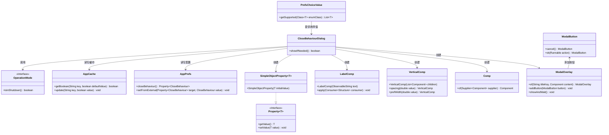
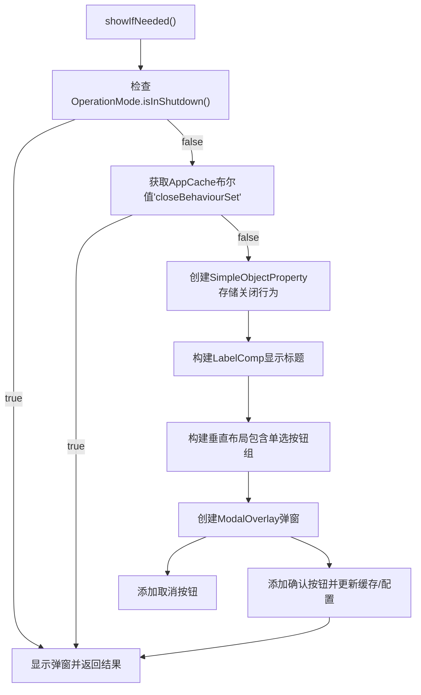

# 基础信息

|      |      |
|------|------|
| 名称 | CloseBehaviourDialog |
| 编码语言 | .java |
| 代码路径 | xpipe/app/src/main/java/io/xpipe/app/prefs/CloseBehaviourDialog.java |
| 包名 | io.xpipe.app.prefs |
| 依赖项 | ['io.xpipe.app.comp.Comp', 'io.xpipe.app.comp.base.LabelComp', 'io.xpipe.app.comp.base.ModalButton', 'io.xpipe.app.comp.base.ModalOverlay', 'io.xpipe.app.comp.base.VerticalComp', 'io.xpipe.app.core.AppCache', 'io.xpipe.app.core.AppI18n', 'io.xpipe.app.core.mode.OperationMode', 'io.xpipe.app.ext.PrefsChoiceValue', 'javafx.beans.property.Property', 'javafx.beans.property.SimpleObjectProperty', 'javafx.scene.control.RadioButton', 'javafx.scene.control.ToggleGroup', 'javafx.scene.layout.VBox', 'java.util.List', 'java.util.concurrent.atomic.AtomicBoolean'] |
| 概述说明 | 检查关闭行为设置，未设置时显示对话框供用户选择，确认后保存设置。 |

# 说明

该代码定义了一个CloseBehaviourDialog类，包含静态方法showIfNeeded用于显示关闭行为设置对话框。方法首先检查系统是否正在关闭或设置已保存，若满足则直接返回true。否则创建包含标题标签和单选按钮组的垂直布局，单选按钮对应不同的关闭行为选项。对话框包含取消和确定按钮，确定时会保存用户选择到应用缓存和偏好设置。最后返回用户是否点击了确定按钮。整个逻辑用于首次运行时让用户选择关闭行为。

# 类列表 Class Summary

| 名称   | 类型  | 说明 |
|-------|------|-------------|
| CloseBehaviourDialog | class | 检查关闭行为设置，未设置时弹窗选择并保存。 |

## 类 CloseBehaviourDialog

|      |      |
|------|------|
| 访问范围 | public |
| 类型 | class |
| 名称 | CloseBehaviourDialog |
| 说明 | 检查关闭行为设置，未设置时弹窗选择并保存。 |

### UML类图

这段代码实现了一个关闭行为设置对话框，主要功能包括：检查系统状态、读取缓存配置、构建包含单选按钮的对话框界面、处理用户选择并持久化配置。通过ModalOverlay实现模态对话框，使用Property进行数据绑定，结合AppCache和AppPrefs实现配置的读取和存储。整个流程包含条件判断、UI构建和用户交互处理，最终返回用户是否确认配置的结果。

### 内部方法调用关系图

这段代码实现了一个可配置的关闭行为对话框，主要逻辑是：首先检查系统是否正在关闭，然后确认用户是否已设置过关闭行为。若未设置，则构建包含单选按钮组的模态对话框，用户选择后更新应用偏好设置和缓存。流程图清晰展示了从条件检查到UI构建，再到用户交互处理的完整流程，特别是对三种提前返回情况和模态对话框构建过程的逻辑分支处理。

### 字段列表 Field List

| 名称  | 类型  | 说明 |
|-------|-------|------|

### 方法列表 Method List

| 名称  | 类型  | 说明 |
|-------|-------|------|
| showIfNeeded | boolean | 检查关闭行为设置，未设置时弹出选项框供用户选择，确认后保存设置并返回操作结果。 |

