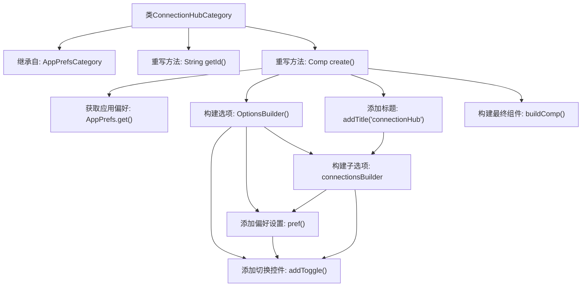

# 基础信息

|      |      |
|------|------|
| 名称 | ConnectionHubCategory |
| 编码语言 | .java |
| 代码路径 | xpipe/app/src/main/java/io/xpipe/app/prefs/ConnectionHubCategory.java |
| 包名 | io.xpipe.app.prefs |
| 依赖项 | ['io.xpipe.app.comp.Comp', 'io.xpipe.app.util.OptionsBuilder'] |
| 概述说明 | ConnectionHubCategory类扩展AppPrefsCategory，定义连接中心配置选项。 |

# 说明

这是一个名为ConnectionHubCategory的Java类，继承自AppPrefsCategory。它重写了getId方法返回connectionHub标识符，并通过create方法构建配置界面。界面包含四个开关选项：压缩连接显示、在父类别中显示子类别、创建连接时打开搜索窗口、连接需要双击操作。所有选项都基于AppPrefs的偏好设置构建，最终组合成带标题的配置组件返回。

# 类列表 Class Summary

| 名称   | 类型  | 说明 |
|-------|------|-------------|
| ConnectionHubCategory | class | ConnectionHubCategory类扩展AppPrefsCategory，定义连接中心设置选项。 |


## 类 ConnectionHubCategory

|      |      |
|------|------|
| 访问范围 | public |
| 类型 | class |
| 名称 | ConnectionHubCategory |
| 说明 | ConnectionHubCategory类扩展AppPrefsCategory，定义连接中心设置选项。 |


### UML类图

```mermaid
classDiagram
    class AppPrefsCategory {
        <<Interface>>
        +String getId()
        +Comp~?~ create()
    }
    class ConnectionHubCategory {
        +String getId()
        +Comp~?~ create()
    }
    class OptionsBuilder {
        +OptionsBuilder()
        +OptionsBuilder pref(Pref~?~ pref)
        +OptionsBuilder addToggle(Pref~?~ pref)
        +OptionsBuilder addTitle(String title)
        +OptionsBuilder sub(OptionsBuilder builder)
        +Comp~?~ buildComp()
    }
    class AppPrefs {
        +Pref~?~ condenseConnectionDisplay
        +Pref~?~ showChildCategoriesInParentCategory
        +Pref~?~ openConnectionSearchWindowOnConnectionCreation
        +Pref~?~ requireDoubleClickForConnections
        +static AppPrefs get()
    }
    class Pref~T~ {
        <<Interface>>
    }
    class Comp~T~ {
        <<Interface>>
    }

    ConnectionHubCategory --|> AppPrefsCategory : 实现
    ConnectionHubCategory --> AppPrefs : 依赖: 获取配置项
    ConnectionHubCategory --> OptionsBuilder : 依赖: 构建选项组件
    OptionsBuilder --> Pref~?~ : 依赖: 使用配置项
    OptionsBuilder --> Comp~?~ : 依赖: 生成组件
    AppPrefs --> Pref~?~ : 包含: 配置项集合
```

这段类图展示了ConnectionHubCategory继承自AppPrefsCategory接口，并通过OptionsBuilder动态构建配置界面组件的过程。核心在于ConnectionHubCategory利用AppPrefs获取用户偏好设置，通过链式调用的OptionsBuilder创建包含多个开关选项的复合组件，最终返回Comp接口的实现类。图中清晰体现了配置项的传递路径（AppPrefs→OptionsBuilder→Comp）和Builder模式的应用，同时通过泛型接口保持类型灵活性。


### 内部方法调用关系图



这段代码流程图展示了ConnectionHubCategory类的核心结构和工作流程。该类继承自AppPrefsCategory，主要实现两个重写方法：getId()返回固定标识符"connectionHub"，create()方法负责构建一个包含多个偏好设置选项的GUI组件。流程从获取应用偏好开始，通过OptionsBuilder逐步添加4个布尔型配置选项（每个配置包含pref声明和addToggle控件），最后组合成带标题的复合组件返回。整个过程体现了清晰的层级构建逻辑，用于创建连接中心的配置界面。

### 字段列表 Field List

| 名称  | 类型  | 说明 |
|-------|-------|------|

### 方法列表 Method List

| 名称  | 类型  | 说明 |
|-------|-------|------|
| getId | String | 重写getId方法，返回"connectionHub"。 |
| create | Comp<?> | 创建连接选项组件，包含显示、搜索和点击行为等偏好设置。 |


