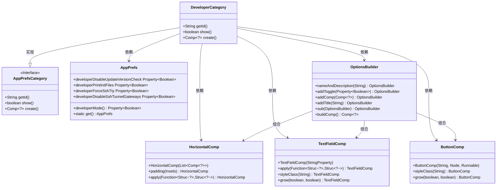
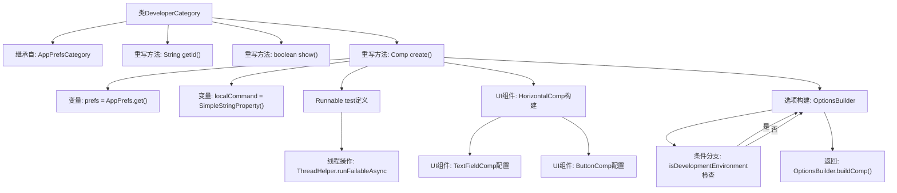

# 基础信息

|      |      |
|------|------|
| 名称 | DeveloperCategory |
| 编码语言 | .java |
| 代码路径 | xpipe/app/src/main/java/io/xpipe/app/prefs/DeveloperCategory.java |
| 包名 | io.xpipe.app.prefs |
| 依赖项 | ['io.xpipe.app.comp.Comp', 'io.xpipe.app.comp.base.ButtonComp', 'io.xpipe.app.comp.base.HorizontalComp', 'io.xpipe.app.comp.base.TextFieldComp', 'io.xpipe.app.core.AppProperties', 'io.xpipe.app.issue.TrackEvent', 'io.xpipe.app.util.LocalShell', 'io.xpipe.app.util.OptionsBuilder', 'io.xpipe.app.util.ThreadHelper', 'io.xpipe.core.process.ProcessOutputException', 'javafx.beans.property.SimpleStringProperty', 'javafx.geometry.Insets', 'javafx.geometry.Pos', 'atlantafx.base.theme.Styles', 'org.kordamp.ikonli.javafx.FontIcon', 'java.util.List'] |
| 概述说明 | 开发者选项类，包含命令执行和调试开关功能。 |

# 说明

该代码定义了一个名为DeveloperCategory的类，继承自AppPrefsCategory。它重写了三个方法：getId返回开发者标识，show方法检查开发者模式是否启用，create方法构建开发者选项界面。界面包含本地命令输入框和执行按钮，以及多个开发者选项开关，如禁用版本检查、打印初始化文件等。在开发环境中还额外提供SSH相关选项。所有操作会触发相应事件跟踪。

# 类列表 Class Summary

| 名称   | 类型  | 说明 |
|-------|------|-------------|
| DeveloperCategory | class | 开发者设置类，包含命令执行和调试选项，仅在开发者模式下显示。 |

## 类 DeveloperCategory

|      |      |
|------|------|
| 访问范围 | public |
| 类型 | class |
| 名称 | DeveloperCategory |
| 说明 | 开发者设置类，包含命令执行和调试选项，仅在开发者模式下显示。 |

### UML类图

这段代码展示了一个开发者设置面板的实现，其中`DeveloperCategory`继承自`AppPrefsCategory`接口，负责构建开发者专用的配置选项。通过`AppPrefs`获取开发者模式状态，使用`OptionsBuilder`动态生成包含开关控件和命令输入框的UI组件。类图清晰地呈现了核心类之间的继承和组合关系，特别是`OptionsBuilder`作为UI构建器的核心作用，以及各类组件如何协同工作来实现功能。

### 内部方法调用关系图

流程图描述：
该流程图展示了DeveloperCategory类的继承关系和核心方法调用链。类继承自AppPrefsCategory并重写了三个关键方法：getId()返回固定标识符，show()控制显示逻辑，create()负责构建复杂的UI配置。create()方法内部包含命令执行线程的异步处理、水平布局组件的组装（含文本输入框和按钮），以及通过OptionsBuilder动态生成选项面板的过程，最后根据开发环境状态添加不同的调试选项。整个流程体现了GUI配置与后台逻辑的紧密结合。

### 字段列表 Field List

| 名称  | 类型  | 说明 |
|-------|-------|------|

### 方法列表 Method List

| 名称  | 类型  | 说明 |
|-------|-------|------|
| show | boolean | 重写show方法，返回开发者模式状态。 |
| getId | String | 重写getId方法，返回固定值"developer"。 |
| create | Comp<?> | 创建开发者选项界面，含本地命令执行和调试开关。 |

