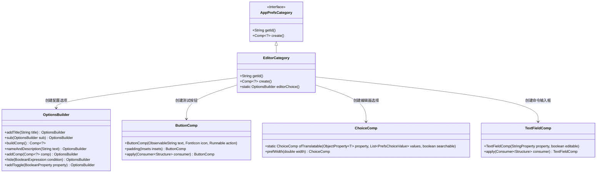
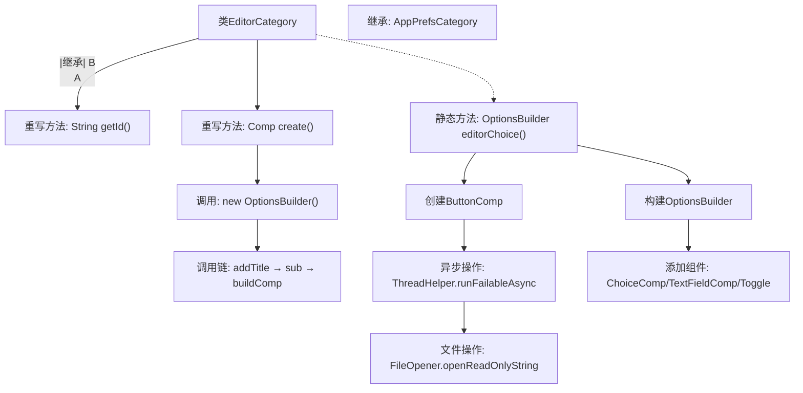

# 基础信息

|      |      |
|------|------|
| 名称 | EditorCategory |
| 编码语言 | .java |
| 代码路径 | xpipe/app/src/main/java/io/xpipe/app/prefs/EditorCategory.java |
| 包名 | io.xpipe.app.prefs |
| 依赖项 | ['io.xpipe.app.comp.Comp', 'io.xpipe.app.comp.base', 'io.xpipe.app.core.AppI18n', 'io.xpipe.app.ext.PrefsChoiceValue', 'io.xpipe.app.util.FileOpener', 'io.xpipe.app.util.OptionsBuilder', 'io.xpipe.app.util.ThreadHelper', 'javafx.geometry.Insets', 'javafx.geometry.Pos', 'org.kordamp.ikonli.javafx.FontIcon'] |
| 概述说明 | 编辑器配置类，含外部编辑器选择和测试功能。 |

# 说明

EditorCategory类继承自AppPrefsCategory，用于编辑器配置。它重写getId方法返回"editor"，并通过create方法构建配置界面。editorChoice方法创建编辑器选择选项，包括外部编辑器类型选择、自定义命令输入框及测试按钮。测试按钮会验证编辑器集成是否正常工作。界面还包含终端中运行自定义命令的开关选项，该选项仅在选择自定义编辑器时显示。所有组件通过OptionsBuilder构建，并设置了适当的布局和提示文本。

# 类列表 Class Summary

| 名称   | 类型  | 说明 |
|-------|------|-------------|
| EditorCategory | class | 编辑器配置类，含外部编辑器选择和测试功能。 |

## 类 EditorCategory

|      |      |
|------|------|
| 访问范围 | public |
| 类型 | class |
| 名称 | EditorCategory |
| 说明 | 编辑器配置类，含外部编辑器选择和测试功能。 |

### UML类图

类图描述：该图展示了EditorCategory继承自AppPrefsCategory接口，并实现其抽象方法。EditorCategory通过OptionsBuilder构建配置界面，包含ButtonComp测试按钮、ChoiceComp编辑器选择框和TextFieldComp自定义命令输入框。各组件通过链式调用配置属性，形成层级关系清晰的偏好设置界面，支持外部编辑器配置和功能测试。

### 内部方法调用关系图

该流程图展示了EditorCategory类的核心结构和工作流程。类继承自AppPrefsCategory，重写了getId()和create()方法，其中create()通过OptionsBuilder构建配置界面。静态方法editorChoice()包含复杂逻辑：创建测试按钮（触发异步文件操作）、构建带条件隐藏功能的选项面板（包含下拉选择框、文本输入框和开关控件）。整个流程体现了GUI配置界面的动态组装和事件处理机制，特别是对编辑器配置的交互式验证功能。

### 字段列表 Field List

| 名称  | 类型  | 说明 |
|-------|-------|------|

### 方法列表 Method List

| 名称  | 类型  | 说明 |
|-------|-------|------|
| create | Comp<?> | 创建配置选项，包含标题和子选项。 |
| getId | String | 重写getId方法，返回字符串"editor"。 |
| editorChoice | OptionsBuilder | 静态方法创建编辑器选项，含测试按钮、类型选择、自定义命令及终端选项，隐藏非自定义项。 |

