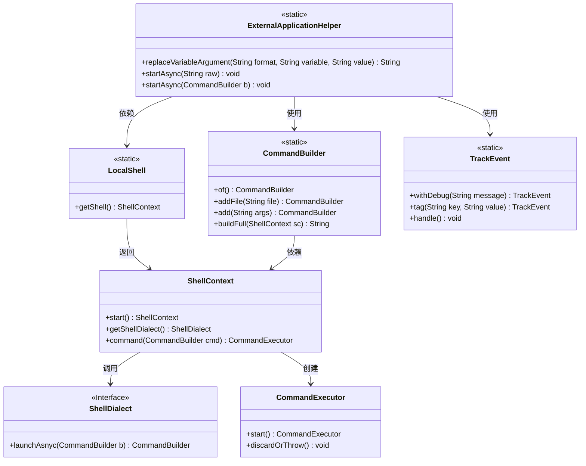
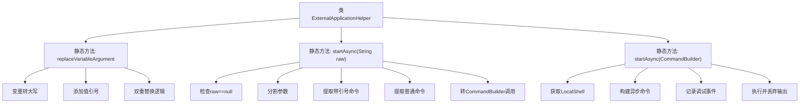
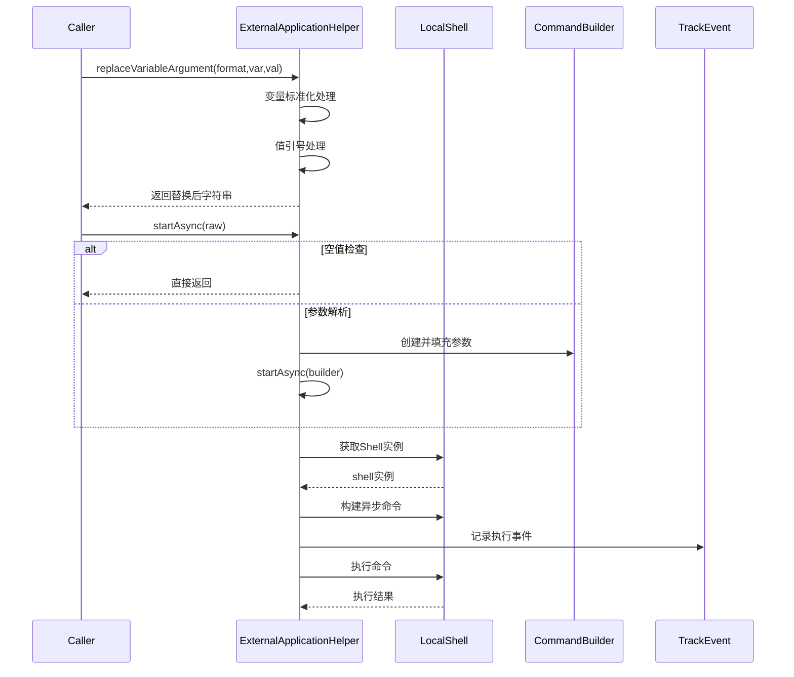

# 基础信息

|      |      |
|------|------|
| 名称 | ExternalApplicationHelper |
| 编码语言 | .java |
| 代码路径 | xpipe/app/src/main/java/io/xpipe/app/prefs/ExternalApplicationHelper.java |
| 包名 | io.xpipe.app.prefs |
| 依赖项 | ['io.xpipe.app.issue.TrackEvent', 'io.xpipe.app.util.LocalShell', 'io.xpipe.core.process.CommandBuilder', 'java.util.Arrays', 'java.util.Locale', 'java.util.stream.Collectors'] |
| 概述说明 | 替换变量并启动异步命令的工具类。 |

# 说明

ExternalApplicationHelper类提供两个核心功能：replaceVariableArgument方法用于替换字符串中的变量参数，支持大小写转换和引号处理；startAsync方法用于异步执行外部命令，支持解析带引号的命令路径和参数，并通过CommandBuilder构建最终命令。方法内部使用LocalShell执行命令，并记录调试事件。

# 类列表 Class Summary

| 名称   | 类型  | 说明 |
|-------|------|-------------|
| ExternalApplicationHelper | class | 替换变量并异步执行命令的工具类。 |

## 类 ExternalApplicationHelper

|      |      |
|------|------|
| 访问范围 | public |
| 类型 | class |
| 名称 | ExternalApplicationHelper |
| 说明 | 替换变量并异步执行命令的工具类。 |

### UML类图

这段代码展示了一个外部应用助手类，主要提供变量替换和异步启动外部程序的功能。类图清晰地展示了核心类之间的关系：ExternalApplicationHelper通过CommandBuilder构造命令，依赖LocalShell获取ShellContext来执行命令，使用TrackEvent记录调试信息。ShellContext负责与底层ShellDialect交互并创建CommandExecutor执行命令。整个设计体现了分层和职责分离的思想，静态方法的使用简化了调用方式。

### 内部方法调用关系图

该流程图展示了ExternalApplicationHelper类的三个核心方法调用链。replaceVariableArgument方法处理字符串模板中的变量替换，包含大小写标准化和引号处理逻辑；startAsync(String)方法实现命令行参数解析，区分带引号和普通参数两种情况；startAsync(CommandBuilder)方法通过LocalShell执行异步命令，包含完整的命令构建、事件跟踪和执行结果处理流程。时序图则详细描述了跨组件的交互过程，特别是与LocalShell和CommandBuilder的协作关系。

### 字段列表 Field List

| 名称  | 类型  | 说明 |
|-------|-------|------|

### 方法列表 Method List

| 名称  | 类型  | 说明 |
|-------|-------|------|
| startAsync | void | 静态方法startAsync处理字符串输入，解析命令和参数后异步执行。 |
| replaceVariableArgument | String | 替换字符串中的变量参数，处理大小写和引号。 |
| startAsync | void | 异步启动本地命令，跟踪执行事件，捕获异常。 |

