# 基础信息

|      |      |
|------|------|
| 名称 | ExternalApplicationType |
| 编码语言 | .java |
| 代码路径 | xpipe/app/src/main/java/io/xpipe/app/prefs/ExternalApplicationType.java |
| 包名 | io.xpipe.app.prefs |
| 依赖项 | ['io.xpipe.app.ext.PrefsChoiceValue', 'io.xpipe.app.issue.ErrorEvent', 'io.xpipe.app.util.CommandSupport', 'io.xpipe.app.util.LocalShell', 'io.xpipe.core.process.CommandBuilder', 'io.xpipe.core.process.OsType', 'io.xpipe.core.process.ShellControl', 'java.io.IOException', 'java.nio.file.Files', 'java.nio.file.Path', 'java.util.Optional'] |
| 概述说明 | 抽象类ExternalApplicationType定义外部应用类型，含Mac、Path、Windows子类，检查可用性并处理启动逻辑。 |

# 说明

该内容定义了一个抽象类ExternalApplicationType及其三个子类，用于表示不同类型的外部应用程序。基类包含id字段和抽象方法isAvailable，子类MacApplication针对macOS应用，通过mdfind查找应用路径并提供focus方法；PathApplication处理基于路径的可执行文件，支持同步和异步启动；WindowsType专为Windows设计，通过路径或安装位置检查应用可用性。所有子类都实现了平台特定的应用检测和操作逻辑。

# 类列表 Class Summary

| 名称   | 类型  | 说明 |
|-------|------|-------------|
| ExternalApplicationType | class | 抽象类ExternalApplicationType定义外部应用类型，含Mac、Path、Windows子类，实现可用性检查与启动逻辑。 |


## 类 ExternalApplicationType

|      |      |
|------|------|
| 访问范围 | public abstract |
| 类型 | class |
| 名称 | ExternalApplicationType |
| 说明 | 抽象类ExternalApplicationType定义外部应用类型，含Mac、Path、Windows子类，实现可用性检查与启动逻辑。 |


### UML类图

```mermaid
classDiagram
    class ExternalApplicationType {
        <<Interface>> PrefsChoiceValue
        -String id
        +ExternalApplicationType(String id)
        +String getId()
        +String toString()
        +abstract boolean isAvailable()
    }

    class MacApplication {
        -String applicationName
        +MacApplication(String id, String applicationName)
        +boolean isAvailable()
        +Optional~Path~ findApp() throws Exception
        +void focus()
        +boolean isSelectable()
    }

    class PathApplication {
        -String executable
        -boolean explicitlyAsync
        +PathApplication(String id, String executable, boolean explicitlyAsync)
        +boolean isAvailable()
        ~void launch(String title, CommandBuilder args) throws Exception
    }

    class WindowsType {
        -String executable
        +WindowsType(String id, String executable)
        ~Optional~Path~ determineInstallation()
        ~Optional~Path~ determineFromPath()
        +boolean isAvailable()
        +boolean isSelectable()
    }

    ExternalApplicationType <|-- MacApplication
    ExternalApplicationType <|-- PathApplication
    ExternalApplicationType <|-- WindowsType
    ExternalApplicationType ..|> PrefsChoiceValue : 实现

    // 依赖关系
    MacApplication ..> ShellControl : 依赖
    MacApplication ..> ErrorEvent : 依赖
    PathApplication ..> ShellControl : 依赖
    PathApplication ..> CommandSupport : 依赖
    PathApplication ..> ErrorEvent : 依赖
    WindowsType ..> ShellControl : 依赖
    WindowsType ..> CommandSupport : 依赖
    WindowsType ..> ErrorEvent : 依赖
```

这段代码定义了一个抽象基类`ExternalApplicationType`及其三个具体子类实现，用于处理不同操作系统下的外部应用程序管理。类图展示了继承结构和关键依赖关系，其中基类实现了`PrefsChoiceValue`接口，三个子类分别针对macOS应用、PATH路径应用和Windows应用提供了不同的实现逻辑。所有子类都实现了`isAvailable()`方法来检查应用是否可用，并根据操作系统类型提供了特定的功能实现，如macOS应用的查找和聚焦、PATH应用的启动以及Windows应用的安装路径检测等。


### 内部方法调用关系图

```mermaid
graph TD
    A["抽象类ExternalApplicationType"]
    B["属性: String id"]
    C["构造方法: ExternalApplicationType(String id)"]
    D["抽象方法: boolean isAvailable()"]
    E["方法: String getId()"]
    F["重写方法: String toString()"]
    
    G["抽象子类MacApplication"]
    H["属性: String applicationName"]
    I["构造方法: MacApplication(String id, String applicationName)"]
    J["重写方法: boolean isAvailable()"]
    K["方法: Optional<Path> findApp()"]
    L["方法: void focus()"]
    M["重写方法: boolean isSelectable()"]
    
    N["抽象子类PathApplication"]
    O["属性: String executable, boolean explicitlyAsync"]
    P["构造方法: PathApplication(String id, String executable, boolean explicitlyAsync)"]
    Q["重写方法: boolean isAvailable()"]
    R["方法: void launch(String title, CommandBuilder args)"]
    
    S["抽象子类WindowsType"]
    T["属性: String executable"]
    U["构造方法: WindowsType(String id, String executable)"]
    V["抽象方法: Optional<Path> determineInstallation()"]
    W["方法: Optional<Path> determineFromPath()"]
    X["重写方法: boolean isAvailable()"]
    Y["重写方法: boolean isSelectable()"]

    A --> B
    A --> C
    A --> D
    A --> E
    A --> F
    
    A --> G
    G --> H
    G --> I
    G --> J
    G --> K
    G --> L
    G --> M
    
    A --> N
    N --> O
    N --> P
    N --> Q
    N --> R
    
    A --> S
    S --> T
    S --> U
    S --> V
    S --> W
    S --> X
    S --> Y
```



该流程图展示了抽象基类ExternalApplicationType及其三个具体子类(MacApplication/PathApplication/WindowsType)的继承关系和核心方法。基类定义了应用程序类型的通用接口，各子类针对不同操作系统实现特定功能：MacApplication通过mdfind命令查找.app应用，PathApplication处理PATH环境变量中的可执行程序，WindowsType支持Windows平台的特殊安装路径查找。所有子类都必须实现isAvailable()方法来检查应用是否存在，并可能覆盖isSelectable()方法进行平台适配。

### 字段列表 Field List

| 名称  | 类型  | 说明 |
|-------|-------|------|
| id | String | 私有字符串ID |

### 方法列表 Method List

| 名称  | 类型  | 说明 |
|-------|-------|------|
| isAvailable | boolean | 抽象方法，检查是否可用。 |
| getId | String | 重写getId方法，返回id值。 |
| toString | String | 重写toString方法，返回对象ID。 |


