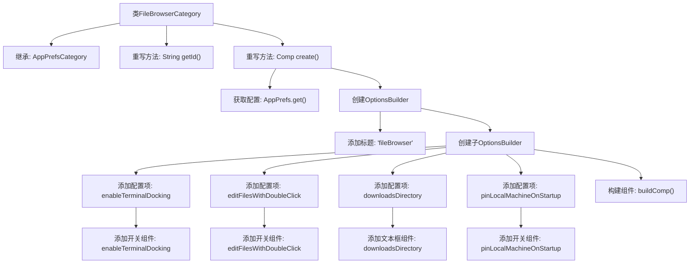

# 基础信息

|      |      |
|------|------|
| 名称 | FileBrowserCategory |
| 编码语言 | .java |
| 代码路径 | xpipe/app/src/main/java/io/xpipe/app/prefs/FileBrowserCategory.java |
| 包名 | io.xpipe.app.prefs |
| 依赖项 | ['io.xpipe.app.comp.Comp', 'io.xpipe.app.comp.base.TextFieldComp', 'io.xpipe.app.util.OptionsBuilder'] |
| 概述说明 | 文件浏览器设置类，包含终端停靠、双击编辑、下载目录和启动固定选项。 |

# 说明

该内容描述了一个名为FileBrowserCategory的类，继承自AppPrefsCategory。该类重写了getId方法，返回字符串fileBrowser作为标识符。create方法构建了一个配置界面，包含文件浏览器相关选项：启用终端停靠、双击编辑文件、下载目录设置文本框以及启动时固定本地机器的开关选项。所有选项通过OptionsBuilder构建，并与应用偏好设置(AppPrefs)绑定。

# 类列表 Class Summary

| 名称   | 类型  | 说明 |
|-------|------|-------------|
| FileBrowserCategory | class | 文件浏览器设置类，包含终端停靠、双击编辑、下载目录和本地机启动选项。 |


## 类 FileBrowserCategory

|      |      |
|------|------|
| 访问范围 | public |
| 类型 | class |
| 名称 | FileBrowserCategory |
| 说明 | 文件浏览器设置类，包含终端停靠、双击编辑、下载目录和本地机启动选项。 |


### UML类图

```mermaid
classDiagram
    class AppPrefsCategory {
        <<abstract>>
        +String getId()*
        +Comp~?~ create()*
    }
    // FileBrowserCategory继承自AppPrefsCategory
    class FileBrowserCategory {
        +String getId()
        +Comp~?~ create()
    }
    class OptionsBuilder {
        +addTitle(String title) OptionsBuilder
        +sub(OptionsBuilder subBuilder) OptionsBuilder
        +pref(Pref~?~ pref) OptionsBuilder
        +addToggle(Pref~Boolean~ pref) OptionsBuilder
        +addComp(Comp~?~ comp, Pref~?~ pref) OptionsBuilder
        +buildComp() Comp~?~
    }
    class TextFieldComp {
        +TextFieldComp(Pref~String~ pref)
        +maxWidth(int width) TextFieldComp
    }
    class AppPrefs {
        +enableTerminalDocking Pref~Boolean~
        +editFilesWithDoubleClick Pref~Boolean~
        +downloadsDirectory Pref~String~
        +pinLocalMachineOnStartup Pref~Boolean~
        +static get() AppPrefs
    }
    class Pref~T~ {
        <<Interface>>
    }
    class Comp~T~ {
        <<Interface>>
    }

    FileBrowserCategory --|> AppPrefsCategory : 继承
    FileBrowserCategory --> OptionsBuilder : 创建实例
    FileBrowserCategory --> AppPrefs : 获取配置
    OptionsBuilder --> TextFieldComp : 包含
    OptionsBuilder --> Pref~?~ : 操作配置项
    AppPrefs --> Pref~Boolean~ : 包含
    AppPrefs --> Pref~String~ : 包含
```

类图描述：该图展示了一个文件浏览器配置系统的类结构。核心类FileBrowserCategory继承自抽象类AppPrefsCategory，实现创建配置界面的功能。通过OptionsBuilder采用链式调用构建包含开关选项和文本输入框的复合组件，所有配置项通过AppPrefs类集中管理。Pref和Comp作为泛型接口提供类型约束，TextFieldComp实现具体的文本输入组件。整个设计采用建造者模式灵活组合配置项，符合开闭原则。


### 内部方法调用关系图



这段代码展示了一个文件浏览器配置类FileBrowserCategory的实现流程。该类继承自AppPrefsCategory，重写了getId()方法返回标识符"fileBrowser"，并通过create()方法构建配置界面。主要流程包括：获取应用配置、创建选项构建器、添加标题和子配置项（包含4个配置开关和1个文本输入框），最后构建并返回完整的配置组件。整个过程清晰地展现了配置界面的层级结构和组件组装逻辑。

### 字段列表 Field List

| 名称  | 类型  | 说明 |
|-------|-------|------|

### 方法列表 Method List

| 名称  | 类型  | 说明 |
|-------|-------|------|
| getId | String | 重写getId方法，返回"fileBrowser"。 |
| create | Comp<?> | 创建文件浏览器选项组件，包含终端停靠、双击编辑、下载目录和启动固定本地机器等设置。 |


