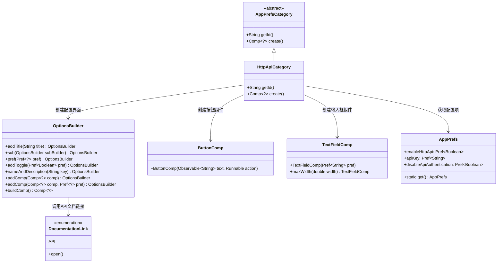
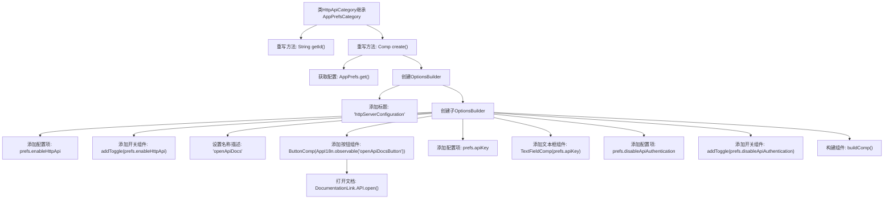

# 基础信息

|      |      |
|------|------|
| 名称 | HttpApiCategory |
| 编码语言 | .java |
| 代码路径 | xpipe/app/src/main/java/io/xpipe/app/prefs/HttpApiCategory.java |
| 包名 | io.xpipe.app.prefs |
| 依赖项 | ['io.xpipe.app.comp.Comp', 'io.xpipe.app.comp.base.ButtonComp', 'io.xpipe.app.comp.base.TextFieldComp', 'io.xpipe.app.core.AppI18n', 'io.xpipe.app.util.DocumentationLink', 'io.xpipe.app.util.OptionsBuilder'] |
| 概述说明 | HTTP API配置类，包含启用开关、API密钥输入和禁用认证选项。 |

# 说明

这段内容描述了一个名为HttpApiCategory的类，继承自AppPrefsCategory。该类主要负责HTTP API的配置界面构建。它重写了getId方法返回标识符"httpApi"，并通过create方法创建配置界面组件。界面包含HTTP服务器配置标题，以及多个配置选项：启用HTTP API的开关、打开API文档的按钮、API密钥输入框和禁用API认证的开关。所有配置项均与AppPrefs中的偏好设置关联，使用OptionsBuilder构建界面布局。

# 类列表 Class Summary

| 名称   | 类型  | 说明 |
|-------|------|-------------|
| HttpApiCategory | class | HTTP API配置类，包含开关、API密钥和认证设置。 |

## 类 HttpApiCategory

|      |      |
|------|------|
| 访问范围 | public |
| 类型 | class |
| 名称 | HttpApiCategory |
| 说明 | HTTP API配置类，包含开关、API密钥和认证设置。 |

### UML类图

这段代码展示了一个HTTP API配置界面的实现。HttpApiCategory继承自抽象类AppPrefsCategory，通过OptionsBuilder构建包含开关、按钮和输入框的配置界面。其中使用了AppPrefs管理配置项，ButtonComp触发API文档打开操作，TextFieldComp用于API密钥输入。类图清晰地呈现了各组件间的依赖关系，包括配置项的获取、界面构建和功能触发流程。

### 内部方法调用关系图

这段代码描述了一个HTTP API配置界面的构建过程。流程图展示了HttpApiCategory类如何继承AppPrefsCategory并实现两个关键方法：getId()返回配置标识符"httpApi"，create()方法通过OptionsBuilder构建包含标题、开关选项、按钮和文本框的复合配置界面。特别值得注意的是子配置项的嵌套构建过程，以及按钮点击事件与API文档打开的关联逻辑。整个流程体现了配置界面的层次化构建思想，最终通过buildComp()方法生成完整的配置组件。

### 字段列表 Field List

| 名称  | 类型  | 说明 |
|-------|-------|------|

### 方法列表 Method List

| 名称  | 类型  | 说明 |
|-------|-------|------|
| getId | String | 重写getId方法，返回固定值"httpApi"。 |
| create | Comp<?> | 创建HTTP服务器配置组件，包含启用API、文档按钮、API密钥输入和禁用认证选项。 |

