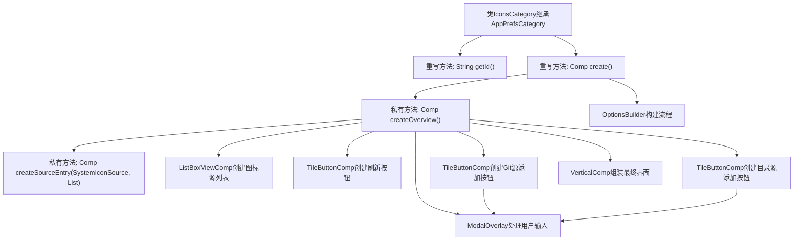
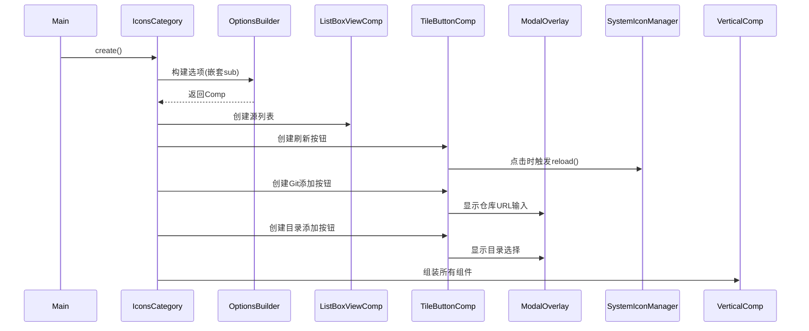

# 基础信息

|      |      |
|------|------|
| 名称 | IconsCategory |
| 编码语言 | .java |
| 代码路径 | xpipe/app/src/main/java/io/xpipe/app/prefs/IconsCategory.java |
| 包名 | io.xpipe.app.prefs |
| 依赖项 | ['io.xpipe.app.comp.Comp', 'io.xpipe.app.comp.base', 'io.xpipe.app.core.window.AppDialog', 'io.xpipe.app.icon.SystemIconManager', 'io.xpipe.app.icon.SystemIconSource', 'io.xpipe.app.storage.DataStorage', 'io.xpipe.app.util', 'io.xpipe.core.store.FilePath', 'javafx.beans.binding.Bindings', 'javafx.beans.property.SimpleBooleanProperty', 'javafx.beans.property.SimpleObjectProperty', 'javafx.beans.property.SimpleStringProperty', 'javafx.collections.FXCollections', 'javafx.scene.control.TextField', 'java.nio.file.Files', 'java.util.ArrayList', 'java.util.List', 'java.util.UUID'] |
| 概述说明 | IconsCategory类管理图标源，提供添加、刷新和删除功能，支持Git和本地目录源。 |

# 说明

这是一个名为IconsCategory的Java类，继承自AppPrefsCategory，用于管理图标源设置界面。类中包含创建图标源配置界面的逻辑，包括显示现有图标源列表、刷新图标源、添加Git仓库图标源和本地目录图标源的功能。界面由多个组件构成，如列表视图、刷新按钮、添加按钮等。每个图标源条目支持删除操作，并显示源名称、描述和图标。添加新源时会验证输入并更新应用偏好设置。整体布局采用垂直排列，包含分隔符和间距调整。

# 类列表 Class Summary

| 名称   | 类型  | 说明 |
|-------|------|-------------|
| IconsCategory | class | IconsCategory类管理图标源，提供添加、删除和刷新功能，支持Git和本地目录。 |

## 类 IconsCategory

|      |      |
|------|------|
| 访问范围 | public |
| 类型 | class |
| 名称 | IconsCategory |
| 说明 | IconsCategory类管理图标源，提供添加、删除和刷新功能，支持Git和本地目录。 |

### UML类图

```mermaid
classDiagram
    class IconsCategory {
        +String getId()
        +Comp~?~ create()
        -Comp~?~ createOverview()
        -Comp~?~ createSourceEntry(SystemIconSource source, List~SystemIconSource~ sources)
    }
    class AppPrefsCategory {
        <<Interface>>
    }
    class OptionsBuilder {
        +addTitle(String title) OptionsBuilder
        +sub(OptionsBuilder subBuilder) OptionsBuilder
        +nameAndDescription(String name) OptionsBuilder
        +addComp(Comp~?~ comp) OptionsBuilder
        +buildComp() Comp~?~
    }
    class SystemIconSource {
        <<Interface>>
        +String getDisplayName()
        +String getDescription()
        +String getIcon()
        +void open()
    }
    class SystemIconManager {
        +List~SystemIconSource~ getEffectiveSources()
        +void reload()
    }
    class AppPrefs {
        +List~SystemIconSource~ getIconSources()
        +Property~List~SystemIconSource~~ iconSources
        +Property~String~ storageGitRemote()
    }
    class ListBoxViewComp~T~ {
        +ListBoxViewComp(ObservableList~T~ items, ObservableList~T~ source, Function~T, Comp~?~~ itemFactory, boolean editable)
    }
    class TileButtonComp {
        +TileButtonComp(String titleKey, String descKey, String iconKey, EventHandler~ActionEvent~ handler)
        +grow(boolean horizontal, boolean vertical) void
        +disable(BooleanProperty condition) void
        +setRight(Comp~?~ rightComp) void
        +setIconSize(double size) void
    }
    class ModalOverlay {
        +static ModalOverlay of(String title, Comp~?~ content)
        +withDefaultButtons(Runnable onConfirm) ModalOverlay
        +show() void
    }
    class ContextualFileReferenceChoiceComp {
        +ContextualFileReferenceChoiceComp(Property~FilePath~ root, Property~FilePath~ selected, Predicate~FilePath~ filter, List~String~ extensions)
    }

    IconsCategory --> AppPrefsCategory : 继承
    IconsCategory --> OptionsBuilder : 创建
    IconsCategory --> SystemIconSource : 使用
    IconsCategory --> SystemIconManager : 调用
    IconsCategory --> AppPrefs : 读取配置
    IconsCategory --> ListBoxViewComp : 创建列表视图
    IconsCategory --> TileButtonComp : 创建按钮
    IconsCategory --> ModalOverlay : 创建模态框
    IconsCategory --> ContextualFileReferenceChoiceComp : 文件选择
    SystemIconSource <|.. SystemIconSource.GitRepository : 实现
    SystemIconSource <|.. SystemIconSource.Directory : 实现
```

这段代码实现了一个图标管理界面，主要功能包括：1) 显示和管理多种图标来源(Git仓库和本地目录)；2) 提供刷新、添加和删除图标源的功能；3) 通过模态框进行用户交互。IconsCategory继承自AppPrefsCategory，使用OptionsBuilder构建UI组件，通过SystemIconManager管理图标源，并与AppPrefs进行配置交互。界面包含列表视图、操作按钮和文件选择器等组件，支持完整的CRUD操作和异步刷新功能。

### 内部方法调用关系图

这段代码实现了一个图标源管理界面，主要功能包括：1) 显示当前图标源列表；2) 提供刷新功能重新加载所有图标；3) 支持通过Git仓库或本地目录添加新图标源；4) 允许删除现有图标源。核心流程通过OptionsBuilder构建界面结构，使用ListBoxViewComp展示数据源列表，TileButtonComp实现操作按钮，ModalOverlay处理用户输入，最终由VerticalComp整合所有组件形成完整界面。代码特别注重线程安全和用户交互体验，通过异步操作和属性绑定实现流畅的界面响应。

### 字段列表 Field List

| 名称  | 类型  | 说明 |
|-------|-------|------|

### 方法列表 Method List

| 名称  | 类型  | 说明 |
|-------|-------|------|
| create | Comp<?> | 创建自定义图标选项构建器，包含标题和子项配置。 |
| getId | String | 重写getId方法，返回字符串"icons"。 |
| createOverview | Comp<?> | 创建图标源管理界面，包含列表显示、刷新按钮、添加Git和目录源功能。 |
| createSourceEntry | Comp<?> | 创建图标源条目，含删除按钮和打开功能。 |

