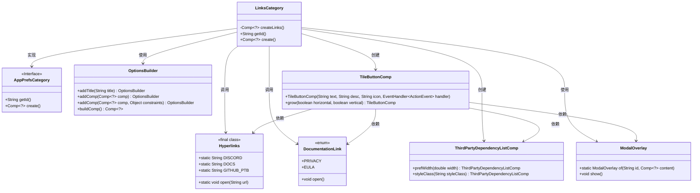
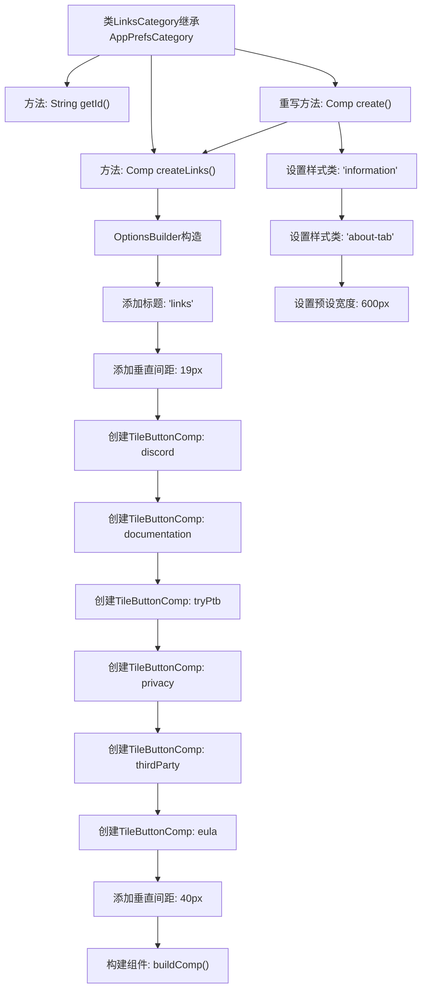

# 基础信息

|      |      |
|------|------|
| 名称 | LinksCategory |
| 编码语言 | .java |
| 代码路径 | xpipe/app/src/main/java/io/xpipe/app/prefs/LinksCategory.java |
| 包名 | io.xpipe.app.prefs |
| 依赖项 | ['io.xpipe.app.comp.Comp', 'io.xpipe.app.comp.base.ModalOverlay', 'io.xpipe.app.comp.base.TileButtonComp', 'io.xpipe.app.util.DocumentationLink', 'io.xpipe.app.util.Hyperlinks', 'io.xpipe.app.util.OptionsBuilder'] |
| 概述说明 | LinksCategory类创建包含多个链接按钮的界面，如Discord、文档、隐私等，点击后跳转对应页面或打开模态框。 |

# 说明

LinksCategory类继承自AppPrefsCategory，用于创建包含多个链接按钮的界面组件。组件包含Discord、文档、测试版、隐私政策、第三方依赖和用户协议等按钮，点击后分别打开对应链接或弹窗。每个按钮具有描述文本、图标和点击事件处理逻辑。组件宽度预设为600像素，并添加了特定样式类。

# 类列表 Class Summary

| 名称   | 类型  | 说明 |
|-------|------|-------------|
| LinksCategory | class | 创建链接分类界面，包含Discord、文档、测试版、隐私、第三方依赖和EULA等按钮。 |

## 类 LinksCategory

|      |      |
|------|------|
| 访问范围 | public |
| 类型 | class |
| 名称 | LinksCategory |
| 说明 | 创建链接分类界面，包含Discord、文档、测试版、隐私、第三方依赖和EULA等按钮。 |

### UML类图

这段代码展示了一个`LinksCategory`类，它继承自`AppPrefsCategory`接口，主要用于创建包含多个链接按钮的界面组件。通过`OptionsBuilder`构建布局，使用`TileButtonComp`创建不同功能的按钮（如打开Discord、文档、测试版等），并处理点击事件。按钮事件涉及`Hyperlinks`打开URL、`DocumentationLink`显示文档、以及`ModalOverlay`显示第三方依赖列表。整体设计采用构建器模式，具有清晰的组件结构和事件处理机制。

### 内部方法调用关系图

这段代码展示了一个LinksCategory类，它继承自AppPrefsCategory，主要用于创建包含多个功能按钮的链接面板。通过createLinks()方法使用OptionsBuilder构建界面，添加了6个不同功能的TileButtonComp（Discord、文档、测试版、隐私条款、第三方依赖和用户协议），每个按钮都绑定了对应的事件处理逻辑。最后通过重写create()方法设置组件样式和宽度，形成一个完整的链接分类界面。

### 字段列表 Field List

| 名称  | 类型  | 说明 |
|-------|-------|------|

### 方法列表 Method List

| 名称  | 类型  | 说明 |
|-------|-------|------|
| getId | String | 重写getId方法，返回字符串"links"。 |
| createLinks | Comp<?> | 创建包含多个功能按钮的界面组件，按钮包括Discord、文档、测试版、隐私、第三方依赖和EULA。 |
| create | Comp<?> | 重写create方法，生成带样式的组件并设置宽度为600。 |

