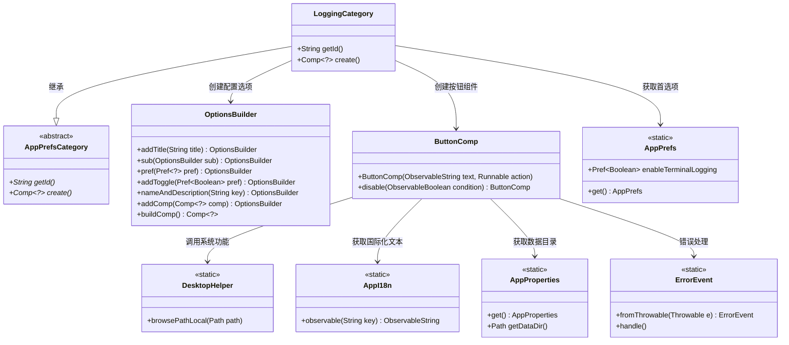
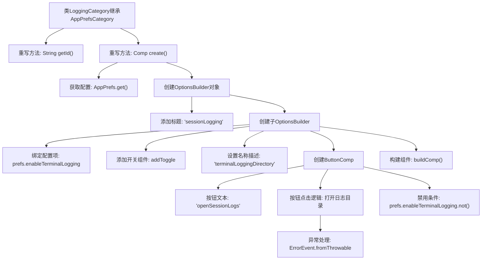

# 基础信息

|      |      |
|------|------|
| 名称 | LoggingCategory |
| 编码语言 | .java |
| 代码路径 | xpipe/app/src/main/java/io/xpipe/app/prefs/LoggingCategory.java |
| 包名 | io.xpipe.app.prefs |
| 依赖项 | ['io.xpipe.app.comp.Comp', 'io.xpipe.app.comp.base', 'io.xpipe.app.core.AppI18n', 'io.xpipe.app.core.AppProperties', 'io.xpipe.app.issue.ErrorEvent', 'io.xpipe.app.util', 'java.io.IOException', 'java.nio.file.Files'] |
| 概述说明 | 日志设置类，包含终端日志开关和打开日志目录按钮功能。 |

# 说明

该代码定义了一个名为LoggingCategory的类，继承自AppPrefsCategory。它重写了getId方法返回"logging"，并实现了create方法构建配置界面。界面包含一个标题为"sessionLogging"的选项组，其中嵌套了终端日志开关选项和打开会话日志目录的按钮。按钮会创建并打开数据目录下的sessions文件夹，且在终端日志禁用时不可用。所有操作都关联到AppPrefs的配置项和异常处理机制。

# 类列表 Class Summary

| 名称   | 类型  | 说明 |
|-------|------|-------------|
| LoggingCategory | class | LoggingCategory类扩展AppPrefsCategory，管理终端日志设置和目录访问。 |

## 类 LoggingCategory

|      |      |
|------|------|
| 访问范围 | public |
| 类型 | class |
| 名称 | LoggingCategory |
| 说明 | LoggingCategory类扩展AppPrefsCategory，管理终端日志设置和目录访问。 |

### UML类图

这段代码展示了一个日志配置模块的实现，其中LoggingCategory继承自抽象类AppPrefsCategory，用于构建日志相关的用户界面配置选项。通过OptionsBuilder动态创建包含开关、按钮等组件的复合配置面板，并整合了首选项管理、国际化、系统目录操作和错误处理等功能。类图清晰地呈现了各组件间的协作关系，特别是通过ButtonComp触发的跨系统操作链（从界面交互到文件系统浏览）。整个设计体现了模块化、可扩展性和异常安全处理的编程思想。

### 内部方法调用关系图

流程图描述：该流程图展示了LoggingCategory类的核心逻辑结构，该类继承自AppPrefsCategory并重写了getId()和create()方法。create()方法通过OptionsBuilder构建一个包含标题、开关选项和按钮的复合配置界面，其中按钮用于打开终端日志目录，且按钮状态与终端日志开关配置联动。异常处理模块确保目录访问错误能被捕获，整体构建过程体现了配置驱动的UI组件生成模式。

### 字段列表 Field List

| 名称  | 类型  | 说明 |
|-------|-------|------|

### 方法列表 Method List

| 名称  | 类型  | 说明 |
|-------|-------|------|
| create | Comp<?> | 创建会话日志选项组件，含终端日志开关和打开日志目录按钮。 |
| getId | String | 重写getId方法，返回"logging"。 |

