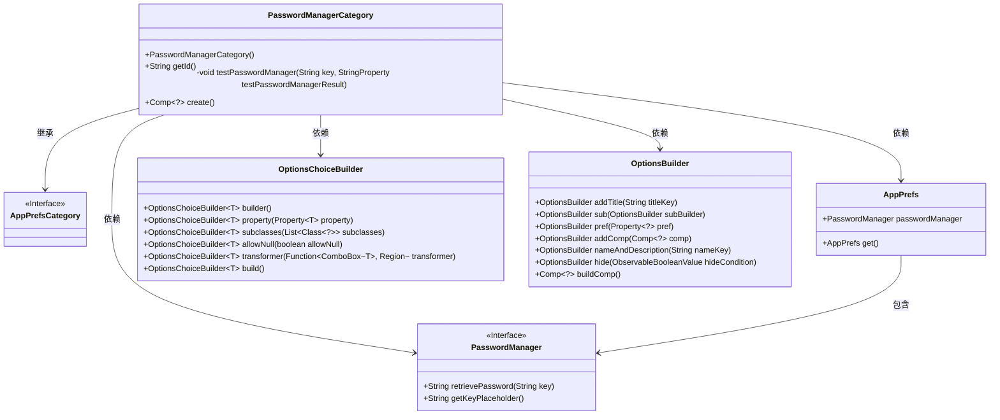
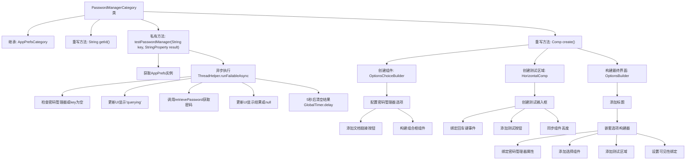

# 基础信息

|      |      |
|------|------|
| 名称 | PasswordManagerCategory |
| 编码语言 | .java |
| 代码路径 | xpipe/app/src/main/java/io/xpipe/app/prefs/PasswordManagerCategory.java |
| 包名 | io.xpipe.app.prefs |
| 依赖项 | ['io.xpipe.app.comp.Comp', 'io.xpipe.app.comp.base.ButtonComp', 'io.xpipe.app.comp.base.HorizontalComp', 'io.xpipe.app.comp.base.LabelComp', 'io.xpipe.app.comp.base.TextFieldComp', 'io.xpipe.app.core.AppI18n', 'io.xpipe.app.password.PasswordManager', 'io.xpipe.app.util', 'javafx.application.Platform', 'javafx.beans.binding.Bindings', 'javafx.beans.property.SimpleStringProperty', 'javafx.beans.property.StringProperty', 'javafx.geometry.Insets', 'javafx.geometry.Pos', 'javafx.scene.input.KeyCode', 'javafx.scene.layout.HBox', 'javafx.scene.layout.Priority', 'javafx.scene.layout.Region', 'atlantafx.base.theme.Styles', 'org.kordamp.ikonli.javafx.FontIcon', 'java.time.Duration', 'java.util.List'] |
| 概述说明 | 密码管理器类，含测试功能与UI组件。 |

# 说明

该代码定义了一个密码管理器配置类PasswordManagerCategory，继承自AppPrefsCategory。主要功能包括：1. 提供密码管理器类型选择下拉框，支持null值；2. 包含测试功能区域，含输入框和测试按钮，可验证密码管理器是否正常工作；3. 测试结果会显示5秒后自动消失；4. 集成文档链接按钮，可跳转至帮助文档；5. 界面元素采用水平布局，包含样式控制和尺寸约束。整体实现了一个完整的密码管理器配置和测试界面。

# 类列表 Class Summary

| 名称   | 类型  | 说明 |
|-------|------|-------------|
| PasswordManagerCategory | class | 密码管理器类，包含测试功能与UI组件。 |

## 类 PasswordManagerCategory

|      |      |
|------|------|
| 访问范围 | public |
| 类型 | class |
| 名称 | PasswordManagerCategory |
| 说明 | 密码管理器类，包含测试功能与UI组件。 |

### UML类图

这段代码展示了一个密码管理器配置界面的实现，核心类PasswordManagerCategory继承自AppPrefsCategory，负责构建密码管理器的UI组件。通过OptionsChoiceBuilder和OptionsBuilder构建可配置的下拉选择框和测试区域，并与AppPrefs中的PasswordManager实现交互。PasswordManager接口定义了密码检索和占位符获取等核心功能，整个设计采用响应式编程模式，支持异步操作和国际化显示。

### 内部方法调用关系图

这段代码实现了一个密码管理器配置界面，主要包含密码管理器类型选择、测试功能和文档链接。流程图展示了从类继承结构到具体方法实现的完整调用链，重点描述了testPasswordManager方法的异步操作流程和create方法的UI构建过程。代码通过组合多个JavaFX组件实现交互功能，包括异步密码查询、输入验证和自动清除结果等特性。

### 字段列表 Field List

| 名称  | 类型  | 说明 |
|-------|-------|------|

### 方法列表 Method List

| 名称  | 类型  | 说明 |
|-------|-------|------|
| getId | String | 重写getId方法，返回固定字符串"passwordManager"。 |
| testPasswordManager | void | 异步测试密码管理器功能，检查密钥并返回查询结果，5秒后清空。 |
| create | Comp<?> | 创建密码管理器选项组件，包含选择器、测试输入框和结果标签。 |

