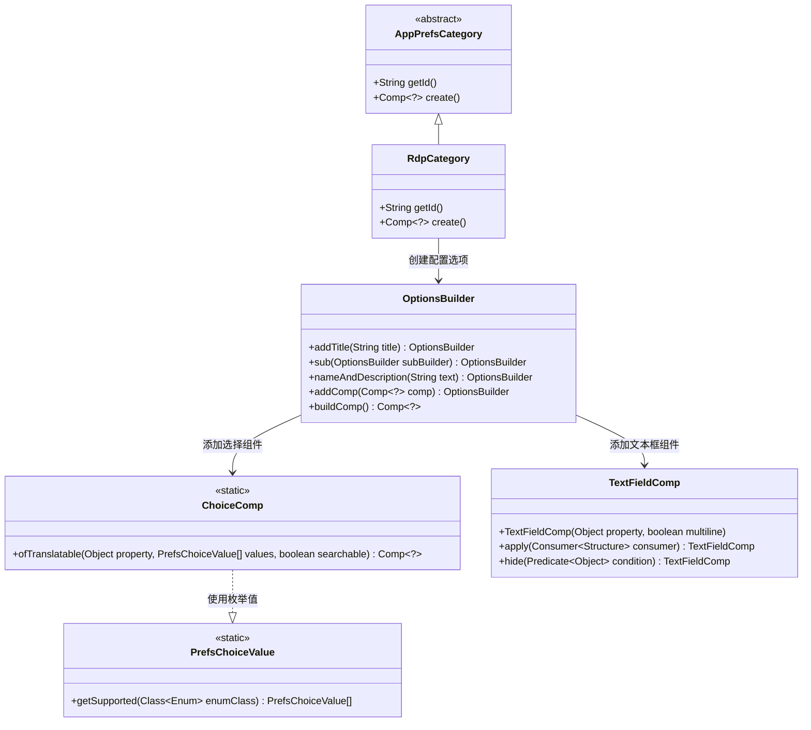
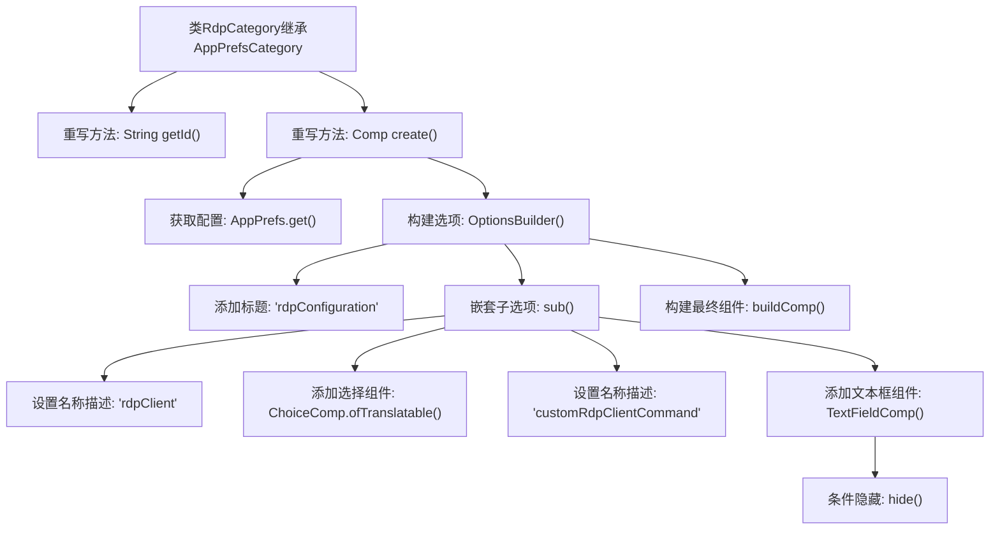

# 基础信息

|      |      |
|------|------|
| 名称 | RdpCategory |
| 编码语言 | .java |
| 代码路径 | xpipe/app/src/main/java/io/xpipe/app/prefs/RdpCategory.java |
| 包名 | io.xpipe.app.prefs |
| 依赖项 | ['io.xpipe.app.comp.Comp', 'io.xpipe.app.comp.base.ChoiceComp', 'io.xpipe.app.comp.base.TextFieldComp', 'io.xpipe.app.ext.PrefsChoiceValue', 'io.xpipe.app.util.OptionsBuilder'] |
| 概述说明 | RdpCategory类定义RDP配置选项，包括客户端类型和自定义命令设置。 |

# 说明

这是一个名为RdpCategory的Java类，继承自AppPrefsCategory，用于配置远程桌面协议(RDP)相关设置。该类重写了getId方法返回标识符"rdp"，并实现create方法构建配置界面。界面包含RDP配置标题和子选项，其中提供RDP客户端类型选择（支持枚举值）和自定义客户端命令输入框（当选择CUSTOM类型时显示）。自定义命令输入框预设了示例文本提示。整个配置结构通过OptionsBuilder构建，并与应用偏好设置(AppPrefs)绑定。

# 类列表 Class Summary

| 名称   | 类型  | 说明 |
|-------|------|-------------|
| RdpCategory | class | RdpCategory类定义RDP配置选项，包括客户端类型和自定义命令。 |

## 类 RdpCategory

|      |      |
|------|------|
| 访问范围 | public |
| 类型 | class |
| 名称 | RdpCategory |
| 说明 | RdpCategory类定义RDP配置选项，包括客户端类型和自定义命令。 |

### UML类图

类图描述：该图展示了RDP配置模块的类结构，核心是RdpCategory继承自抽象类AppPrefsCategory，通过OptionsBuilder构建包含ChoiceComp（下拉选择框）和TextFieldComp（文本框）的配置界面。ChoiceComp使用PrefsChoiceValue获取枚举类型的支持值，TextFieldComp支持条件隐藏和结构定制。整体实现了动态生成RDP客户端配置的可扩展架构。

### 内部方法调用关系图

这段代码流程图展示了RdpCategory类的核心逻辑，该类继承自AppPrefsCategory并实现两个关键方法。getId()返回固定标识符"rdp"，而create()方法构建了一个嵌套配置界面，包含RDP客户端类型选择器和自定义命令输入框（根据选择动态显示）。流程清晰呈现了从配置获取、UI组件构建到条件控制的完整过程，体现了GUI配置界面的分层设计模式。

### 字段列表 Field List

| 名称  | 类型  | 说明 |
|-------|-------|------|

### 方法列表 Method List

| 名称  | 类型  | 说明 |
|-------|-------|------|
| create | Comp<?> | 创建RDP配置选项，包含客户端选择和自定义命令输入框。 |
| getId | String | 重写getId方法，返回字符串"rdp"。 |

