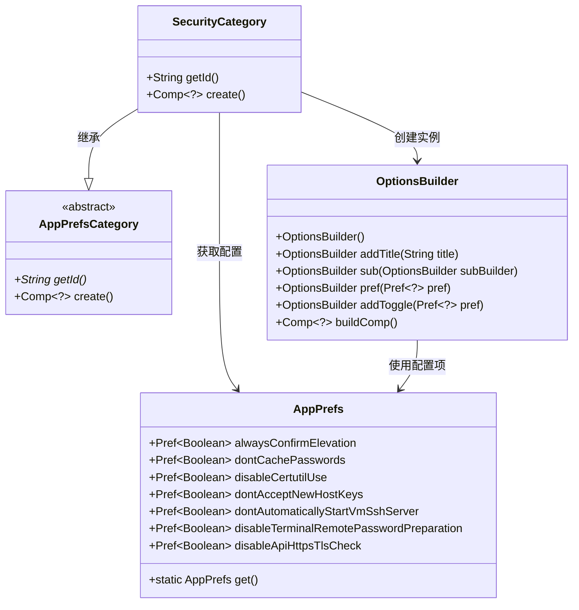
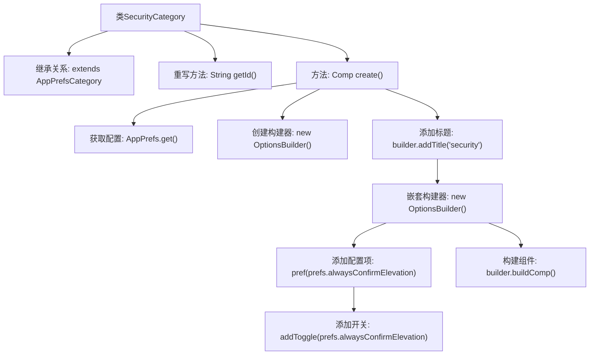

# 基础信息

|      |      |
|------|------|
| 名称 | SecurityCategory |
| 编码语言 | .java |
| 代码路径 | xpipe/app/src/main/java/io/xpipe/app/prefs/SecurityCategory.java |
| 包名 | io.xpipe.app.prefs |
| 依赖项 | ['io.xpipe.app.comp.Comp', 'io.xpipe.app.util.OptionsBuilder'] |
| 概述说明 | 安全设置类，包含权限确认、密码缓存等选项。 |

# 说明

该代码定义了一个名为SecurityCategory的类，继承自AppPrefsCategory。该类重写了getId方法，返回字符串"security"。create方法使用OptionsBuilder构建安全相关的配置选项，包括始终确认提升权限、不缓存密码、禁用certutil工具、不接受新主机密钥、不自动启动虚拟机SSH服务器、禁用终端远程密码准备以及禁用API HTTPS TLS检查等开关选项。最后通过buildComp方法返回构建的组件。

# 类列表 Class Summary

| 名称   | 类型  | 说明 |
|-------|------|-------------|
| SecurityCategory | class | 安全设置类，包含权限确认、密码缓存等选项。 |

## 类 SecurityCategory

|      |      |
|------|------|
| 访问范围 | public |
| 类型 | class |
| 名称 | SecurityCategory |
| 说明 | 安全设置类，包含权限确认、密码缓存等选项。 |

### UML类图

这段代码描述了一个安全配置界面构建系统。SecurityCategory继承自抽象类AppPrefsCategory，负责生成包含7个布尔型安全选项的界面组件。通过OptionsBuilder链式调用构建选项布局，每个选项绑定到AppPrefs中的对应配置项（如alwaysConfirmElevation等）。类图清晰展示了继承关系、依赖关系和核心方法，体现了通过组合模式动态构建配置界面的设计思想。

### 内部方法调用关系图

这段代码流程图展示了SecurityCategory类的结构和工作流程。该类继承自AppPrefsCategory，重写了getId方法返回"security"标识。核心是create方法，它通过OptionsBuilder构建一个包含多个安全配置选项的界面组件，包括7个布尔型配置项的标题和开关控件。流程从获取应用配置开始，逐步构建选项界面，最终返回完整的UI组件。

### 字段列表 Field List

| 名称  | 类型  | 说明 |
|-------|-------|------|

### 方法列表 Method List

| 名称  | 类型  | 说明 |
|-------|-------|------|
| getId | String | 重写getId方法，返回"security"。 |
| create | Comp<?> | 创建安全选项组件，包含多个开关配置项。 |

