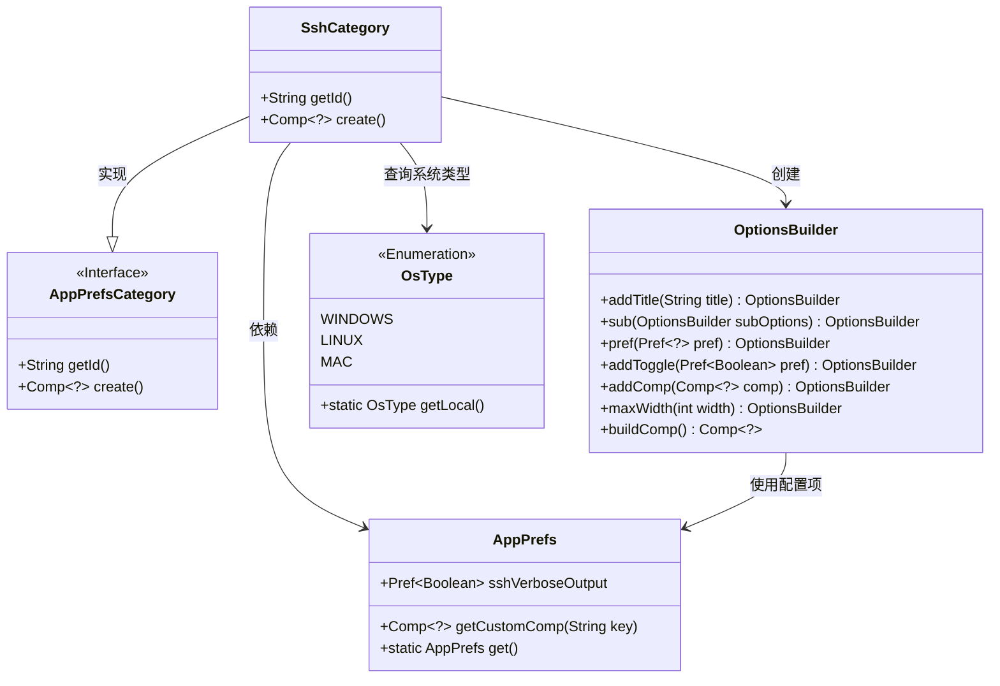
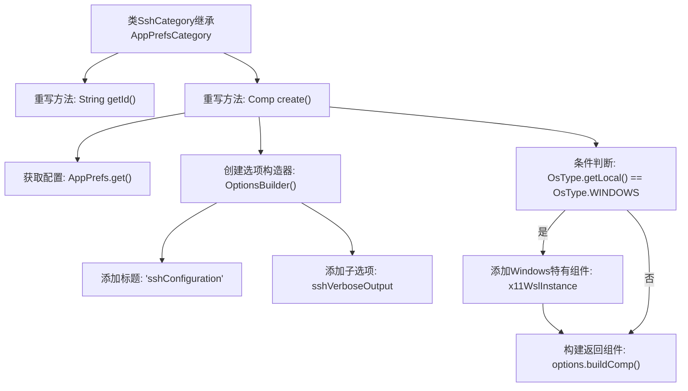

# 基础信息

|      |      |
|------|------|
| 名称 | SshCategory |
| 编码语言 | .java |
| 代码路径 | xpipe/app/src/main/java/io/xpipe/app/prefs/SshCategory.java |
| 包名 | io.xpipe.app.prefs |
| 依赖项 | ['io.xpipe.app.comp.Comp', 'io.xpipe.app.util.OptionsBuilder', 'io.xpipe.core.process.OsType'] |
| 概述说明 | SSH配置类，含详细输出选项，Windows下支持X11 WSL实例设置。 |

# 说明

该代码定义了一个名为SshCategory的类，继承自AppPrefsCategory。类中包含两个重写方法：getId返回字符串"ssh"作为标识符；create方法构建SSH配置界面，包含一个标题为"sshConfiguration"的选项面板，其中添加了verbose输出开关。若操作系统为Windows，则额外添加一个最大宽度匹配父容器的X11 WSL实例配置组件。所有配置项通过AppPrefs获取预设值，使用OptionsBuilder构建界面元素。

# 类列表 Class Summary

| 名称   | 类型  | 说明 |
|-------|------|-------------|
| SshCategory | class | SSH配置类，含ID返回和创建选项逻辑，支持Windows特定组件。 |

## 类 SshCategory

|      |      |
|------|------|
| 访问范围 | public |
| 类型 | class |
| 名称 | SshCategory |
| 说明 | SSH配置类，含ID返回和创建选项逻辑，支持Windows特定组件。 |

### UML类图

这段类图展示了SSH配置模块的核心结构。SshCategory继承自AppPrefsCategory接口，负责构建SSH配置界面，通过OptionsBuilder动态生成包含开关选项和平台特定组件的配置面板。AppPrefs提供全局配置项存储，OsType枚举用于平台检测。整个设计采用建造者模式灵活构建UI，同时通过接口实现确保扩展性，特别处理了Windows平台的X11/WSL特殊配置需求。

### 内部方法调用关系图

这段代码流程图展示了SshCategory类的核心逻辑。该类继承自AppPrefsCategory，主要实现两个重写方法：getId()返回固定标识"ssh"，create()负责构建SSH配置界面。流程包括获取应用偏好设置、创建带标题的选项构造器、添加通用配置项，并根据操作系统类型决定是否添加Windows特有的X11/WSL配置组件，最后返回构建好的界面组件。条件分支结构清晰体现了跨平台配置的差异性处理。

### 字段列表 Field List

| 名称  | 类型  | 说明 |
|-------|-------|------|

### 方法列表 Method List

| 名称  | 类型  | 说明 |
|-------|-------|------|
| getId | String | 重写getId方法，返回"ssh"。 |
| create | Comp<?> | 创建SSH配置选项，含详细输出开关，Windows下添加X11组件。 |

