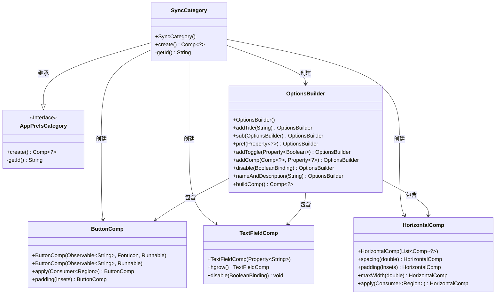
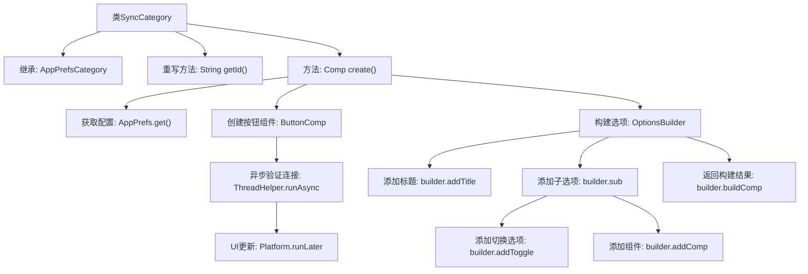

# 基础信息

|      |      |
|------|------|
| 名称 | SyncCategory |
| 编码语言 | .java |
| 代码路径 | xpipe/app/src/main/java/io/xpipe/app/prefs/SyncCategory.java |
| 包名 | io.xpipe.app.prefs |
| 依赖项 | ['io.xpipe.app.comp.Comp', 'io.xpipe.app.comp.base', 'io.xpipe.app.core.AppI18n', 'io.xpipe.app.storage.DataStorage', 'io.xpipe.app.storage.DataStorageSyncHandler', 'io.xpipe.app.util.DesktopHelper', 'io.xpipe.app.util.DocumentationLink', 'io.xpipe.app.util.OptionsBuilder', 'io.xpipe.app.util.ThreadHelper', 'javafx.application.Platform', 'javafx.beans.property.SimpleBooleanProperty', 'javafx.geometry.Insets', 'javafx.geometry.Pos', 'javafx.scene.layout.Region', 'atlantafx.base.theme.Styles', 'org.kordamp.ikonli.javafx.FontIcon', 'java.util.List', 'java.util.concurrent.atomic.AtomicReference'] |
| 概述说明 | SyncCategory类实现同步设置界面，包含测试连接、远程仓库配置和浏览保险库功能。 |

# 说明

SyncCategory类继承自AppPrefsCategory，用于创建同步配置界面。其核心功能包括：通过getId方法返回标识符"vaultSync"；create方法构建包含远程仓库设置、测试连接按钮和帮助按钮的交互界面。测试按钮会异步验证连接有效性，成功时更新样式并启用重启标志。界面布局采用HorizontalComp组织组件，包含禁用逻辑（依赖enableGitStorage状态）和路径浏览功能。所有配置项通过OptionsBuilder构建，最终返回组合后的组件。

# 类列表 Class Summary

| 名称   | 类型  | 说明 |
|-------|------|-------------|
| SyncCategory | class | SyncCategory类实现同步功能，包含测试按钮、远程仓库设置及帮助文档链接。 |

## 类 SyncCategory

|      |      |
|------|------|
| 访问范围 | public |
| 类型 | class |
| 名称 | SyncCategory |
| 说明 | SyncCategory类实现同步功能，包含测试按钮、远程仓库设置及帮助文档链接。 |

### UML类图

这段类图展示了SyncCategory继承自AppPrefsCategory接口，并创建了多个UI组件类(OptionsBuilder、ButtonComp等)来实现同步功能的配置界面。SyncCategory通过组合模式构建复杂UI，其中OptionsBuilder作为构建器模式的核心类，负责组织各种输入组件和按钮。整个结构体现了GUI构建的分层设计，从基础组件到复合组件的组合过程。

### 内部方法调用关系图

这段代码流程图展示了SyncCategory类的核心结构和工作流程。该类继承自AppPrefsCategory，主要功能是创建一个包含多个配置选项的界面组件。流程从获取应用配置开始，创建测试按钮并设置异步验证逻辑，然后构建包含远程仓库设置、帮助按钮等元素的选项面板。最后通过OptionsBuilder构建并返回完整的配置组件，实现了数据存储同步相关的用户界面配置功能。

### 字段列表 Field List

| 名称  | 类型  | 说明 |
|-------|-------|------|

### 方法列表 Method List

| 名称  | 类型  | 说明 |
|-------|-------|------|
| getId | String | 重写getId方法，返回字符串"vaultSync"。 |
| create | Comp<?> | 创建包含Git同步功能的UI组件，含测试按钮、远程仓库输入框及帮助按钮，支持启用/禁用和浏览存储库。 |

