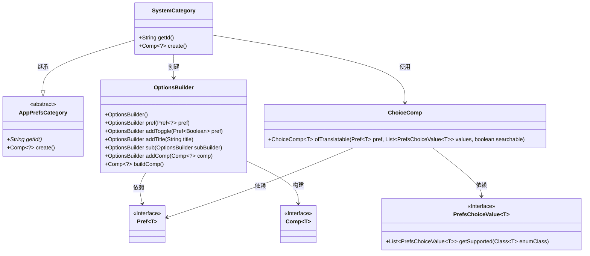
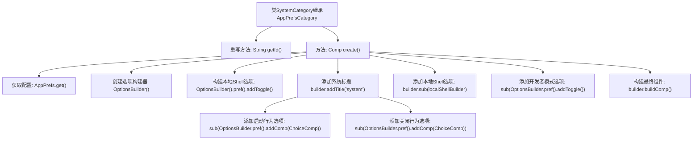

# 基础信息

|      |      |
|------|------|
| 名称 | SystemCategory |
| 编码语言 | .java |
| 代码路径 | xpipe/app/src/main/java/io/xpipe/app/prefs/SystemCategory.java |
| 包名 | io.xpipe.app.prefs |
| 依赖项 | ['io.xpipe.app.comp.Comp', 'io.xpipe.app.comp.base.ChoiceComp', 'io.xpipe.app.ext.PrefsChoiceValue', 'io.xpipe.app.util.OptionsBuilder'] |
| 概述说明 | SystemCategory类扩展AppPrefsCategory，创建系统偏好设置界面，包含启动、关闭行为和开发者模式选项。 |

# 说明

SystemCategory类继承自AppPrefsCategory，用于构建系统偏好设置界面。该类重写getId方法返回"system"标识符。create方法使用OptionsBuilder构建配置选项，包含启动行为、关闭行为的可翻译选择组件，设置最小宽度为父组件一半。同时集成本地备用Shell切换选项和开发者模式开关。所有选项均基于AppPrefs实例的偏好设置值进行初始化。

# 类列表 Class Summary

| 名称   | 类型  | 说明 |
|-------|------|-------------|
| SystemCategory | class | SystemCategory类扩展AppPrefsCategory，创建系统偏好设置界面，包含启动、关闭行为和开发者模式选项。 |

## 类 SystemCategory

|      |      |
|------|------|
| 访问范围 | public |
| 类型 | class |
| 名称 | SystemCategory |
| 说明 | SystemCategory类扩展AppPrefsCategory，创建系统偏好设置界面，包含启动、关闭行为和开发者模式选项。 |

### UML类图

这段代码描述了一个系统设置分类`SystemCategory`，它继承自抽象基类`AppPrefsCategory`，用于构建应用程序的系统偏好设置界面。主要功能包括创建启动行为、关闭行为、本地Shell回退和开发者模式等选项。通过`OptionsBuilder`和`ChoiceComp`等组件构建交互式界面，其中涉及泛型偏好设置(`Pref`)和选项值(`PrefsChoiceValue`)的处理。类图清晰地展示了各组件间的继承、创建和依赖关系。

### 内部方法调用关系图

该流程图展示了SystemCategory类的核心结构和工作流程。类继承自AppPrefsCategory，主要实现两个方法：getId()返回系统标识，create()构建配置界面组件。create()方法通过OptionsBuilder逐步添加系统标题、启动/关闭行为选项、本地Shell开关和开发者模式开关，最后构建完整组件。流程清晰展现了配置选项的层级关系和构建顺序，体现了模块化设计思想。

### 字段列表 Field List

| 名称  | 类型  | 说明 |
|-------|-------|------|

### 方法列表 Method List

| 名称  | 类型  | 说明 |
|-------|-------|------|
| create | Comp<?> | 创建系统选项组件，包含启动、关闭行为和开发者模式设置。 |
| getId | String | 重写getId方法，返回固定值"system"。 |

