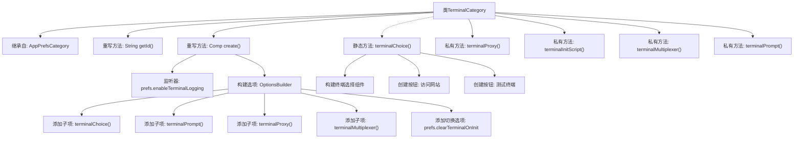

# 基础信息

|      |      |
|------|------|
| 名称 | TerminalCategory |
| 编码语言 | .java |
| 代码路径 | xpipe/app/src/main/java/io/xpipe/app/prefs/TerminalCategory.java |
| 包名 | io.xpipe.app.prefs |
| 依赖项 | ['io.xpipe.app.comp.Comp', 'io.xpipe.app.comp.base', 'io.xpipe.app.comp.store.StoreChoiceComp', 'io.xpipe.app.comp.store.StoreViewState', 'io.xpipe.app.core.AppI18n', 'io.xpipe.app.ext.PrefsChoiceValue', 'io.xpipe.app.ext.ProcessControlProvider', 'io.xpipe.app.ext.ShellStore', 'io.xpipe.app.issue.ErrorEvent', 'io.xpipe.app.storage.DataStorage', 'io.xpipe.app.storage.DataStoreEntryRef', 'io.xpipe.app.terminal', 'io.xpipe.app.util', 'io.xpipe.core.process.OsType', 'javafx.application.Platform', 'javafx.beans.binding.Bindings', 'javafx.beans.property.SimpleObjectProperty', 'javafx.geometry.Insets', 'javafx.geometry.Pos', 'javafx.scene.control.ListCell', 'javafx.scene.layout.HBox', 'javafx.scene.layout.Priority', 'javafx.scene.layout.Region', 'javafx.scene.paint.Color', 'org.kordamp.ikonli.javafx.FontIcon', 'java.util.List', 'java.util.UUID'] |
| 概述说明 | 终端配置类，包含类型选择、代理设置、提示符和多路复用器选项，支持测试和许可验证。 |

# 说明

TerminalCategory类继承自AppPrefsCategory，用于管理终端相关配置。主要功能包括：创建终端配置界面，包含终端类型选择、提示符设置、代理配置和多路复用器选项。终端类型选择支持自定义命令，并显示推荐标识；代理配置仅在Windows系统显示，依赖ShellStore；多路复用器和提示符设置提供文档链接按钮。类中还包含终端测试功能，验证终端集成是否正常。所有配置通过AppPrefs管理，并支持许可证验证和错误处理。

# 类列表 Class Summary

| 名称   | 类型  | 说明 |
|-------|------|-------------|
| TerminalCategory | class | 终端配置类，包含类型选择、代理设置、提示符和多路复用器选项，支持许可证验证和测试功能。 |

## 类 TerminalCategory

|      |      |
|------|------|
| 访问范围 | public |
| 类型 | class |
| 名称 | TerminalCategory |
| 说明 | 终端配置类，包含类型选择、代理设置、提示符和多路复用器选项，支持许可证验证和测试功能。 |

### UML类图

```mermaid
classDiagram
    class TerminalCategory {
        +TerminalCategory()
        +String getId()
        +Comp~?~ create()
        +OptionsBuilder terminalChoice()
        -OptionsBuilder terminalProxy()
        -OptionsBuilder terminalInitScript()
        -OptionsBuilder terminalMultiplexer()
        -OptionsBuilder terminalPrompt()
    }
    
    class AppPrefsCategory {
        <<Interface>>
        +String getId()
        +Comp~?~ create()
    }
    
    class OptionsBuilder {
        +OptionsBuilder()
        +OptionsBuilder addTitle(String)
        +OptionsBuilder sub(OptionsBuilder)
        +OptionsBuilder pref(Property~?~)
        +OptionsBuilder addToggle(Property~Boolean~)
        +OptionsBuilder addComp(Comp~?~, Property~?~)
        +OptionsBuilder nameAndDescription(String)
        +OptionsBuilder hide(BooleanBinding)
        +OptionsBuilder disable(BooleanBinding)
        +Comp~?~ buildComp()
    }
    
    class ChoiceComp~T~ {
        +ChoiceComp~T~()
        +ChoiceComp~T~ ofTranslatable(Property~T~, List~PrefsChoiceValue~, boolean)
        +void maxWidth(double)
        +void apply(Consumer~?~)
        +void prefWidth(double)
    }
    
    class ButtonComp {
        +ButtonComp(ObservableString, FontIcon, Runnable)
        +void visible(BooleanBinding)
        +Region createRegion()
    }
    
    class HorizontalComp {
        +HorizontalComp(List~Comp~?~)
        +void apply(Consumer~?~)
        +void maxWidth(double)
    }
    
    class TextFieldComp {
        +TextFieldComp(Property~String~, boolean)
        +TextFieldComp apply(Consumer~?~)
        +TextFieldComp hide(BooleanBinding)
    }
    
    class DelayedInitComp {
        +DelayedInitComp(Supplier~Comp~?~, Supplier~Boolean~)
        +void maxWidth(double)
    }
    
    class StoreChoiceComp~T~ {
        +StoreChoiceComp(Mode, String, Property~DataStoreEntryRef~T~~, Class~T~, Predicate~DataStoreEntryRef~T~~, String)
        +Region createRegion()
    }
    
    class IntegratedTextAreaComp {
        +IntegratedTextAreaComp script(Property~DataStoreEntryRef~ShellStore~~, Property~String~)
        +IntegratedTextAreaComp maxWidth(double)
        +IntegratedTextAreaComp minHeight(double)
    }
    
    class OptionsChoiceBuilder {
        +OptionsChoiceBuilder builder()
        +OptionsChoiceBuilder property(Property~?~)
        +OptionsChoiceBuilder allowNull(boolean)
        +OptionsChoiceBuilder subclasses(List~Class~?~~)
        +OptionsChoiceBuilder transformer(Function~?~)
        +OptionsBuilder build()
    }
    
    TerminalCategory --> AppPrefsCategory : 继承
    TerminalCategory --> OptionsBuilder : 使用
    TerminalCategory --> ChoiceComp : 使用
    TerminalCategory --> ButtonComp : 使用
    TerminalCategory --> HorizontalComp : 使用
    TerminalCategory --> TextFieldComp : 使用
    TerminalCategory --> DelayedInitComp : 使用
    TerminalCategory --> StoreChoiceComp : 使用
    TerminalCategory --> IntegratedTextAreaComp : 使用
    TerminalCategory --> OptionsChoiceBuilder : 使用
    OptionsBuilder --> Comp : 生成
    ChoiceComp --> PrefsChoiceValue : 依赖
    ButtonComp --> Hyperlinks : 依赖
    HorizontalComp --> HBox : 组合
    TextFieldComp --> Property : 绑定
    DelayedInitComp --> DataStorage : 依赖
    StoreChoiceComp --> DataStoreEntryRef : 泛型关联
    IntegratedTextAreaComp --> ShellStore : 关联
    OptionsChoiceBuilder --> TerminalMultiplexer : 关联
    OptionsChoiceBuilder --> TerminalPrompt : 关联
```

这段代码实现了一个终端配置界面，主要功能包括：终端类型选择、代理设置、初始化脚本配置、多路复用器选择和提示符定制。TerminalCategory继承自AppPrefsCategory，通过多个私有方法构建不同配置模块，使用OptionsBuilder进行界面布局。代码采用观察者模式处理配置变更，支持国际化显示，并包含丰富的UI组件交互逻辑（如带图标的按钮、动态显示/隐藏控件等）。各配置模块通过属性绑定与用户偏好设置(AppPrefs)保持同步，同时实现了许可证验证和错误处理机制。

### 内部方法调用关系图

这段代码是TerminalCategory类的实现，继承自AppPrefsCategory，主要用于管理终端相关的配置选项。通过重写create()方法构建包含终端类型选择、提示符设置、代理配置和多路复用器等子项的选项面板，并处理终端日志功能的许可证验证。各私有方法分别实现不同终端组件的构建逻辑，静态方法terminalChoice()提供终端类型选择功能，包含网站访问和测试按钮。整体采用监听器模式响应配置变更，通过OptionsBuilder结构化构建UI组件。

### 字段列表 Field List

| 名称  | 类型  | 说明 |
|-------|-------|------|

### 方法列表 Method List

| 名称  | 类型  | 说明 |
|-------|-------|------|
| terminalInitScript | OptionsBuilder | 终端初始化脚本配置方法，监听代理变更并更新引用，集成文本区组件设置。 |
| create | Comp<?> | 创建终端配置组件，监听日志许可，含选项构建器添加标题及子项。 |
| terminalChoice | OptionsBuilder | 创建终端选择界面，包含类型选择、网站访问和测试功能。 |
| terminalProxy | OptionsBuilder | 终端代理设置构建器，含存储选择组件和监听器，支持本地与远程代理切换，仅限Windows。 |
| getId | String | 重写getId方法，返回固定值"terminal"。 |
| terminalMultiplexer | OptionsBuilder | 构建终端复用器选项，含下拉选择框和网站链接按钮，支持Windows禁用条件。 |
| terminalPrompt | OptionsBuilder | 构建终端提示选项，包含下拉选择、网站链接按钮及布局处理。 |

