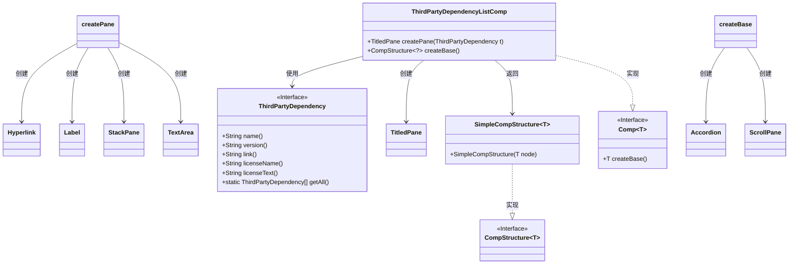

# 基础信息

|      |      |
|------|------|
| 名称 | ThirdPartyDependencyListComp |
| 编码语言 | .java |
| 代码路径 | xpipe/app/src/main/java/io/xpipe/app/prefs/ThirdPartyDependencyListComp.java |
| 包名 | io.xpipe.app.prefs |
| 依赖项 | ['io.xpipe.app.comp.Comp', 'io.xpipe.app.comp.CompStructure', 'io.xpipe.app.comp.SimpleCompStructure', 'io.xpipe.app.core.AppFontSizes', 'io.xpipe.app.util.Hyperlinks', 'javafx.geometry.Insets', 'javafx.geometry.Pos', 'javafx.scene.control', 'javafx.scene.layout.StackPane'] |
| 概述说明 | 创建第三方依赖列表组件，包含可折叠面板、超链接、许可证信息及文本展示。 |

# 说明

该代码定义了一个名为ThirdPartyDependencyListComp的组件类，用于展示第三方依赖项列表。主要功能包括：创建可折叠的标题面板，每个面板显示依赖项名称、版本和许可证名称，点击超链接可打开相关链接。面板内容包含不可编辑的许可证文本区域，自动换行并限制高度。组件使用Accordion布局管理多个面板，并通过ScrollPane提供滚动支持，确保宽度适配且隐藏水平滚动条。整体设计简洁，适配小字号显示。

# 类列表 Class Summary

| 名称   | 类型  | 说明 |
|-------|------|-------------|
| ThirdPartyDependencyListComp | class | 创建第三方依赖列表组件，包含可折叠面板显示依赖名称、版本、许可证及文本。 |

## 类 ThirdPartyDependencyListComp

|      |      |
|------|------|
| 访问范围 | public |
| 类型 | class |
| 名称 | ThirdPartyDependencyListComp |
| 说明 | 创建第三方依赖列表组件，包含可折叠面板显示依赖名称、版本、许可证及文本。 |

### UML类图

这段代码展示了一个用于显示第三方依赖列表的GUI组件`ThirdPartyDependencyListComp`，它继承自泛型类`Comp`。该类通过`createPane`方法为每个依赖项创建可折叠面板，包含依赖名称、版本、许可证信息和完整许可证文本。`createBase`方法将所有依赖面板整合到一个可滚动的Accordion布局中。该设计采用了JavaFX组件如TitledPane、Hyperlink等，实现了清晰的依赖项展示界面，同时通过泛型和接口保证了组件结构的灵活性。

### 内部方法调用关系图

这段代码实现了一个第三方依赖项列表组件，主要包含两个核心方法：createPane用于创建单个依赖项的可折叠面板，包含超链接、许可证信息和文本内容；createBase方法整合所有依赖项面板，生成带滚动功能的折叠容器。流程图清晰展示了从初始化到最终布局的完整调用链，特别是createBase方法通过流式处理调用createPane的循环关系。组件采用JavaFX控件实现交互式UI，支持点击链接跳转和展开/折叠操作。

### 字段列表 Field List

| 名称  | 类型  | 说明 |
|-------|-------|------|

### 方法列表 Method List

| 名称  | 类型  | 说明 |
|-------|-------|------|
| createBase | CompStructure<?> | 创建包含第三方依赖面板的滚动式手风琴组件，宽度500像素。 |
| createPane | TitledPane | 创建可折叠面板，显示第三方依赖名称、版本、许可证及文本，支持点击链接。 |

