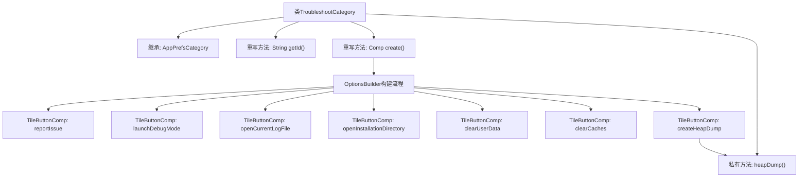

# 基础信息

|      |      |
|------|------|
| 名称 | TroubleshootCategory |
| 编码语言 | .java |
| 代码路径 | xpipe/app/src/main/java/io/xpipe/app/prefs/TroubleshootCategory.java |
| 包名 | io.xpipe.app.prefs |
| 依赖项 | ['io.xpipe.app.comp.Comp', 'io.xpipe.app.comp.base.ModalOverlay', 'io.xpipe.app.comp.base.TileButtonComp', 'io.xpipe.app.core.AppCache', 'io.xpipe.app.core.AppLogs', 'io.xpipe.app.core.AppProperties', 'io.xpipe.app.core.mode.OperationMode', 'io.xpipe.app.core.window.AppDialog', 'io.xpipe.app.issue.ErrorEvent', 'io.xpipe.app.issue.UserReportComp', 'io.xpipe.app.terminal.TerminalLauncher', 'io.xpipe.app.util.DesktopHelper', 'io.xpipe.app.util.FileOpener', 'io.xpipe.app.util.OptionsBuilder', 'io.xpipe.app.util.ThreadHelper', 'io.xpipe.core.process.OsType', 'io.xpipe.core.process.ShellScript', 'io.xpipe.core.store.FileNames', 'io.xpipe.core.util.XPipeInstallation', 'com.sun.management.HotSpotDiagnosticMXBean', 'lombok.SneakyThrows', 'org.apache.commons.io.FileUtils', 'java.lang.management.ManagementFactory', 'java.nio.file.Files', 'javax.management.MBeanServer'] |
| 概述说明 | TroubleshootCategory类提供故障排查选项，包括报告问题、调试模式、日志操作、数据清理和堆转储功能。 |

# 说明

该代码定义了一个名为TroubleshootCategory的类，继承自AppPrefsCategory，用于创建故障排除选项界面。界面包含多个功能按钮：报告问题、启动调试模式、打开当前日志文件、打开安装目录、清除用户数据、清除缓存和创建堆转储。每个按钮触发相应操作，如生成错误报告、执行调试脚本、清理数据或生成内存快照。代码还处理了日志文件操作和用户确认对话框，确保操作安全性和用户友好性。

# 类列表 Class Summary

| 名称   | 类型  | 说明 |
|-------|------|-------------|
| TroubleshootCategory | class | TroubleshootCategory类提供故障排除选项，包括报告问题、调试模式、日志操作、清理数据和生成堆转储。 |

## 类 TroubleshootCategory

|      |      |
|------|------|
| 访问范围 | public |
| 类型 | class |
| 名称 | TroubleshootCategory |
| 说明 | TroubleshootCategory类提供故障排除选项，包括报告问题、调试模式、日志操作、清理数据和生成堆转储。 |

### UML类图

```mermaid
classDiagram
    class AppPrefsCategory {
        <<abstract>>
        +String getId()
        +Comp~?~ create()
    }

    class TroubleshootCategory {
        +String getId()
        +Comp~?~ create()
        -heapDump()
    }

    class OptionsBuilder {
        +addTitle(String title) OptionsBuilder
        +spacer(int size) OptionsBuilder
        +addComp(Comp~?~ comp, Object constraints) OptionsBuilder
        +buildComp() Comp~?~
    }

    class TileButtonComp {
        +TileButtonComp(String title, String desc, String icon, Consumer~Event~ action)
        +grow(boolean horizontal, boolean vertical) TileButtonComp
    }

    class ModalOverlay {
        +of(String title, String content) ModalOverlay
        +withDefaultButtons(Runnable action) ModalOverlay
        +show()
    }

    class ErrorEvent {
        +fromMessage(String msg) ErrorEvent
        +attachment(Path path) ErrorEvent
        +build() ErrorEvent
    }

    class UserReportComp {
        +show(ErrorEvent event)
    }

    class OperationMode {
        +executeAfterShutdown(Runnable action)
        +halt(int code)
    }

    class TerminalLauncher {
        +openDirectFallback(String title, Function~ShellControl, ShellScript~ scriptProvider)
    }

    class ShellScript {
        +ShellScript(String command)
    }

    class FileOpener {
        +openInTextEditor(String path)
    }

    class DesktopHelper {
        +browsePathLocal(Path path)
        +browseFileInDirectory(Path file)
        +getDesktopDirectory() Path
    }

    class AppLogs {
        +isWriteToFile() boolean
        +flush()
        +getSessionLogsDirectory() Path
    }

    class AppCache {
        +clear()
    }

    class AppProperties {
        +getDataDir() Path
    }

    class FileUtils {
        +deleteQuietly(File file)
    }

    TroubleshootCategory --|> AppPrefsCategory : 继承
    TroubleshootCategory --> OptionsBuilder : 创建
    TroubleshootCategory --> TileButtonComp : 创建
    TroubleshootCategory --> ModalOverlay : 使用
    TroubleshootCategory --> ErrorEvent : 使用
    TroubleshootCategory --> UserReportComp : 调用
    TroubleshootCategory --> OperationMode : 调用
    TroubleshootCategory --> TerminalLauncher : 调用
    TroubleshootCategory --> ShellScript : 创建
    TroubleshootCategory --> FileOpener : 调用
    TroubleshootCategory --> DesktopHelper : 调用
    TroubleshootCategory --> AppLogs : 查询
    TroubleshootCategory --> AppCache : 调用
    TroubleshootCategory --> AppProperties : 查询
    TroubleshootCategory --> FileUtils : 调用
    OptionsBuilder --> TileButtonComp : 组合
    ModalOverlay ..> Runnable : 依赖
    TerminalLauncher ..> ShellScript : 依赖
    ErrorEvent ..> Path : 依赖
```

这段代码展示了一个故障排除类别`TroubleshootCategory`的实现，它继承自`AppPrefsCategory`基类。主要功能是通过`OptionsBuilder`构建包含多个操作按钮的界面组件，每个按钮对应不同的故障排除操作，如报告问题、调试模式、日志查看、清理数据等。类图中清晰地展示了核心类之间的继承、组合和依赖关系，包括UI组件构建、文件操作、系统管理等模块的交互。该设计采用建造者模式灵活构建复杂界面，并通过事件驱动机制处理用户操作。

### 内部方法调用关系图

流程图描述：该流程图展示了TroubleshootCategory类的结构，它继承自AppPrefsCategory并重写了getId()和create()方法。create()方法通过OptionsBuilder构建包含多个功能按钮的界面，包括问题报告、调试模式启动、日志文件操作等。每个按钮对应不同的功能实现，其中createHeapDump按钮会调用私有方法heapDump()生成堆转储文件。流程清晰展现了类的方法调用关系和功能模块的组织结构。

### 字段列表 Field List

| 名称  | 类型  | 说明 |
|-------|-------|------|

### 方法列表 Method List

| 名称  | 类型  | 说明 |
|-------|-------|------|
| create | Comp<?> | 创建调试选项面板，包含报告问题、调试模式、日志操作、数据清理等功能。 |
| getId | String | 重写getId方法，返回固定值"troubleshoot"。 |
| heapDump | void | 生成Java堆转储文件并打开所在目录。 |

