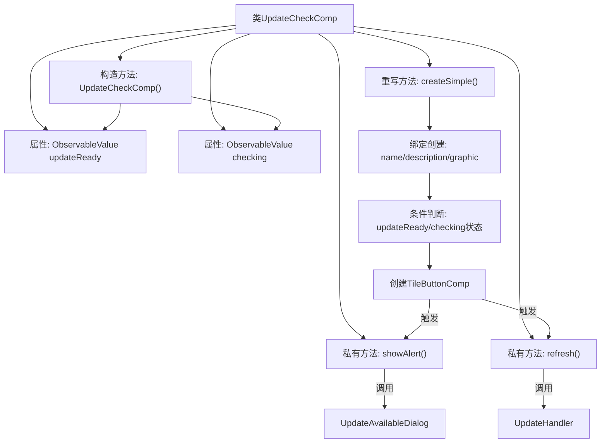

# 基础信息

|      |      |
|------|------|
| 名称 | UpdateCheckComp |
| 编码语言 | .java |
| 代码路径 | xpipe/app/src/main/java/io/xpipe/app/prefs/UpdateCheckComp.java |
| 包名 | io.xpipe.app.prefs |
| 依赖项 | ['io.xpipe.app.comp.SimpleComp', 'io.xpipe.app.comp.base.TileButtonComp', 'io.xpipe.app.core.AppDistributionType', 'io.xpipe.app.core.AppI18n', 'io.xpipe.app.update.UpdateAvailableDialog', 'io.xpipe.app.util.PlatformThread', 'io.xpipe.app.util.ThreadHelper', 'javafx.beans.binding.Bindings', 'javafx.beans.value.ObservableValue', 'javafx.scene.layout.Region'] |
| 概述说明 | 更新检查组件，包含状态监测、刷新和弹窗功能，支持多语言和不同分发类型。 |

# 说明

该代码定义了一个名为UpdateCheckComp的组件类，用于检查和处理应用程序更新。该类包含两个主要状态：updateReady表示更新已准备就绪，checking表示正在检查更新。提供了showAlert和refresh方法分别用于显示更新提示和执行更新检查。createSimple方法创建了一个交互式区域，根据当前状态显示不同的文本描述和图标，包括检查中、更新就绪和检查更新三种状态。该组件还支持便携式和非便携式两种分发类型的差异处理，并通过绑定机制实现动态UI更新。

# 类列表 Class Summary

| 名称   | 类型  | 说明 |
|-------|------|-------------|
| UpdateCheckComp | class | 更新检查组件，含状态监测和刷新功能，支持多语言显示。 |

## 类 UpdateCheckComp

|      |      |
|------|------|
| 访问范围 | public |
| 类型 | class |
| 名称 | UpdateCheckComp |
| 说明 | 更新检查组件，含状态监测和刷新功能，支持多语言显示。 |

### UML类图

```mermaid
classDiagram
    class SimpleComp {
        <<abstract>>
        +createSimple() Region
    }

    class UpdateCheckComp {
        -ObservableValue~Boolean~ updateReady
        -ObservableValue~Boolean~ checking
        +UpdateCheckComp()
        -showAlert()
        -refresh()
        +createSimple() Region
    }

    class AppDistributionType {
        <<enumeration>>
        PORTABLE
        +get() AppDistributionType
        +getUpdateHandler() UpdateHandler
    }

    class UpdateHandler {
        <<Interface>>
        +getPreparedUpdate() ObservableValue~UpdateInfo~
        +getBusy() ObservableValue~Boolean~
        +refreshUpdateCheckSilent(boolean, boolean)
        +refreshUpdateCheck(boolean, boolean)
        +prepareUpdate()
        +supportsDirectInstallation() boolean
    }

    class TileButtonComp {
        +TileButtonComp(ObservableValue~String~, ObservableValue~String~, ObservableValue~String~, EventHandler~ActionEvent~)
        +styleClass(String) TileButtonComp
        +disable(ObservableValue~Boolean~) TileButtonComp
        +createRegion() Region
    }

    class ThreadHelper {
        <<Utility>>
        +runFailableAsync(Runnable)
    }

    class PlatformThread {
        <<Utility>>
        +sync(ObservableValue~T~) ObservableValue~T~
    }

    class Bindings {
        <<Utility>>
        +createBooleanBinding(Callable~Boolean~, ObservableValue~*~...) ObservableValue~Boolean~
        +createStringBinding(Callable~String~, ObservableValue~*~...) ObservableValue~String~
        +createObjectBinding(Callable~T~, ObservableValue~*~...) ObservableValue~T~
    }

    class AppI18n {
        <<Utility>>
        +get(String) String
        +activeLanguage() ObservableValue~String~
    }

    class UpdateAvailableDialog {
        <<Utility>>
        +showIfNeeded(boolean)
    }

    UpdateCheckComp --> SimpleComp : 继承
    UpdateCheckComp --> AppDistributionType : 查询
    UpdateCheckComp --> UpdateHandler : 调用
    UpdateCheckComp --> TileButtonComp : 组合
    UpdateCheckComp --> ThreadHelper : 调用
    UpdateCheckComp --> PlatformThread : 调用
    UpdateCheckComp --> Bindings : 调用
    UpdateCheckComp --> AppI18n : 调用
    UpdateCheckComp --> UpdateAvailableDialog : 调用
    AppDistributionType --> UpdateHandler : 聚合
```

类图描述：该图展示了UpdateCheckComp类继承自SimpleComp，并通过组合和依赖多个工具类实现更新检查功能。核心包括与AppDistributionType枚举交互获取UpdateHandler接口实例，使用Bindings创建动态绑定，通过TileButtonComp构建UI组件，并借助ThreadHelper和PlatformThread处理异步操作。整体结构清晰地分离了业务逻辑、UI构建和工具方法，体现了模块化设计思想。

### 内部方法调用关系图

该流程图展示了UpdateCheckComp类的核心结构和逻辑流程。类通过构造方法初始化两个关键状态属性updateReady和checking，createSimple()方法作为核心功能实现了动态UI构建。流程包含三个关键分支：1) 构造时建立双向数据绑定；2) 根据更新状态动态生成界面元素；3) 用户交互触发更新检查或警报显示。所有异步操作均通过ThreadHelper处理，状态变更通过ObservableValue实现响应式更新，体现了典型的MVVM模式实现。

### 字段列表 Field List

| 名称  | 类型  | 说明 |
|-------|-------|------|
| updateReady | ObservableValue<Boolean> | 私有可观察布尔值updateReady |
| checking | ObservableValue<Boolean> | 私有不可变布尔可观察值checking |

### 方法列表 Method List

| 名称  | 类型  | 说明 |
|-------|-------|------|
| createSimple | Region | 创建更新按钮，根据状态显示不同文本和图标，支持检查更新和安装。 |
| showAlert | void | 异步检查更新并显示可用更新对话框。 |
| refresh | void | 异步刷新并准备更新检查 |

