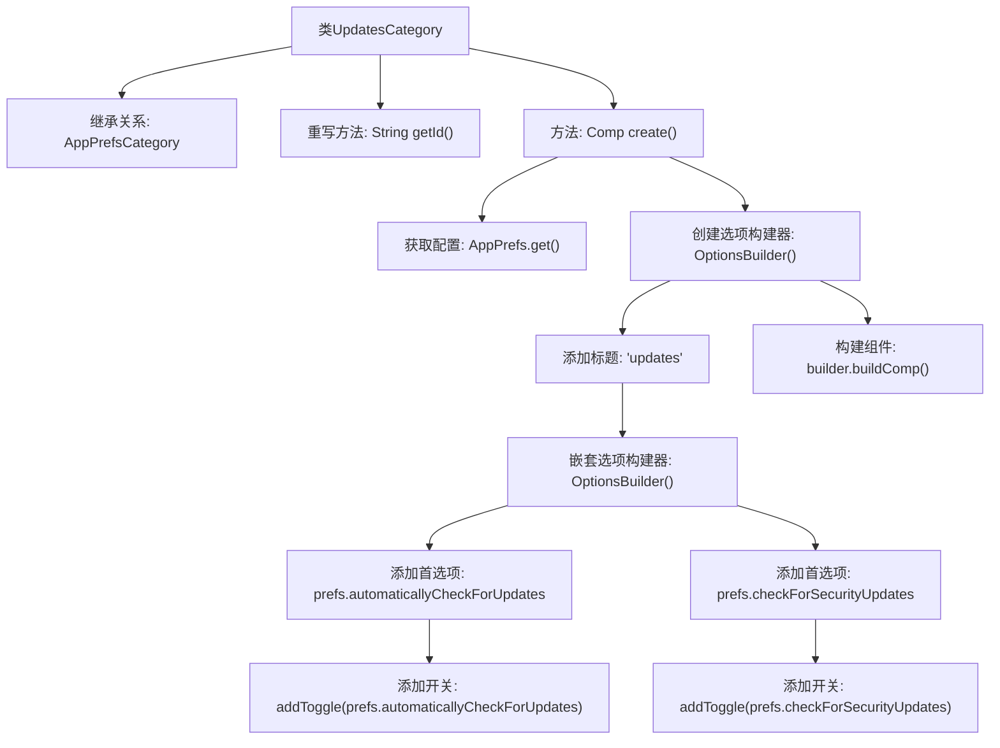

# 基础信息

|      |      |
|------|------|
| 名称 | UpdatesCategory |
| 编码语言 | .java |
| 代码路径 | xpipe/app/src/main/java/io/xpipe/app/prefs/UpdatesCategory.java |
| 包名 | io.xpipe.app.prefs |
| 依赖项 | ['io.xpipe.app.comp.Comp', 'io.xpipe.app.util.OptionsBuilder'] |
| 概述说明 | UpdatesCategory类扩展AppPrefsCategory，创建包含自动检查和安全性更新选项的界面。 |

# 说明

该代码定义了一个名为UpdatesCategory的类，继承自AppPrefsCategory。该类主要负责处理应用程序更新相关的偏好设置。它实现了两个关键方法：getId返回字符串"updates"作为标识符；create方法构建了一个包含两个开关选项的界面，分别用于控制自动检查更新和检查安全更新的功能。通过OptionsBuilder构建选项界面，最终返回一个组件对象。整个类简洁地封装了更新相关的用户偏好设置逻辑。

# 类列表 Class Summary

| 名称   | 类型  | 说明 |
|-------|------|-------------|
| UpdatesCategory | class | UpdatesCategory类扩展AppPrefsCategory，创建包含自动检查和安全性更新选项的UI组件。 |


## 类 UpdatesCategory

|      |      |
|------|------|
| 访问范围 | public |
| 类型 | class |
| 名称 | UpdatesCategory |
| 说明 | UpdatesCategory类扩展AppPrefsCategory，创建包含自动检查和安全性更新选项的UI组件。 |


### UML类图

```mermaid
classDiagram
    class AppPrefsCategory {
        <<abstract>>
        +String getId()
        +Comp~?~ create()
    }

    class UpdatesCategory {
        +String getId()
        +Comp~?~ create()
    }

    class OptionsBuilder {
        +OptionsBuilder addTitle(String title)
        +OptionsBuilder sub(OptionsBuilder subBuilder)
        +OptionsBuilder pref(Pref~?~ pref)
        +OptionsBuilder addToggle(Pref~Boolean~ pref)
        +Comp~?~ buildComp()
    }

    class AppPrefs {
        +Pref~Boolean~ automaticallyCheckForUpdates
        +Pref~Boolean~ checkForSecurityUpdates
        +static AppPrefs get()
    }

    class Pref~T~ {
        <<Interface>>
    }

    AppPrefsCategory <|-- UpdatesCategory : 继承
    UpdatesCategory --> AppPrefs : 依赖 : 获取配置项
    UpdatesCategory --> OptionsBuilder : 依赖 : 构建选项界面
    OptionsBuilder --> Pref : 依赖 : 操作配置项
```

这段类图展示了更新配置界面的实现结构。UpdatesCategory继承自抽象基类AppPrefsCategory，通过AppPrefs获取用户配置项，使用OptionsBuilder构建包含自动检查更新和安全更新开关的界面组件。图中清晰呈现了类间的继承关系（UpdatesCategory→AppPrefsCategory）和依赖关系（与AppPrefs、OptionsBuilder的交互），以及泛型接口Pref~T~在配置项管理中的应用。整个设计采用建造者模式灵活组装界面元素，体现了配置界面的模块化实现方式。


### 内部方法调用关系图



该流程图展示了UpdatesCategory类的结构和工作流程。该类继承自AppPrefsCategory，重写了getId方法返回"updates"标识符。核心方法create()通过OptionsBuilder构建配置界面：先添加标题，再嵌套子选项构建器来添加两个开关选项（自动检查更新和安全更新），最后返回构建好的组件。流程清晰展现了配置界面的层级结构和构建过程。

### 字段列表 Field List

| 名称  | 类型  | 说明 |
|-------|-------|------|

### 方法列表 Method List

| 名称  | 类型  | 说明 |
|-------|-------|------|
| create | Comp<?> | 创建更新选项组件，包含自动检查和安全性更新开关。 |
| getId | String | 重写getId方法，返回固定值"updates"。 |


