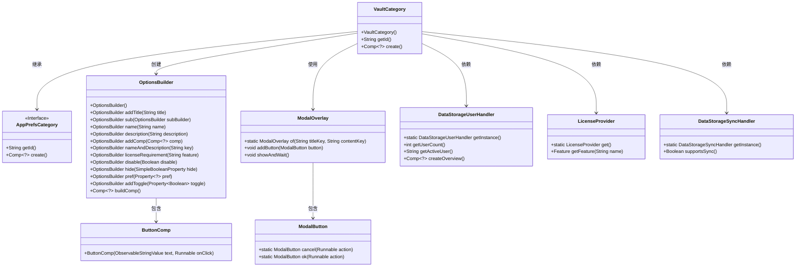
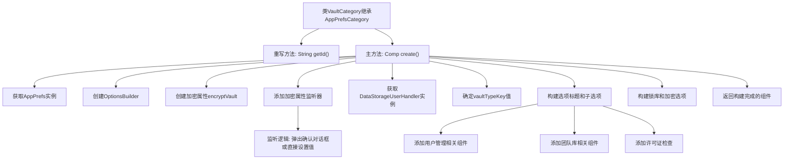

# 基础信息

|      |      |
|------|------|
| 名称 | VaultCategory |
| 编码语言 | .java |
| 代码路径 | xpipe/app/src/main/java/io/xpipe/app/prefs/VaultCategory.java |
| 包名 | io.xpipe.app.prefs |
| 依赖项 | ['io.xpipe.app.comp.Comp', 'io.xpipe.app.comp.base.ButtonComp', 'io.xpipe.app.comp.base.ModalButton', 'io.xpipe.app.comp.base.ModalOverlay', 'io.xpipe.app.core.AppI18n', 'io.xpipe.app.core.window.AppDialog', 'io.xpipe.app.storage.DataStorageSyncHandler', 'io.xpipe.app.storage.DataStorageUserHandler', 'io.xpipe.app.util.LicenseProvider', 'io.xpipe.app.util.OptionsBuilder', 'javafx.application.Platform', 'javafx.beans.property.SimpleBooleanProperty', 'lombok.SneakyThrows'] |
| 概述说明 | VaultCategory类扩展AppPrefsCategory，管理保险库设置，包括加密、用户类型和团队功能，支持同步和许可控制。 |

# 说明

该代码定义了一个名为VaultCategory的类，继承自AppPrefsCategory，用于管理保险库相关设置。主要功能包括：创建保险库配置界面，处理加密选项切换（含确认对话框），根据用户数量显示不同类型（默认/个人/团队）的保险库信息，管理用户界面显示逻辑，以及添加休眠锁定和全局加密的开关选项。界面构建使用OptionsBuilder，包含标题、子选项、许可证校验和条件显示控制。

# 类列表 Class Summary

| 名称   | 类型  | 说明 |
|-------|------|-------------|
| VaultCategory | class | VaultCategory类继承AppPrefsCategory，管理保险库设置，包括加密、用户类型和团队功能。 |

## 类 VaultCategory

|      |      |
|------|------|
| 访问范围 | public |
| 类型 | class |
| 名称 | VaultCategory |
| 说明 | VaultCategory类继承AppPrefsCategory，管理保险库设置，包括加密、用户类型和团队功能。 |

### UML类图

这段代码展示了一个VaultCategory类，它继承自AppPrefsCategory接口，主要用于创建保险库相关的配置界面。该类通过OptionsBuilder构建复杂的选项布局，包含加密开关、用户管理、团队保险库等功能模块。代码中涉及多种设计模式，包括建造者模式（OptionsBuilder）、工厂方法（ModalButton）和单例模式（DataStorageUserHandler）。核心功能包括动态UI构建、用户交互处理和许可证验证，通过观察者模式实现属性变更监听。

### 内部方法调用关系图

这段代码是VaultCategory类的实现，主要功能是创建保险库设置界面。流程从获取应用偏好设置开始，然后构建选项界面，包括加密开关、用户类型判断、团队库管理和同步功能等。关键点包括加密属性的双向绑定、用户类型判断逻辑、以及根据不同条件动态显示/隐藏界面元素。最后将所有选项组合成完整的设置组件返回。整个过程体现了复杂的业务逻辑和条件判断，特别是对用户状态和许可证的检查。

### 字段列表 Field List

| 名称  | 类型  | 说明 |
|-------|-------|------|

### 方法列表 Method List

| 名称  | 类型  | 说明 |
|-------|-------|------|
| getId | String | 重写getId方法，返回字符串"vault"。 |
| create | Comp<?> | 创建组件方法，含加密选项、用户管理和团队功能，基于偏好设置构建。 |

