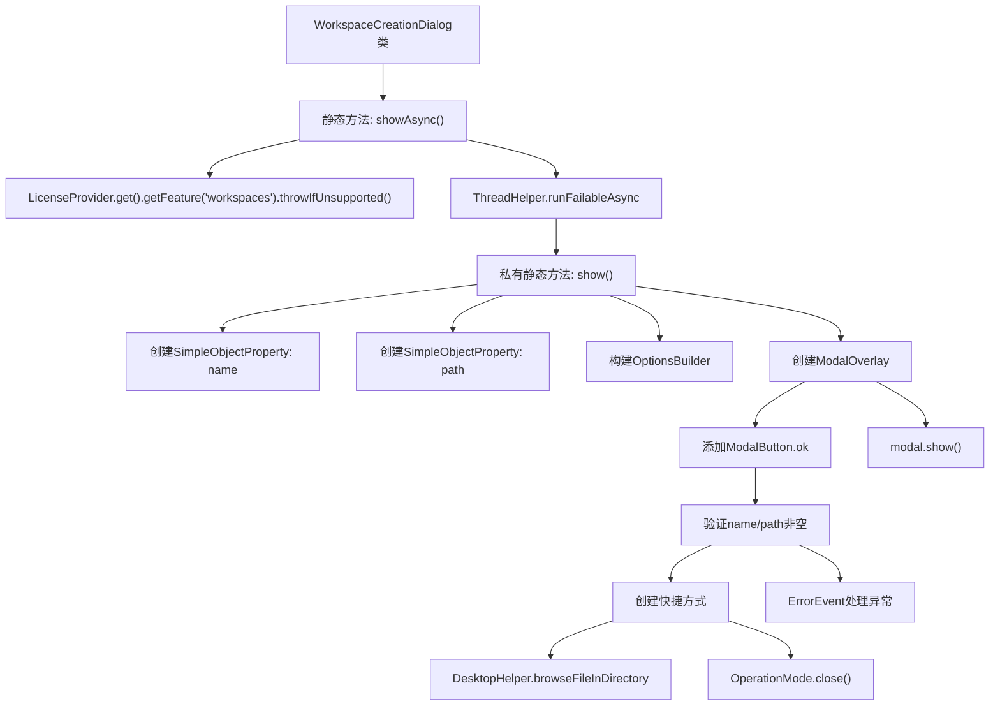

# 基础信息

|      |      |
|------|------|
| 名称 | WorkspaceCreationDialog |
| 编码语言 | .java |
| 代码路径 | xpipe/app/src/main/java/io/xpipe/app/prefs/WorkspaceCreationDialog.java |
| 包名 | io.xpipe.app.prefs |
| 依赖项 | ['io.xpipe.app.comp.base.ModalButton', 'io.xpipe.app.comp.base.ModalOverlay', 'io.xpipe.app.core.AppFontSizes', 'io.xpipe.app.core.AppProperties', 'io.xpipe.app.core.mode.OperationMode', 'io.xpipe.app.issue.ErrorEvent', 'io.xpipe.app.util', 'io.xpipe.core.process.OsType', 'io.xpipe.core.util.XPipeInstallation', 'javafx.beans.property.SimpleObjectProperty'] |
| 概述说明 | 异步显示工作空间创建对话框，验证许可后收集名称和路径，创建快捷方式并关闭操作模式。 |

# 说明

该代码描述了一个工作空间创建对话框的实现。主要功能包括异步显示对话框，收集用户输入的工作空间名称和路径，并根据不同操作系统创建对应的桌面快捷方式。流程包含验证许可证、构建UI界面、处理用户确认操作，以及在创建快捷方式后关闭当前操作模式。错误处理机制会捕获并报告异常。

# 类列表 Class Summary

| 名称   | 类型  | 说明 |
|-------|------|-------------|
| WorkspaceCreationDialog | class | 异步显示工作空间创建对话框，验证许可后收集名称和路径，创建快捷方式并关闭操作模式。 |

## 类 WorkspaceCreationDialog

|      |      |
|------|------|
| 访问范围 | public |
| 类型 | class |
| 名称 | WorkspaceCreationDialog |
| 说明 | 异步显示工作空间创建对话框，验证许可后收集名称和路径，创建快捷方式并关闭操作模式。 |

### UML类图

```mermaid
classDiagram
    class WorkspaceCreationDialog {
        +showAsync()
        -show()
    }

    class LicenseProvider {
        <<Interface>>
        +get(): LicenseProvider
        +getFeature(String featureName): Feature
    }

    class Feature {
        <<Interface>>
        +throwIfUnsupported()
    }

    class ThreadHelper {
        +runFailableAsync(Runnable task)
    }

    class SimpleObjectProperty~T~ {
        +SimpleObjectProperty(T initialValue)
        +get(): T
    }

    class AppProperties {
        +get(): AppProperties
        +getDataDir(): Path
        +isStaging(): boolean
    }

    class OptionsBuilder {
        +nameAndDescription(String key): OptionsBuilder
        +addString(SimpleObjectProperty~String~ prop): OptionsBuilder
        +addPath(SimpleObjectProperty~Path~ prop): OptionsBuilder
        +buildComp(): Component
    }

    class Component {
        +prefWidth(double width): Component
        +apply(Function~Component, Component~ func): Component
    }

    class ModalOverlay {
        +of(String title, Component content): ModalOverlay
        +addButton(ModalButton button)
        +show()
    }

    class ModalButton {
        +ok(Runnable action): ModalButton
    }

    class OsType {
        <<Interface>>
        +getLocal(): OsType
    }

    class XPipeInstallation {
        +getCurrentInstallationBasePath(): Path
        +getDaemonExecutablePath(OsType os): Path
        +getRelativeCliExecutablePath(OsType os): Path
    }

    class DesktopShortcuts {
        +create(String execPath, String args, String name): Path
    }

    class DesktopHelper {
        +browseFileInDirectory(Path file)
    }

    class OperationMode {
        +close()
    }

    class ErrorEvent {
        +fromThrowable(Throwable t): ErrorEvent
        +handle()
    }

    WorkspaceCreationDialog --> LicenseProvider : 获取许可证
    WorkspaceCreationDialog --> ThreadHelper : 异步执行
    WorkspaceCreationDialog --> SimpleObjectProperty : 存储名称和路径
    WorkspaceCreationDialog --> AppProperties : 获取应用属性
    WorkspaceCreationDialog --> OptionsBuilder : 构建选项界面
    WorkspaceCreationDialog --> ModalOverlay : 显示模态对话框
    ModalOverlay --> ModalButton : 添加确认按钮
    WorkspaceCreationDialog --> OsType : 检测操作系统
    WorkspaceCreationDialog --> XPipeInstallation : 获取安装路径
    WorkspaceCreationDialog --> DesktopShortcuts : 创建快捷方式
    WorkspaceCreationDialog --> DesktopHelper : 浏览文件
    WorkspaceCreationDialog --> OperationMode : 关闭操作模式
    WorkspaceCreationDialog --> ErrorEvent : 处理错误
```

这段代码实现了一个工作空间创建对话框，主要功能包括：异步显示对话框、收集用户输入的工作空间名称和路径、根据操作系统类型创建对应的桌面快捷方式，并处理可能出现的错误。代码通过多个辅助类协作完成功能，包括许可证检查、异步任务执行、UI构建、操作系统适配等模块，体现了良好的模块化设计。

### 内部方法调用关系图

该流程图展示了WorkspaceCreationDialog类的工作流程。首先通过showAsync()异步调用核心方法，进行许可证验证后进入show()方法。该方法创建表单属性，构建模态对话框，添加确认按钮逻辑。确认时验证输入并创建系统快捷方式，最后处理结果或异常。整个过程体现了从界面构建到系统操作的完整链条，特别注意了异步调用和跨平台处理的实现细节。

### 字段列表 Field List

| 名称  | 类型  | 说明 |
|-------|-------|------|

### 方法列表 Method List

| 名称  | 类型  | 说明 |
|-------|-------|------|
| show | void | 创建新工作区对话框，设置名称和路径，生成桌面快捷方式并处理异常。 |
| showAsync | void | 异步显示功能，检查许可后运行。 |

