# 基础信息

|      |      |
|------|------|
| 名称 | WorkspacesCategory |
| 编码语言 | .java |
| 代码路径 | xpipe/app/src/main/java/io/xpipe/app/prefs/WorkspacesCategory.java |
| 包名 | io.xpipe.app.prefs |
| 依赖项 | ['io.xpipe.app.comp.Comp', 'io.xpipe.app.comp.base.ButtonComp', 'io.xpipe.app.core.AppI18n', 'io.xpipe.app.util.LicenseProvider', 'io.xpipe.app.util.OptionsBuilder'] |
| 概述说明 | WorkspacesCategory类扩展AppPrefsCategory，管理创建工作区选项，需许可证支持。 |

# 说明

这段代码描述了一个名为WorkspacesCategory的类，继承自AppPrefsCategory。该类主要负责管理工作区相关的配置选项。它重写了getId方法返回标识符"workspaces"，并通过create方法构建一个包含标题为"manageWorkspaces"的选项界面。界面中有一个子选项用于添加工作区，需要"workspaces"许可证支持，包含一个触发WorkspaceCreationDialog对话框的按钮。如果许可证不支持该功能，整个选项会被禁用。

# 类列表 Class Summary

| 名称   | 类型  | 说明 |
|-------|------|-------------|
| WorkspacesCategory | class | WorkspacesCategory类扩展AppPrefsCategory，管理创建工作区选项，需许可证支持。 |

## 类 WorkspacesCategory

|      |      |
|------|------|
| 访问范围 | public |
| 类型 | class |
| 名称 | WorkspacesCategory |
| 说明 | WorkspacesCategory类扩展AppPrefsCategory，管理创建工作区选项，需许可证支持。 |

### UML类图

```mermaid
classDiagram
    class AppPrefsCategory {
        <<abstract>>
        +String getId()*
        +Comp~?~ create()*
    }
    
    class WorkspacesCategory {
        +String getId()
        +Comp~?~ create()
    }
    
    class OptionsBuilder {
        +OptionsBuilder addTitle(String title)
        +OptionsBuilder sub(OptionsBuilder subBuilder)
        +OptionsBuilder nameAndDescription(String nameDesc)
        +OptionsBuilder licenseRequirement(String feature)
        +OptionsBuilder addComp(Comp~?~ comp)
        +OptionsBuilder disable(boolean disabled)
        +Comp~?~ buildComp()
    }
    
    class ButtonComp {
        +ButtonComp(Observable~String~ text, Runnable onClick)
    }
    
    class WorkspaceCreationDialog {
        <<static>>
        +void showAsync()
    }
    
    class LicenseProvider {
        <<static>>
        +LicenseProvider get()
        +Feature getFeature(String name)
    }
    
    class Feature {
        +boolean isSupported()
    }
    
    AppPrefsCategory <|-- WorkspacesCategory
    WorkspacesCategory --> OptionsBuilder : 创建
    OptionsBuilder --> ButtonComp : 包含
    OptionsBuilder --> WorkspaceCreationDialog : 调用
    WorkspacesCategory --> LicenseProvider : 检查许可
    LicenseProvider --> Feature : 获取
```

这段代码展示了一个工作空间管理界面的实现结构。WorkspacesCategory继承自抽象类AppPrefsCategory，负责创建工作空间管理界面，包含添加工作空间的按钮组件。通过OptionsBuilder构建界面元素，使用LicenseProvider检查功能许可，并调用WorkspaceCreationDialog异步显示创建对话框。类间关系清晰展示了从界面构建到功能实现的完整流程，体现了模块化设计和依赖注入的思想。

### 内部方法调用关系图

这段代码展示了一个继承自AppPrefsCategory的WorkspacesCategory类，主要用于创建工作区管理界面的配置选项。流程从重写create()方法开始，通过链式调用OptionsBuilder构建界面元素，包括添加标题、嵌套选项组、按钮组件，并根据许可证状态设置禁用条件，最终返回构建好的组件。整个过程体现了GUI配置的层级结构和条件控制逻辑。

### 字段列表 Field List

| 名称  | 类型  | 说明 |
|-------|-------|------|

### 方法列表 Method List

| 名称  | 类型  | 说明 |
|-------|-------|------|
| create | Comp<?> | 创建管理工作区选项，包含添加工作区按钮，需许可证支持。 |
| getId | String | 重写getId方法，返回"workspaces"。 |

