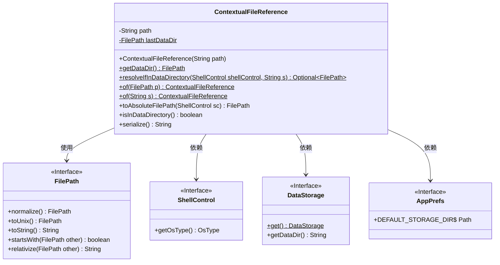
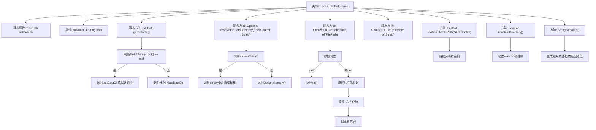

# 基础信息

|      |      |
|------|------|
| 名称 | ContextualFileReference |
| 编码语言 | .java |
| 代码路径 | xpipe/app/src/main/java/io/xpipe/app/storage/ContextualFileReference.java |
| 包名 | io.xpipe.app.storage |
| 依赖项 | ['io.xpipe.app.prefs.AppPrefs', 'io.xpipe.core.process.ShellControl', 'io.xpipe.core.store.FilePath', 'lombok.AccessLevel', 'lombok.AllArgsConstructor', 'lombok.NonNull', 'lombok.Value', 'java.util.Optional', 'java.util.regex.Matcher'] |
| 概述说明 | ContextualFileReference类处理文件路径，支持数据目录解析和序列化。 |

# 说明

该内容描述了一个名为ContextualFileReference的Java类，主要用于处理文件路径的上下文引用。类包含私有构造方法和静态工具方法，用于解析和转换文件路径。核心功能包括获取数据目录路径、解析包含特殊标记<DATA>的路径、将路径转换为绝对路径，并判断路径是否位于数据目录内。类还提供了路径序列化和反序列化功能，支持处理用户主目录(~)替换和路径规范化操作。所有方法均围绕文件路径的上下文处理展开，确保路径在不同环境下正确解析和转换。

# 类列表 Class Summary

| 名称   | 类型  | 说明 |
|-------|------|-------------|
| ContextualFileReference | class | ContextualFileReference类处理文件路径，支持数据目录解析和序列化。 |

## 类 ContextualFileReference

|      |      |
|------|------|
| 访问范围 | @AllArgsConstructor(access = AccessLevel.PRIVATE);@Value;public |
| 类型 | class |
| 名称 | ContextualFileReference |
| 说明 | ContextualFileReference类处理文件路径，支持数据目录解析和序列化。 |

### UML类图

这段代码定义了一个`ContextualFileReference`类，用于处理与数据目录相关的文件路径操作。该类提供了静态方法来解析路径字符串、检查路径是否在数据目录中、序列化路径等功能。它依赖于`FilePath`接口处理路径操作，`ShellControl`接口获取操作系统信息，`DataStorage`接口获取数据存储目录，以及`AppPrefs`接口获取默认存储目录配置。类图清晰地展示了这些依赖关系和类的成员结构。

### 内部方法调用关系图

这段流程图描述了ContextualFileReference类的完整结构，重点展示了其核心数据处理逻辑。该类主要用于管理文件路径的上下文引用，包含路径标准化、数据目录解析、占位符替换等关键功能。静态方法getDataDir()实现了数据目录的动态获取与缓存，而of()方法族提供了灵活的路径转换机制。serialize()和toAbsoluteFilePath()方法则分别处理路径的序列化和系统适配转换，整体构成一个高效的文件路径上下文管理系统。

### 字段列表 Field List

| 名称  | 类型  | 说明 |
|-------|-------|------|
| path | String | 非空字符串路径 |
| lastDataDir | FilePath | 私有静态文件路径变量lastDataDir |

### 方法列表 Method List

| 名称  | 类型  | 说明 |
|-------|-------|------|
| getDataDir | FilePath | 获取数据目录路径，优先使用存储实例路径，否则返回默认路径或上次路径。 |
| of | ContextualFileReference | 静态方法`of`处理文件路径，替换`~`和`<DATA>`为实际路径，返回新引用。 |
| serialize | String | Java方法：序列化路径，若在数据目录内则返回相对路径，否则返回原路径。 |
| isInDataDirectory | boolean | 检查数据是否在目录中 |
| toAbsoluteFilePath | FilePath | 方法将路径中的斜杠替换为系统文件分隔符，返回绝对路径。 |
| resolveIfInDataDirectory | Optional<FilePath> | 检查路径是否以"<DATA>"开头，是则返回绝对路径，否则返回空。 |
| of | ContextualFileReference | 静态方法，根据字符串路径创建文件引用，支持空值。 |

