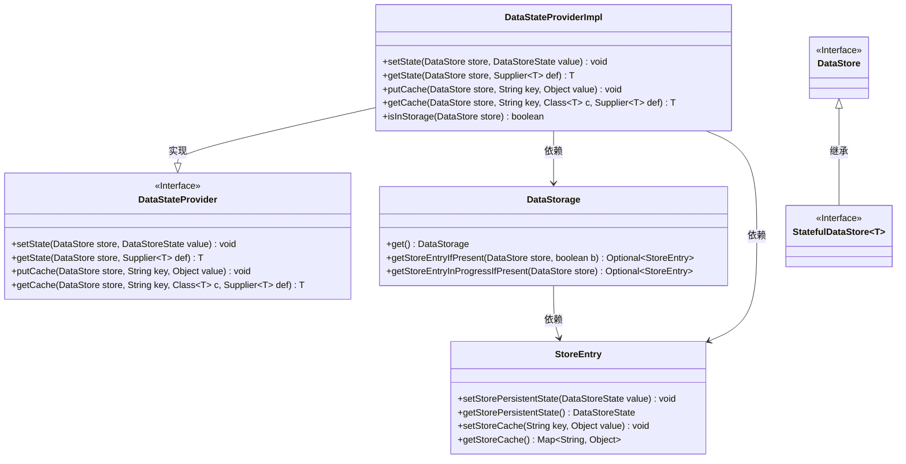
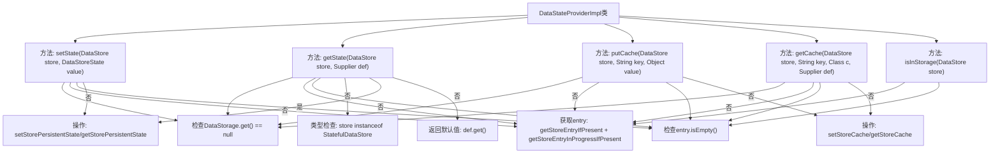

# 基础信息

|      |      |
|------|------|
| 名称 | DataStateProviderImpl |
| 编码语言 | .java |
| 代码路径 | xpipe/app/src/main/java/io/xpipe/app/storage/DataStateProviderImpl.java |
| 包名 | io.xpipe.app.storage |
| 依赖项 | ['io.xpipe.core.store.DataStore', 'io.xpipe.core.store.DataStoreState', 'io.xpipe.core.store.StatefulDataStore', 'io.xpipe.core.util.DataStateProvider', 'java.util.function.Supplier'] |
| 概述说明 | DataStateProviderImpl实现数据存储状态和缓存的读写操作。 |

# 说明

DataStateProviderImpl类继承自DataStateProvider，实现了数据状态和缓存的存取功能。setState方法检查DataStorage是否存在，获取存储条目并设置持久状态。getState方法获取存储条目的持久状态，若不存在则使用默认值。putCache方法将键值对存入缓存。getCache方法获取缓存值，若不存在则使用默认值。isInStorage方法检查存储条目是否存在。所有方法均处理了DataStorage为空或条目不存在的情况。

# 类列表 Class Summary

| 名称   | 类型  | 说明 |
|-------|------|-------------|
| DataStateProviderImpl | class | DataStateProviderImpl实现数据存储状态和缓存的读写操作。 |

## 类 DataStateProviderImpl

|      |      |
|------|------|
| 访问范围 | public |
| 类型 | class |
| 名称 | DataStateProviderImpl |
| 说明 | DataStateProviderImpl实现数据存储状态和缓存的读写操作。 |

### UML类图

这段代码展示了一个数据状态提供者实现类(DataStateProviderImpl)及其相关类的关系。DataStateProviderImpl实现了DataStateProvider接口，主要功能包括设置/获取数据存储状态、操作缓存数据以及检查存储状态。它依赖于DataStorage单例来获取StoreEntry，通过StoreEntry来操作持久化状态和缓存数据。StatefulDataStore是DataStore的一个特殊子接口，用于标记具有状态的数据存储。整个设计采用了接口隔离和依赖抽象的原则，通过Optional处理空值情况，并支持泛型类型安全操作。

### 内部方法调用关系图

该流程图展示了DataStateProviderImpl类的核心方法调用流程，重点描述了数据存储状态管理和缓存操作的控制逻辑。所有方法都遵循相似的验证模式：先检查DataStorage可用性，再获取存储条目，最后执行相应操作。其中getState方法包含额外的类型安全检查，而缓存相关方法则采用惰性初始化策略。整体结构体现了防御性编程思想，通过多重验证确保操作安全性。

### 字段列表 Field List

| 名称  | 类型  | 说明 |
|-------|-------|------|

### 方法列表 Method List

| 名称  | 类型  | 说明 |
|-------|-------|------|
| putCache | void | 重写putCache方法：检查存储状态，获取条目并设置缓存。 |
| getState | T | 获取存储状态，若不存在则返回默认值。 |
| setState | void | 重写setState方法：检查DataStorage存在性，获取存储条目并更新状态。 |
| getCache | T | 方法从缓存获取数据，若无则使用默认值并缓存。 |
| isInStorage | boolean | 检查数据存储中是否存在指定条目。 |

