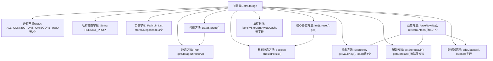

# 基础信息

|      |      |
|------|------|
| 名称 | DataStorage |
| 编码语言 | .java |
| 代码路径 | xpipe/app/src/main/java/io/xpipe/app/storage/DataStorage.java |
| 包名 | io.xpipe.app.storage |
| 依赖项 | ['io.xpipe.app.comp.store.StoreSortMode', 'io.xpipe.app.core.AppProperties', 'io.xpipe.app.ext.LocalStore', 'io.xpipe.app.ext.NameableStore', 'io.xpipe.app.issue.ErrorEvent', 'io.xpipe.app.issue.TrackEvent', 'io.xpipe.app.util.FixedHierarchyStore', 'io.xpipe.app.util.ThreadHelper', 'io.xpipe.core.store.DataStore', 'io.xpipe.core.store.FixedChildStore', 'io.xpipe.core.store.StorePath', 'javafx.util.Pair', 'lombok.Getter', 'lombok.NonNull', 'lombok.Setter', 'lombok.SneakyThrows', 'java.nio.file.Path', 'java.time.Instant', 'java.util', 'java.util.concurrent.ConcurrentHashMap', 'java.util.concurrent.CopyOnWriteArrayList', 'java.util.stream.Collectors', 'java.util.stream.Stream', 'javax.crypto.SecretKey'] |
| 概述说明 | 数据存储类，管理连接、脚本和身份的分类与条目操作。 |

# 说明

DataStorage是一个抽象类，用于管理数据存储的目录结构、分类和条目。它定义了多个预置分类的UUID，如所有连接、脚本和身份的分类。类中包含存储目录的路径管理方法，支持持久化和非持久化存储模式。提供了对存储条目和分类的增删改查操作，包括条目更新、分类配置修改、父子关系管理等。类中还实现了条目同步功能，支持本地和远程同步。通过监听器机制通知存储变更事件，维护条目和分类的缓存状态，确保数据一致性和高效访问。

# 类列表 Class Summary

| 名称   | 类型  | 说明 |
|-------|------|-------------|
| DataStorage | class | 抽象类DataStorage管理数据存储目录、分类和条目，提供增删改查及同步功能。 |

## 类 DataStorage

|      |      |
|------|------|
| 访问范围 | public abstract |
| 类型 | class |
| 名称 | DataStorage |
| 说明 | 抽象类DataStorage管理数据存储目录、分类和条目，提供增删改查及同步功能。 |

### UML类图

```mermaid
classDiagram
    class DataStorage {
        <<abstract>>
        +UUID ALL_CONNECTIONS_CATEGORY_UUID
        +UUID ALL_SCRIPTS_CATEGORY_UUID
        +UUID PREDEFINED_SCRIPTS_CATEGORY_UUID
        +UUID CUSTOM_SCRIPTS_CATEGORY_UUID
        +UUID DEFAULT_CATEGORY_UUID
        +UUID LOCAL_ID
        +UUID ALL_IDENTITIES_CATEGORY_UUID
        +UUID LOCAL_IDENTITIES_CATEGORY_UUID
        +UUID SYNCED_IDENTITIES_CATEGORY_UUID
        +Path getStorageDirectory()
        -String PERSIST_PROP
        -static DataStorage INSTANCE
        #Path dir
        #List~DataStoreCategory~ storeCategories
        #Map~DataStoreEntry, DataStoreEntry~ storeEntries
        #Set~DataStoreEntry~ storeEntriesSet
        #List~StorageListener~ listeners
        -Map~DataStoreEntry, DataStoreEntry~ storeEntriesInProgress
        #boolean loaded
        #DataStoreCategory selectedCategory
        -Map~DataStore, DataStoreEntry~ identityStoreEntryMapCache
        -Map~DataStore, DataStoreEntry~ storeEntryMapCache
        +DataStorage()
        -static boolean shouldPersist()
        +static void init()
        +static void reset()
        +static DataStorage get()
        +abstract SecretKey getVaultKey()
        +DataStoreCategory getDefaultConnectionsCategory()
        +DataStoreCategory getAllConnectionsCategory()
        +DataStoreCategory getAllScriptsCategory()
        +DataStoreCategory getAllIdentitiesCategory()
        +void forceRewrite()
        -void dispose()
        #void setupBuiltinCategories()
        +Path getStorageDir()
        #Path getStoresDir()
        +Path getDataDir()
        #Path getCategoriesDir()
        +void addListener(StorageListener l)
        +abstract void load()
        +abstract void saveAsync()
        +abstract void save(boolean dispose)
        +abstract boolean supportsSync()
        +boolean shouldSync(DataStoreCategory category)
        +boolean shouldSync(DataStoreEntry entry)
        #void refreshEntries()
        +void updateEntry(DataStoreEntry entry, DataStoreEntry newEntry)
        +void updateCategoryConfig(DataStoreCategory category, DataStoreCategoryConfig config)
        +void moveEntryToCategory(DataStoreEntry entry, DataStoreCategory newCategory)
        +void setOrder(DataStoreEntry entry, DataStoreEntry.Order order)
        +boolean refreshChildren(DataStoreEntry e)
        +boolean refreshChildrenOrThrow(DataStoreEntry e)
        +boolean refreshChildren(DataStoreEntry e, boolean throwOnFail)
        -boolean shouldUpdateChildrenStoreName(DataStoreEntry o, DataStoreEntry n)
        -Optional~String~ getNameableStoreName(DataStoreEntry o)
        -OptionalInt getFixedChildId(DataStoreEntry entry)
        +void deleteWithChildren(DataStoreEntry... entries)
        +void addStoreCategory(DataStoreCategory cat)
        +void addStoreEntryInProgress(DataStoreEntry e)
        +void removeStoreEntryInProgress(DataStoreEntry e)
        +DataStoreEntry addStoreEntryIfNotPresent(DataStoreEntry e)
        +void addStoreEntriesIfNotPresent(DataStoreEntry... es)
        +DataStoreEntry addStoreIfNotPresent(String name, DataStore store)
        +DataStoreEntry addStoreIfNotPresent(DataStoreEntry related, String name, DataStore store)
        +void deleteStoreEntry(DataStoreEntry store)
        +boolean canDeleteStoreCategory(DataStoreCategory cat)
        +void deleteStoreCategory(DataStoreCategory cat)
        +boolean isRootEntry(DataStoreEntry entry, DataStoreCategory current)
        -boolean isParentLoop(DataStoreEntry entry)
        +DataStoreColor getEffectiveColor(DataStoreEntry entry)
        +DataStoreEntry getRootForEntry(DataStoreEntry entry, DataStoreCategory cat)
        +Optional~DataStoreEntry~ getSyntheticParent(DataStoreEntry entry)
        +Optional~DataStoreEntry~ getDefaultDisplayParent(DataStoreEntry entry)
        +Set~DataStoreEntry~ getDeepStoreChildren(DataStoreEntry entry)
        -void getDeepStoreChildren(DataStoreEntry entry, Set~DataStoreEntry~ current)
        +Set~DataStoreEntry~ getStoreChildren(DataStoreEntry entry)
        +List~DataStoreCategory~ getCategoryParentHierarchy(DataStoreCategory cat)
        +List~DataStoreEntry~ getStoreParentHierarchy(DataStoreEntry entry)
        +StorePath getStorePath(DataStoreEntry entry)
        +StorePath getStorePath(DataStoreCategory entry)
        +Optional~DataStoreEntry~ getStoreEntryInProgressIfPresent(DataStore store)
        +Optional~DataStoreEntry~ getStoreEntryIfPresent(DataStore store, boolean identityOnly)
        +DataStoreCategory getRootCategory(DataStoreCategory category)
        +DataStoreCategory getStoreCategory(DataStoreEntry entry)
        +Optional~DataStoreCategory~ getStoreCategoryIfPresent(UUID uuid)
        +Optional~DataStoreEntry~ getStoreEntryIfPresent(String name)
        +String getStoreEntryDisplayName(DataStoreEntry entry)
        +DataStoreCategoryConfig getEffectiveCategoryConfig(DataStoreEntry entry)
        +DataStoreCategoryConfig getEffectiveCategoryConfig(DataStoreCategory category)
        +Optional~DataStoreEntry~ getStoreEntryIfPresent(UUID id)
        +Set~DataStoreEntry~ getStoreEntries()
        +DataStoreEntry getOrCreateNewSyntheticEntry(DataStoreEntry parent, String name, DataStore store)
        +DataStoreEntry getStoreEntry(UUID id)
        +DataStoreEntry local()
    }

    class StandardStorage {
        +StandardStorage()
        +SecretKey getVaultKey()
        +void load()
        +void saveAsync()
        +void save(boolean dispose)
        +boolean supportsSync()
    }

    class ImpersistentStorage {
        +ImpersistentStorage()
        +SecretKey getVaultKey()
        +void load()
        +void saveAsync()
        +void save(boolean dispose)
        +boolean supportsSync()
    }

    DataStorage <|-- StandardStorage
    DataStorage <|-- ImpersistentStorage
```

该代码实现了一个抽象类DataStorage，作为数据存储系统的核心组件，管理数据存储类别(DataStoreCategory)和条目(DataStoreEntry)。它提供了完整的CRUD操作、层次结构管理、同步支持和监听机制。StandardStorage和ImpersistentStorage作为具体实现，分别处理持久化和非持久化存储场景。类图中展示了丰富的功能方法，包括条目管理、类别操作、父子关系维护、缓存处理等核心功能，体现了复杂的数据组织能力和灵活的扩展性。

### 内部方法调用关系图

该流程图展示了DataStorage抽象类的核心结构，包含静态常量定义、路径操作方法、存储初始化逻辑、业务操作方法和监听器体系等关键组件。类通过静态方法管理单例实例，提供数据存储目录操作，并定义了加载/保存等抽象方法供子类实现。业务方法涵盖存储条目增删改查、分类管理、子条目刷新等复杂操作，同时维护身份映射缓存和监听器列表，形成完整的存储管理系统。

### 字段列表 Field List

| 名称  | 类型  | 说明 |
|-------|-------|------|
| PREDEFINED_SCRIPTS_CATEGORY_UUID = UUID.fromString("5faf1d71-0efc-4293-8b70-299406396973") | UUID | 预定义脚本分类UUID常量。 |
| ALL_SCRIPTS_CATEGORY_UUID = UUID.fromString("19024cf9-d192-41a9-88a6-a22694cf716a") | UUID | 定义UUID常量ALL_SCRIPTS_CATEGORY_UUID，值为19024cf9-d192-41a9-88a6-a22694cf716a。 |
| selectedCategory | DataStoreCategory | Getter和Setter保护的DataStoreCategory类型变量selectedCategory。 |
| PERSIST_PROP = "io.xpipe.storage.persist" | String | 私有静态常量字符串PERSIST_PROP存储持久化属性键。 |
| LOCAL_ID = UUID.fromString("f0ec68aa-63f5-405c-b178-9a4454556d6b") | UUID | 定义本地UUID常量，值为f0ec68aa-63f5-405c-b178-9a4454556d6b。 |
| DEFAULT_CATEGORY_UUID = UUID.fromString("97458c07-75c0-4f9d-a06e-92d8cdf67c40") | UUID | 默认分类UUID常量定义。 |
| CUSTOM_SCRIPTS_CATEGORY_UUID = UUID.fromString("d3496db5-b709-41f9-abc0-ee0a660fbab9") | UUID | 自定义脚本分类UUID常量定义 |
| storeEntryMapCache = new HashMap<>() | Map<DataStore, DataStoreEntry> | 私有缓存映射存储数据条目 |
| identityStoreEntryMapCache = new IdentityHashMap<>() | Map<DataStore, DataStoreEntry> | 私有缓存映射：IdentityHashMap存储DataStore与DataStoreEntry对应关系。 |
| loaded | boolean | 声明布尔变量loaded并生成getter方法。 |
| ALL_CONNECTIONS_CATEGORY_UUID = UUID.fromString("bfb0b51a-e7a3-4ce4-8878-8d4cb5828d6c") | UUID | UUID常量，标识所有连接类别。 |
| storeEntriesInProgress = new ConcurrentHashMap<>() | Map<DataStoreEntry, DataStoreEntry> | 私有并发映射存储处理中的条目。 |
| storeEntriesSet | Set<DataStoreEntry> | Getter方法保护的最终数据存储条目集合。 |
| storeEntries | Map<DataStoreEntry, DataStoreEntry> | 保护性Map存储DataStoreEntry键值对。 |
| storeCategories | List<DataStoreCategory> | 获取存储分类列表的受保护最终字段。 |
| listeners = new CopyOnWriteArrayList<>() | List<StorageListener> | 私有终态监听器列表，线程安全。 |
| dir | Path | 受保护的最终路径变量dir |
| INSTANCE | DataStorage | 单例模式私有静态实例变量 |
| SYNCED_IDENTITIES_CATEGORY_UUID = UUID.fromString("69aa5040-28dc-451e-b4ff-1192ce5e1e3c") | UUID | UUID常量定义，标识同步身份类别。 |
| LOCAL_IDENTITIES_CATEGORY_UUID = UUID.fromString("e784de4e-abea-4cb8-a839-fc557cd23097") | UUID | 静态常量UUID，值为e784de4e-abea-4cb8-a839-fc557cd23097。 |
| ALL_IDENTITIES_CATEGORY_UUID = UUID.fromString("23a5565d-b343-4ab2-abf4-48a5d12dda22") | UUID | 定义UUID常量ALL_IDENTITIES_CATEGORY_UUID，值为23a5565d-b343-4ab2-abf4-48a5d12dda22。 |

### 方法列表 Method List

| 名称  | 类型  | 说明 |
|-------|-------|------|
| get | DataStorage | 静态方法返回单例实例 |
| addStoreEntryInProgress | void | 方法`addStoreEntryInProgress`将`DataStoreEntry`对象存入`storeEntriesInProgress`映射中。 |
| isParentLoop | boolean | 检查数据存储条目是否存在父循环引用。 |
| getStoresDir | Path | 定义方法getStoresDir，返回路径dir下的stores子目录。 |
| getStorageDir | Path | 获取存储目录路径的方法。 |
| getAllConnectionsCategory | DataStoreCategory | 获取所有连接的数据存储类别，若无则抛出异常。 |
| getStoreEntries | Set<DataStoreEntry> | 获取存储条目集合 |
| getOrCreateNewSyntheticEntry | DataStoreEntry | 获取或创建新数据存储条目，存在则返回，否则新建。 |
| getStoreEntry | DataStoreEntry | 获取指定ID的数据存储条目，不存在则抛出异常。 |
| local | DataStoreEntry | 获取本地存储条目，缺失则报错需重启。 |
| reset | void | 静态方法reset()：若实例存在则销毁并置空。 |
| getEffectiveCategoryConfig | DataStoreCategoryConfig | 获取数据存储条目分类配置，若无则返回空。 |
| canDeleteStoreCategory | boolean | 检查分类是否可删除：非根目录且非预设分类返回真。 |
| shouldSync | boolean | 检查数据条目是否可同步：验证类别、有效性、本地存储及共享权限，递归检查父项。 |
| deleteStoreEntry | void | 删除存储条目：释放资源、移除缓存、更新监听器并异步保存。 |
| shouldSync | boolean | 检查数据类别是否需同步：排除独立身份类别，验证可共享性及配置。 |
| init | void | 静态初始化方法，检查实例存在则返回，否则根据持久化条件创建存储实例并加载。 |
| supportsSync | boolean | 判断是否支持同步操作 |
| shouldPersist | boolean | 检查系统属性决定是否持久化，默认返回真。 |
| getStoreEntryIfPresent | Optional<DataStoreEntry> | 查找指定名称的数据存储条目，忽略大小写，返回首个匹配项。 |
| deleteStoreCategory | void | 删除商店分类方法：检查可删后重置关联条目分类，移除分类并异步保存，通知监听器。 |
| addStoreIfNotPresent | DataStoreEntry | 添加存储若不存在，返回数据存储条目。 |
| save | void | 抽象方法：保存数据，可选释放资源。 |
| getStoreCategoryIfPresent | Optional<DataStoreCategory> | 方法根据UUID查找匹配的数据存储类别，无则返回空。 |
| addStoreEntriesIfNotPresent | void | 方法检查并添加不存在的DataStoreEntry，处理父子关系后刷新存储并通知监听器。 |
| refreshEntries | void | 刷新存储条目：遍历键集并调用每个条目的刷新方法。 |
| saveAsync | void | 异步保存方法，无返回值。 |
| getStoreCategory | DataStoreCategory | 获取存储条目分类，若无则抛出异常。 |
| addStoreEntryIfNotPresent | DataStoreEntry | 检查并添加数据存储条目，处理分类、父级关联及初始化操作。 |
| load | void | 抽象方法load，无参数无返回值。 |
| getRootCategory | DataStoreCategory | 获取数据存储类别的根类别，通过循环查找父类别直到顶层。 |
| getStoreEntryDisplayName | String | 获取存储条目显示名称，无效或空返回问号。 |
| getAllScriptsCategory | DataStoreCategory | 获取所有脚本分类，若无则抛出异常。 |
| getStoreEntryInProgressIfPresent | Optional<DataStoreEntry> | 检查存储中是否有进行中的条目，返回首个匹配项。 |
| removeStoreEntryInProgress | void | 删除进行中的存储条目。 |
| addStoreIfNotPresent | DataStoreEntry | 方法检查存储是否存在，不存在则创建新条目并返回。 |
| addListener | void | 添加存储监听器到列表。 |
| getStoreEntryIfPresent | Optional<DataStoreEntry> | 方法根据条件从缓存或集合中查找并返回DataStoreEntry，若找到则更新缓存。 |
| getStorageDirectory | Path | 获取存储目录路径方法：解析应用数据目录下的storage子目录并返回。 |
| isRootEntry | boolean | 检查数据存储条目是否为根条目，通过父类目层级和当前类目比较判断。 |
| getCategoriesDir | Path | 获取分类目录路径方法，返回指定目录下的"categories"子目录。 |
| getStoreParentHierarchy | List<DataStoreEntry> | 获取数据存储条目层级列表，避免循环引用。 |
| getNameableStoreName | Optional<String> | 检查数据存储条目是否可命名，返回名称或空。 |
| getCategoryParentHierarchy | List<DataStoreCategory> | 获取数据存储类别的父级层次列表，避免循环引用。 |
| addStoreCategory | void | 添加存储分类：设置目录路径，加入列表，异步保存并通知监听器。 |
| getStoreEntryIfPresent | Optional<DataStoreEntry> | 方法根据UUID查找存储条目，存在则返回Optional封装结果。 |
| setupBuiltinCategories | void | 初始化内置分类：创建连接、脚本和身份分类，设置目录和父类关系。 |
| getDataDir | Path | 方法返回数据目录路径，路径由dir解析"data"生成。 |
| getStoreChildren | Set<DataStoreEntry> | 获取数据存储条目子项：检查有效性、缓存及循环引用后返回符合条件的子集。 |
| getFixedChildId | OptionalInt | 获取固定子ID，失败返回空。 |
| dispose | void | 释放资源并异步处理数据存储项，必要时延迟退出。 |
| getStorePath | StorePath | 获取存储路径：过滤非本地存储条目，转换名称并拼接路径。 |
| updateEntry | void | 更新数据存储条目，合并状态、处理图标、父级变更及缓存清理。 |
| refreshChildren | boolean | 刷新子节点数据，处理增删改，返回是否更新。 |
| getDeepStoreChildren | Set<DataStoreEntry> | 获取数据存储条目的所有深层子条目集合。 |
| forceRewrite | void | 强制重写存储：遍历所有条目并重新分配存储节点。 |
| refreshChildrenOrThrow | boolean | 刷新子节点数据，失败则抛出异常。 |
| deleteWithChildren | void | 删除数据条目及其子项，更新缓存并通知监听器。 |
| getDefaultDisplayParent | Optional<DataStoreEntry> | 获取默认显示父项，失败返回空，成功检查存在性。 |
| getAllIdentitiesCategory | DataStoreCategory | 获取所有身份的数据存储类别，若无则抛出异常。 |
| refreshChildren | boolean | 刷新子节点数据，默认不强制刷新。 |
| getSyntheticParent | Optional<DataStoreEntry> | 获取数据存储条目的合成父项，失败返回空。 |
| setOrder | void | 设置数据存储条目顺序并触发监听器更新。 |
| shouldUpdateChildrenStoreName | boolean | 检查数据存储条目名称变更，决定是否更新子存储名称。 |
| getRootForEntry | DataStoreEntry | 获取数据存储条目的根节点，若为空或根节点则返回自身，否则循环查找父节点直至根节点。 |
| getDeepStoreChildren | void | 递归获取数据存储条目所有子项，避免循环。 |
| getStorePath | StorePath | 获取存储路径：转换分类名并拼接为路径。 |
| moveEntryToCategory | void | 移动条目到新分类，更新子条目分类并通知监听器。 |
| getDefaultConnectionsCategory | DataStoreCategory | 获取默认连接类别，若无则抛出异常。 |
| getEffectiveColor | DataStoreColor | 获取条目有效颜色：优先根节点颜色，其次分类配置颜色。 |
| getVaultKey | SecretKey | 获取密钥库密钥的抽象方法。 |
| updateCategoryConfig | void | 更新分类配置并异步保存数据存储。 |
| getEffectiveCategoryConfig | DataStoreCategoryConfig | 获取指定类别的有效配置，合并父类配置后返回。 |

