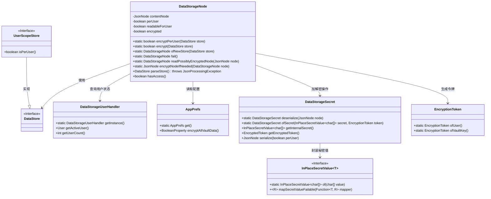

# 基础信息

|      |      |
|------|------|
| 名称 | DataStorageNode |
| 编码语言 | .java |
| 代码路径 | xpipe/app/src/main/java/io/xpipe/app/storage/DataStorageNode.java |
| 包名 | io.xpipe.app.storage |
| 依赖项 | ['io.xpipe.app.ext.UserScopeStore', 'io.xpipe.app.issue.ErrorEvent', 'io.xpipe.app.prefs.AppPrefs', 'io.xpipe.app.util.EncryptionToken', 'io.xpipe.core.store.DataStore', 'io.xpipe.core.util.InPlaceSecretValue', 'io.xpipe.core.util.JacksonMapper', 'com.fasterxml.jackson.core.JsonFactory', 'com.fasterxml.jackson.core.JsonGenerator', 'com.fasterxml.jackson.core.JsonProcessingException', 'com.fasterxml.jackson.core.util.DefaultPrettyPrinter', 'com.fasterxml.jackson.databind.JsonNode', 'com.fasterxml.jackson.databind.node.JsonNodeFactory', 'lombok.Value', 'java.io.CharArrayReader', 'java.io.CharArrayWriter', 'java.io.IOException'] |
| 概述说明 | DataStorageNode类处理数据存储节点的加密、解密和访问控制逻辑。 |

# 说明

DataStorageNode类提供数据存储节点的加密、解析和访问控制功能。包含两个静态加密判断方法：encryptPerUser检查用户级加密条件，encrypt检查全局加密或用户级加密。ofNewStore创建新存储节点，fail返回失败节点。readPossiblyEncryptedNode读取可能加密的节点并处理解密逻辑。encryptNodeIfNeeded按需加密节点内容。parseStore将节点解析为DataStore对象。hasAccess控制节点访问权限。类成员包括内容节点、用户级标识、可读性和加密状态。

# 类列表 Class Summary

| 名称   | 类型  | 说明 |
|-------|------|-------------|
| DataStorageNode | class | DataStorageNode类处理数据存储加密与访问控制逻辑。 |

## 类 DataStorageNode

|      |      |
|------|------|
| 访问范围 | @Value;public |
| 类型 | class |
| 名称 | DataStorageNode |
| 说明 | DataStorageNode类处理数据存储加密与访问控制逻辑。 |

### UML类图

这段代码展示了一个数据存储节点(DataStorageNode)的核心逻辑，它负责处理数据的加密、解密和访问控制。类图显示了它与数据存储接口(DataStore)、用户范围存储(UserScopeStore)、用户处理器(DataStorageUserHandler)、应用偏好设置(AppPrefs)以及加密组件(DataStorageSecret/EncryptionToken)的交互关系。主要功能包括根据用户权限和配置决定是否加密数据，处理加密节点的读写，以及验证用户访问权限。加密逻辑支持按用户单独加密和全局加密两种模式，通过令牌系统实现细粒度访问控制。

### 内部方法调用关系图

```mermaid
graph TD
    A["类DataStorageNode"]
    B["静态方法: encryptPerUser(DataStore store)"]
    C["静态方法: encrypt(DataStore store)"]
    D["静态方法: ofNewStore(DataStore store)"]
    E["静态方法: fail()"]
    F["静态方法: readPossiblyEncryptedNode(JsonNode node)"]
    G["静态方法: encryptNodeIfNeeded(DataStorageNode node)"]
    H["实例方法: parseStore()"]
    I["实例方法: hasAccess()"]
    J["属性: JsonNode contentNode"]
    K["属性: boolean perUser"]
    L["属性: boolean readableForUser"]
    M["属性: boolean encrypted"]

    A --> B
    A --> C
    A --> D
    A --> E
    A --> F
    A --> G
    A --> H
    A --> I
    A --> J
    A --> K
    A --> L
    A --> M

    B --> B1["检查ActiveUser存在"]
    B --> B2["检查UserScopeStore"]
    B --> B3["检查AppPrefs设置"]
    B --> B4["返回加密决策"]

    C --> C1["检查AppPrefs全局加密"]
    C --> C2["检查ActiveUser存在"]
    C --> C3["检查UserScopeStore"]
    C --> C4["返回加密决策"]

    F --> F1["检查节点有效性"]
    F --> F2["处理DataStorageSecret"]
    F --> F3["解密处理"]
    F --> F4["错误处理"]
    F --> F5["返回新节点实例"]

    G --> G1["检查加密状态"]
    G --> G2["JSON序列化"]
    G --> G3["加密处理"]
    G --> G4["错误处理"]
```

该流程图展示了DataStorageNode类的完整结构，包含4个静态工具方法和2个实例方法的核心逻辑路径。静态方法主要处理数据存储的加密决策、节点读取和加密转换，实例方法负责数据解析和访问控制。加密逻辑涉及多层条件判断，包括用户范围检查、全局偏好设置验证和异常处理流程。读取加密节点时包含完整的解密处理链和错误恢复机制，体现了安全数据存储的核心设计思想。

### 字段列表 Field List

| 名称  | 类型  | 说明 |
|-------|-------|------|
| contentNode | JsonNode | JsonNode内容节点对象 |
| readableForUser | boolean | 用户可读布尔值 |
| encrypted | boolean | 布尔型加密标识 |
| perUser | boolean | 布尔变量perUser |

### 方法列表 Method List

| 名称  | 类型  | 说明 |
|-------|-------|------|
| encrypt | boolean | 检查条件决定是否加密数据：应用偏好设置、活跃用户及存储类型。 |
| fail | DataStorageNode | 静态方法返回失败状态的存储节点，属性全为false。 |
| ofNewStore | DataStorageNode | 创建新数据存储节点，包含序列化、加密及用户加密标记。 |
| readPossiblyEncryptedNode | DataStorageNode | 读取可能加密的节点，处理解密逻辑，返回存储节点或失败。 |
| encryptPerUser | boolean | 检查用户数据存储加密条件：用户激活、存储类型及偏好设置。 |
| encryptNodeIfNeeded | JsonNode | 检查节点加密状态，未加密返回内容，加密则序列化并处理异常。 |
| parseStore | DataStore | 解析存储数据，若内容为空返回null，否则转为DataStore对象。 |
| hasAccess | boolean | 检查用户是否有访问权限，条件满足时返回真。 |

