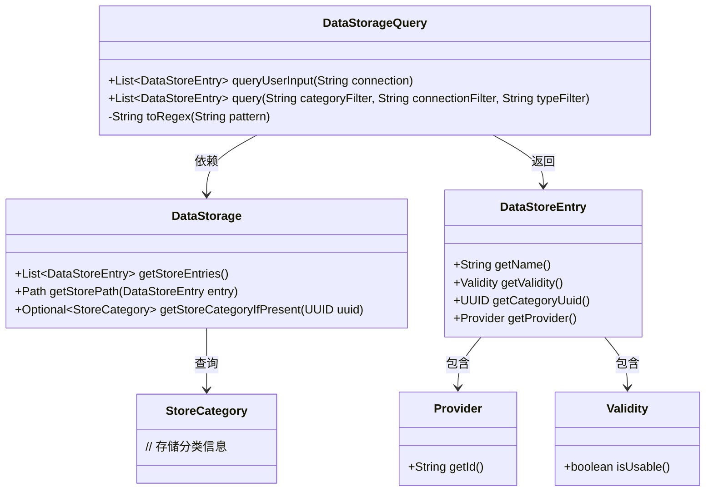
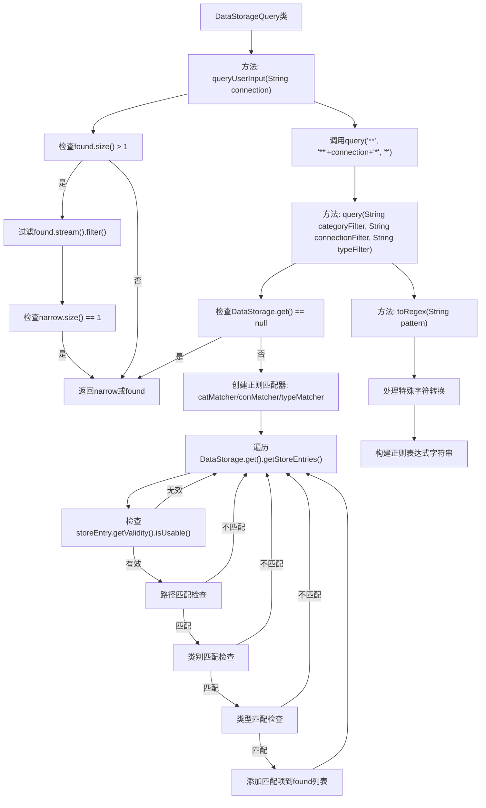

# 基础信息

|      |      |
|------|------|
| 名称 | DataStorageQuery |
| 编码语言 | .java |
| 代码路径 | xpipe/app/src/main/java/io/xpipe/app/storage/DataStorageQuery.java |
| 包名 | io.xpipe.app.storage |
| 依赖项 | ['java.util.ArrayList', 'java.util.List', 'java.util.regex.Pattern'] |
| 概述说明 | 数据存储查询类，含模糊匹配和正则转换功能。 |

# 说明

该代码定义了一个数据存储查询类，包含两个主要方法。queryUserInput方法通过调用query方法查询用户输入，若结果多于一条则尝试精确匹配名称。query方法根据类别、连接和类型过滤器，使用正则表达式匹配存储条目，返回符合条件的可用条目列表。toRegex方法将通配符模式转换为正则表达式，处理各种特殊字符和转义情况。整个过程涉及路径匹配、类别验证和类型检查。

# 类列表 Class Summary

| 名称   | 类型  | 说明 |
|-------|------|-------------|
| DataStorageQuery | class | 数据存储查询类，含模糊查询和精确匹配功能，支持正则表达式转换。 |

## 类 DataStorageQuery

|      |      |
|------|------|
| 访问范围 | public |
| 类型 | class |
| 名称 | DataStorageQuery |
| 说明 | 数据存储查询类，含模糊查询和精确匹配功能，支持正则表达式转换。 |

### UML类图

类图描述：该图展示了数据存储查询系统的核心结构。DataStorageQuery类提供两个主要方法：queryUserInput()和query()，前者简化用户输入查询，后者执行多条件过滤查询。查询过程依赖DataStorage类获取存储条目(DataStoreEntry)，每个条目包含Provider和Validity信息，并通过StoreCategory进行分类。toRegex()方法处理通配符转正则表达式的逻辑。

### 内部方法调用关系图

这段代码实现了一个数据存储查询系统，主要包含三个核心方法：queryUserInput处理用户输入查询并优化结果，query执行实际的数据存储查询操作，toRegex将通配符模式转换为正则表达式。流程图展示了从用户输入到结果返回的完整处理流程，包括输入验证、多重过滤条件检查、正则表达式转换等关键步骤，最终返回符合条件的数据存储条目列表。

### 字段列表 Field List

| 名称  | 类型  | 说明 |
|-------|-------|------|

### 方法列表 Method List

| 名称  | 类型  | 说明 |
|-------|-------|------|
| query | List<DataStoreEntry> | 查询数据存储条目，按类别、连接和类型过滤，返回有效匹配项。 |
| queryUserInput | List<DataStoreEntry> | 查询用户输入数据，若匹配多个则精确筛选同名项，否则返回全部结果。 |
| toRegex | String | 将字符串模式转换为正则表达式，处理特殊字符和转义。 |

