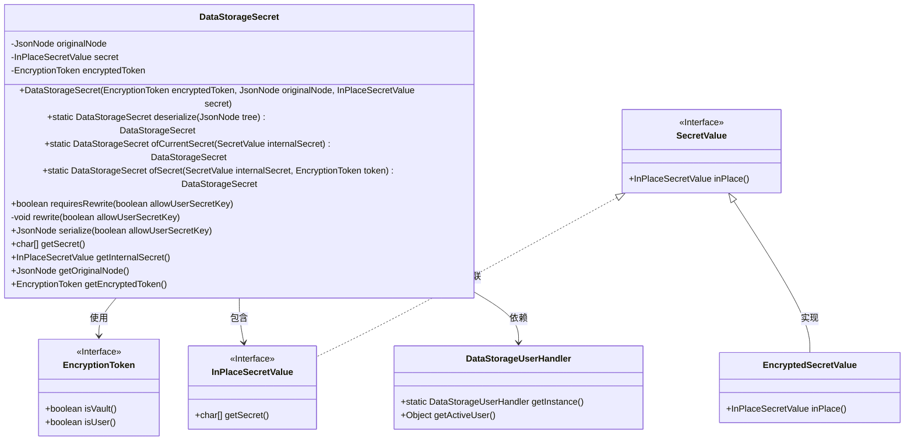
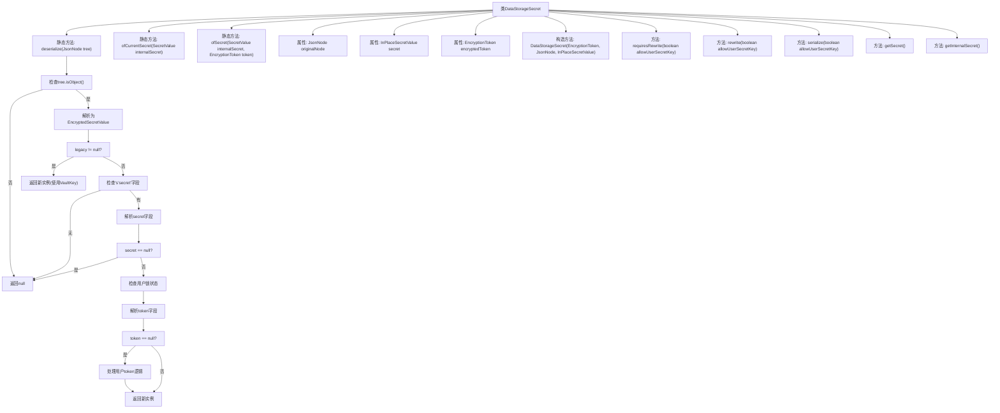
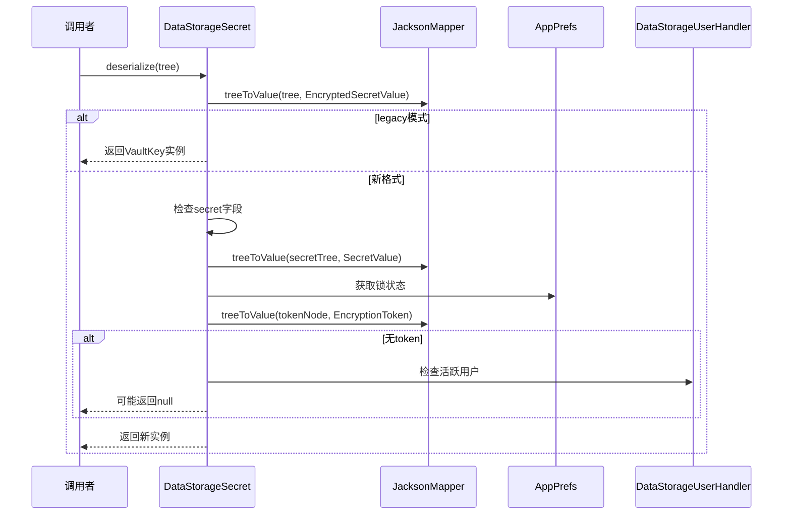

# 基础信息

|      |      |
|------|------|
| 名称 | DataStorageSecret |
| 编码语言 | .java |
| 代码路径 | xpipe/app/src/main/java/io/xpipe/app/storage/DataStorageSecret.java |
| 包名 | io.xpipe.app.storage |
| 依赖项 | ['io.xpipe.app.prefs.AppPrefs', 'io.xpipe.app.util.EncryptionToken', 'io.xpipe.app.util.PasswordLockSecretValue', 'io.xpipe.app.util.VaultKeySecretValue', 'io.xpipe.core.util.EncryptedSecretValue', 'io.xpipe.core.util.InPlaceSecretValue', 'io.xpipe.core.util.JacksonMapper', 'io.xpipe.core.util.SecretValue', 'com.fasterxml.jackson.databind.JsonNode', 'com.fasterxml.jackson.databind.node.JsonNodeFactory', 'com.fasterxml.jackson.databind.node.ObjectNode', 'lombok.EqualsAndHashCode', 'lombok.Getter', 'lombok.ToString', 'java.io.IOException'] |
| 概述说明 | DataStorageSecret类处理加密数据存储，支持序列化和反序列化，管理用户和保险库密钥的转换。 |

# 说明

DataStorageSecret类用于处理加密数据存储，包含反序列化、序列化和密钥管理功能。主要方法包括从JSON节点反序列化数据、创建当前用户或指定令牌的密钥实例、检查是否需要重写密钥以及序列化为JSON节点。类成员包括原始JSON节点、加密令牌和秘密值。支持用户密钥和保险库密钥两种加密方式，能根据用户状态动态切换密钥类型。序列化时会检查密钥有效性，必要时重新加密数据。

# 类列表 Class Summary

| 名称   | 类型  | 说明 |
|-------|------|-------------|
| DataStorageSecret | class | DataStorageSecret类处理加密数据存储，支持用户和保险库密钥，提供序列化和反序列化功能。 |

## 类 DataStorageSecret

|      |      |
|------|------|
| 访问范围 | @EqualsAndHashCode;@ToString;public |
| 类型 | class |
| 名称 | DataStorageSecret |
| 说明 | DataStorageSecret类处理加密数据存储，支持用户和保险库密钥，提供序列化和反序列化功能。 |

### UML类图

类图描述：该图展示了DataStorageSecret类的核心结构及其关联关系。DataStorageSecret通过组合方式持有EncryptionToken和InPlaceSecretValue，并依赖DataStorageUserHandler进行用户状态判断。类中包含静态工厂方法(deserialize/ofCurrentSecret/ofSecret)用于对象创建，以及序列化(serialize)、密钥重写(rewrite)等核心方法。加密令牌(EncryptionToken)和密钥值(SecretValue/InPlaceSecretValue)通过接口实现多态，支持不同的加密策略和密钥存储方式。

### 内部方法调用关系图

流程图描述了DataStorageSecret类的完整结构，包含3个静态工厂方法、5个成员方法和3个核心属性。关键方法deserialize()包含完整的JSON解析逻辑，会处理传统格式和新格式两种情况，涉及加密令牌处理和用户状态验证。时序图展示了deserialize()方法的两种执行路径：当输入是传统加密格式时直接返回VaultKey实例；当输入是新格式时，会逐步验证secret字段、解析加密令牌，并最终返回包含解密数据的实例。整个设计体现了对数据安全性和向后兼容性的考虑。

### 字段列表 Field List

| 名称  | 类型  | 说明 |
|-------|-------|------|
| originalNode | JsonNode | 私有JsonNode类型变量originalNode，带Getter注解。 |
| secret | InPlaceSecretValue | 私有不可变密钥值 |
| encryptedToken | EncryptionToken | 私有加密令牌的Getter方法。 |

### 方法列表 Method List

| 名称  | 类型  | 说明 |
|-------|-------|------|
| rewrite | void | 方法根据条件重写数据：若允许用户密钥且用户活跃，使用密码锁密钥；否则使用保管库密钥。 |
| serialize | JsonNode | 序列化方法：检查密钥，保留原输出或重新加密后返回JSON。 |
| ofSecret | DataStorageSecret | 创建DataStorageSecret对象，使用token和internalSecret参数。 |
| ofCurrentSecret | DataStorageSecret | 静态方法创建数据存储密钥，根据活跃用户选择加密方式。 |
| deserialize | DataStorageSecret | 解析JSON树为DataStorageSecret对象，处理旧版数据、加密令牌及用户锁检查。 |
| requiresRewrite | boolean | 检查密钥类型变化，用户状态变更时需重写密钥。 |
| getSecret | char[] | 获取secret数组，非空返回其值，否则返回空数组。 |
| getInternalSecret | InPlaceSecretValue | 获取内部秘密值的方法。 |

