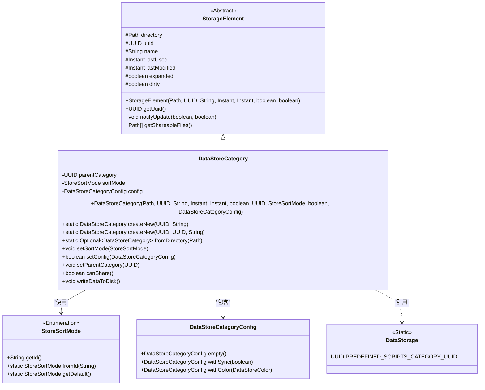

# 基础信息

|      |      |
|------|------|
| 名称 | DataStoreCategory |
| 编码语言 | .java |
| 代码路径 | xpipe/app/src/main/java/io/xpipe/app/storage/DataStoreCategory.java |
| 包名 | io.xpipe.app.storage |
| 依赖项 | ['io.xpipe.app.comp.store.StoreSortMode', 'io.xpipe.core.util.JacksonMapper', 'com.fasterxml.jackson.core.JsonProcessingException', 'com.fasterxml.jackson.databind.JsonNode', 'com.fasterxml.jackson.databind.ObjectMapper', 'com.fasterxml.jackson.databind.node.JsonNodeFactory', 'com.fasterxml.jackson.databind.node.ObjectNode', 'lombok.EqualsAndHashCode', 'lombok.NonNull', 'lombok.Value', 'lombok.experimental.NonFinal', 'org.apache.commons.io.FileUtils', 'java.nio.file.Files', 'java.nio.file.Path', 'java.time.Instant', 'java.util.Optional', 'java.util.UUID'] |
| 概述说明 | DataStoreCategory类，继承StorageElement，管理数据存储分类，含父分类UUID、排序模式和配置，支持创建、读取和写入磁盘操作。 |

# 说明

DataStoreCategory类继承StorageElement，表示数据存储类别。包含父类别UUID、排序模式和配置信息。提供构造方法初始化目录、UUID、名称、时间戳等属性。支持创建新实例的静态方法，支持从目录读取JSON数据解析为对象实例。提供设置排序模式、配置和父类别的更新方法，变更时触发通知。可检查是否允许共享，返回可共享文件路径。实现将数据写入磁盘的功能，包括序列化对象为JSON并保存到文件。维护最后使用和修改时间戳，处理脏状态标记。

# 类列表 Class Summary

| 名称   | 类型  | 说明 |
|-------|------|-------------|
| DataStoreCategory | class | 数据存储分类类，继承StorageElement，含父分类ID、排序模式和配置，支持创建、读取和写入磁盘操作。 |

## 类 DataStoreCategory

|      |      |
|------|------|
| 访问范围 | @EqualsAndHashCode(callSuper = true);@Value;public |
| 类型 | class |
| 名称 | DataStoreCategory |
| 说明 | 数据存储分类类，继承StorageElement，含父分类ID、排序模式和配置，支持创建、读取和写入磁盘操作。 |

### UML类图

这段代码描述了一个数据存储分类系统，其中`DataStoreCategory`继承自抽象类`StorageElement`，用于管理分类目录的元数据和配置。该类包含父分类ID、排序模式和配置信息，提供创建、读取、更新分类的方法，并能将数据持久化到磁盘。通过`StoreSortMode`枚举管理排序方式，`DataStoreCategoryConfig`存储分类配置，并与`DataStorage`交互实现共享功能。整体设计体现了清晰的层次结构和职责分离。

### 内部方法调用关系图

```mermaid
graph TD
    A["类DataStoreCategory"]
    B["继承自: StorageElement"]
    C["属性: UUID parentCategory"]
    D["属性: StoreSortMode sortMode"]
    E["属性: DataStoreCategoryConfig config"]
    F["构造方法: DataStoreCategory(Path,UUID,String,Instant,Instant,boolean,UUID,StoreSortMode,boolean,DataStoreCategoryConfig)"]
    G["静态方法: createNew(parentCategory,name)"]
    H["静态方法: createNew(parentCategory,uuid,name)"]
    I["静态方法: fromDirectory(dir)"]
    J["方法: setSortMode(sortMode)"]
    K["方法: setConfig(config)"]
    L["方法: setParentCategory(parentCategory)"]
    M["方法: canShare()"]
    N["方法: getShareableFiles()"]
    O["方法: writeDataToDisk()"]

    A --> B
    A --> C
    A --> D
    A --> E
    A --> F
    A --> G
    A --> H
    A --> I
    A --> J
    A --> K
    A --> L
    A --> M
    A --> N
    A --> O
```

这段代码定义了一个DataStoreCategory类，用于管理数据存储分类。该类继承自StorageElement，包含分类的父级UUID、排序模式和配置信息。主要功能包括创建新分类、从目录加载分类、修改分类属性以及将分类数据写入磁盘。类提供了多个静态工厂方法创建实例，并实现了配置变更通知机制。关键操作包括设置排序模式、更新配置、修改父分类以及数据持久化到文件系统。

### 字段列表 Field List

| 名称  | 类型  | 说明 |
|-------|-------|------|
| config | DataStoreCategoryConfig | 非最终数据存储类别配置对象 |
| parentCategory | UUID | 非终态父类UUID |
| sortMode | StoreSortMode | 非final的StoreSortMode类型变量sortMode |

### 方法列表 Method List

| 名称  | 类型  | 说明 |
|-------|-------|------|
| setSortMode | void | 设置排序模式，若变更则通知更新。 |
| setParentCategory | void | 设置父类目ID并触发更新通知。 |
| fromDirectory | Optional<DataStoreCategory> | 静态方法从目录读取数据存储类别信息，返回Optional对象。检查category.json和state.json文件，解析UUID、名称、排序模式等配置项，处理异常并设置默认值。 |
| createNew | DataStoreCategory | 创建新数据存储分类，含父类ID、UUID、名称等参数。 |
| createNew | DataStoreCategory | 创建新数据存储类别，含父类ID、名称等参数，返回新实例。 |
| setConfig | boolean | 检查配置变更，更新后通知并返回状态。 |
| canShare | boolean | 检查父类非空且非预定义脚本类别时允许共享。 |
| getShareableFiles | Path[] | 重写getShareableFiles方法，返回包含category.json的路径数组。 |
| writeDataToDisk | void | 方法将脏数据写入磁盘，包含UUID、名称、状态和配置信息，生成JSON文件。 |

