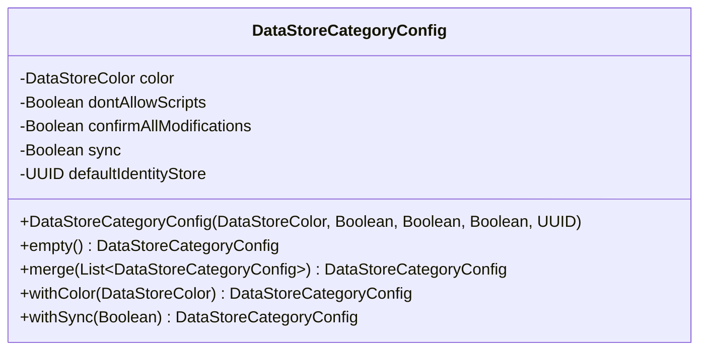
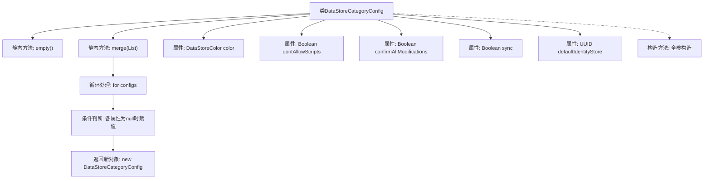

# 基础信息

|      |      |
|------|------|
| 名称 | DataStoreCategoryConfig |
| 编码语言 | .java |
| 代码路径 | xpipe/app/src/main/java/io/xpipe/app/storage/DataStoreCategoryConfig.java |
| 包名 | io.xpipe.app.storage |
| 依赖项 | ['lombok.AllArgsConstructor', 'lombok.Builder', 'lombok.Value', 'lombok.With', 'lombok.extern.jackson.Jacksonized', 'java.util.List', 'java.util.UUID'] |
| 概述说明 | 数据存储配置类，含合并方法及空实例创建。 |

# 说明

该代码定义了一个名为DataStoreCategoryConfig的类，用于存储数据存储类别的配置信息。类中包含五个字段：颜色配置、是否禁用脚本、是否警告所有修改、是否同步以及默认身份存储的UUID。提供了两个静态方法：empty()返回一个所有字段为null的空实例；merge()方法合并多个配置实例，优先取非null值。类使用了Lombok注解简化代码，包括构建器模式、Jackson序列化支持和全参构造函数。

# 类列表 Class Summary

| 名称   | 类型  | 说明 |
|-------|------|-------------|
| DataStoreCategoryConfig | class | 数据存储配置类，含合并方法及空实例创建。 |

## 类 DataStoreCategoryConfig

|      |      |
|------|------|
| 访问范围 | @Value;@Builder;@Jacksonized;@AllArgsConstructor;public |
| 类型 | class |
| 名称 | DataStoreCategoryConfig |
| 说明 | 数据存储配置类，含合并方法及空实例创建。 |

### UML类图

类图描述：  
DataStoreCategoryConfig 是一个配置类，使用Lombok注解实现建造者模式、全参构造器和JSON序列化功能。包含五个字段：颜色配置、脚本禁用标志、修改确认标志、同步标志和默认身份存储UUID。提供两个静态方法：empty()创建空配置，merge()合并多个配置列表（优先取非空值）。通过@With注解生成不可变对象的修改方法，体现了函数式编程思想。

### 内部方法调用关系图

这段代码展示了一个使用Lombok注解的配置类，包含两个核心静态方法和五个属性。流程图清晰呈现了类结构关系，其中merge方法通过倒序遍历配置列表，智能合并非空属性值，empty方法提供空配置实例。特别值得注意的是with注解支持的颜色和同步属性的不可变修改，以及合并逻辑中"最后有效值优先"的设计策略。

### 字段列表 Field List

| 名称  | 类型  | 说明 |
|-------|-------|------|
| dontAllowScripts | Boolean | 禁止脚本执行 |
| color | DataStoreColor | 定义颜色变量color。 |
| sync | Boolean | 带同步布尔参数 |
| defaultIdentityStore | UUID | 声明UUID类型的defaultIdentityStore变量 |
| confirmAllModifications | Boolean | 确认所有修改的布尔变量。 |

### 方法列表 Method List

| 名称  | 类型  | 说明 |
|-------|-------|------|
| empty | DataStoreCategoryConfig | 创建空配置的静态方法，返回无参构造的DataStoreCategoryConfig实例。 |
| merge | DataStoreCategoryConfig | 合并多个DataStoreCategoryConfig对象，优先取非空值。 |

