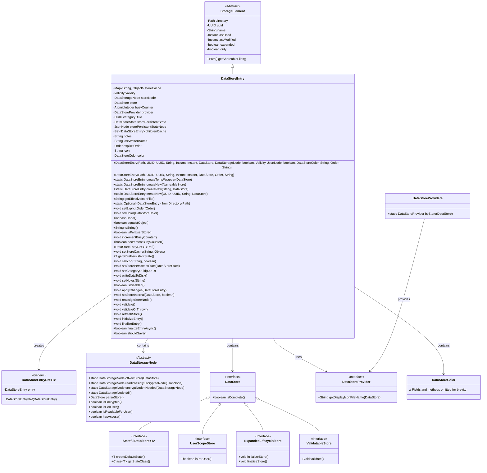
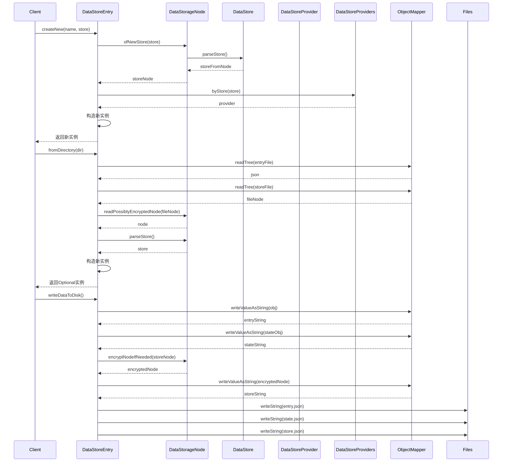

# 基础信息

|      |      |
|------|------|
| 名称 | DataStoreEntry |
| 编码语言 | .java |
| 代码路径 | xpipe/app/src/main/java/io/xpipe/app/storage/DataStoreEntry.java |
| 包名 | io.xpipe.app.storage |
| 依赖项 | ['io.xpipe.app.ext.DataStoreProvider', 'io.xpipe.app.ext.DataStoreProviders', 'io.xpipe.app.ext.NameableStore', 'io.xpipe.app.ext.UserScopeStore', 'io.xpipe.app.issue.ErrorEvent', 'io.xpipe.app.util.ThreadHelper', 'io.xpipe.core.store', 'io.xpipe.core.util.JacksonMapper', 'com.fasterxml.jackson.annotation.JsonProperty', 'com.fasterxml.jackson.core.JacksonException', 'com.fasterxml.jackson.core.JsonProcessingException', 'com.fasterxml.jackson.databind.JsonNode', 'com.fasterxml.jackson.databind.ObjectMapper', 'com.fasterxml.jackson.databind.node.JsonNodeFactory', 'com.fasterxml.jackson.databind.node.ObjectNode', None, 'lombok.experimental.NonFinal', 'org.apache.commons.io.FileUtils', 'java.nio.file.Files', 'java.nio.file.Path', 'java.time.Instant', 'java.util', 'java.util.concurrent.atomic.AtomicInteger', 'java.util.stream.Stream'] |
| 概述说明 | DataStoreEntry类，用于存储数据，包含缓存、状态、子项等属性，支持创建、读写和验证操作。 |

# 说明

DataStoreEntry类是一个存储元素，用于管理数据存储条目。它包含多个属性，如存储缓存、有效性状态、存储节点、存储提供者、类别UUID、持久状态、笔记、图标和颜色等。类提供了创建新条目、从目录加载条目、写入数据到磁盘、验证条目等方法。支持多线程操作，具有状态管理和生命周期控制功能。条目可以标记为禁用、不完整或完整，并支持排序和图标自定义。类还处理笔记的加密存储和共享文件管理。

# 类列表 Class Summary

| 名称   | 类型  | 说明 |
|-------|------|-------------|
| DataStoreEntry | class | DataStoreEntry类用于存储数据，包含缓存、状态、子节点等属性，支持创建、读写和验证操作。 |

## 类 DataStoreEntry

|      |      |
|------|------|
| 访问范围 | @Value;public |
| 类型 | class |
| 名称 | DataStoreEntry |
| 说明 | DataStoreEntry类用于存储数据，包含缓存、状态、子节点等属性，支持创建、读写和验证操作。 |

### UML类图

这段代码定义了一个复杂的数据存储系统，核心是`DataStoreEntry`类，它继承自`StorageElement`并管理着数据存储的完整生命周期。该类包含多个状态字段（如validity、storePersistentState）、缓存机制（storeCache、childrenCache）和并发控制（busyCounter）。它与多种接口交互，包括数据存储节点(DataStorageNode)、不同类型的存储接口(DataStore及其子接口)和提供者模式(DataStoreProvider)。系统支持加密存储、用户范围隔离、生命周期管理和验证功能，并通过原子操作保证线程安全。

### 内部方法调用关系图

这段代码定义了一个DataStoreEntry类，用于管理数据存储条目，包含丰富的属性和方法用于处理存储状态、验证、持久化等操作。流程图展示了类的完整结构，包括20多个属性和30多个方法，以及两个内部枚举类型。时序图则重点展示了三个核心操作：创建新条目、从目录加载条目和写入数据到磁盘的过程，体现了与DataStorageNode、DataStore等组件的交互关系。该类设计复杂，提供了完整的数据存储生命周期管理能力。

### 字段列表 Field List

| 名称  | 类型  | 说明 |
|-------|-------|------|
| lastWrittenNotes | String | 非最终字符串变量lastWrittenNotes。 |
| provider | DataStoreProvider | 非final的DataStoreProvider成员变量，使用@Getter注解生成get方法。 |
| validity | Validity | 非终态有效性对象 |
| storeNode | DataStorageNode | 非终态存储节点设置器 |
| storeCache = Collections.synchronizedMap(new HashMap<>()) | Map<String, Object> | 创建线程安全的HashMap存储缓存。 |
| icon | String | 非终态字符串变量icon |
| storePersistentStateNode | JsonNode | 非终态持久化状态节点 |
| childrenCache = null | Set<DataStoreEntry> | 非final的childrenCache集合，可空且含setter方法。 |
| notes | String | 非终态字符串备注 |
| explicitOrder | Order | 非终态订单显式排序 |
| storePersistentState | DataStoreState | 非最终持久化存储状态变量。 |
| store | DataStore | 使用@Getter生成非final的DataStore成员变量store的getter方法。 |
| categoryUuid | UUID | 非终态分类UUID |
| color | DataStoreColor | 非final的color字段，带Getter注解。 |
| busyCounter = new AtomicInteger() | AtomicInteger | 原子计数器初始化 |

### 方法列表 Method List

| 名称  | 类型  | 说明 |
|-------|-------|------|
| validateOrThrow | void | 验证存储对象，非空且可验证时执行检查并更新计数器。 |
| setNotes | void | 方法设置新注释，若值改变则通知更新。 |
| setStoreInternal | void | 方法设置数据存储，检查权限后更新存储、节点、提供者，可选更新时间，标记为脏并通知更新。 |
| applyChanges | void | 方法applyChanges更新DataStoreEntry属性，包括名称、节点、存储、有效性、提供者、缓存等，并通知更新。 |
| setIcon | void | 方法设置图标，非强制时已有图标则跳过；图标变更时通知更新。 |
| setColor | void | 设置颜色并通知更新（若颜色改变）。 |
| getEffectiveIconFile | String | 方法返回有效图标文件路径，优先失效图标，其次提供者默认图标，最后指定SVG图标。 |
| isPerUserStore | boolean | 检查存储是否为用户级存储，忽略异常。 |
| equals | boolean | 重写equals方法，比较对象UUID是否相同。 |
| validate | void | 验证方法：捕获异常并处理错误事件。 |
| incrementBusyCounter | void | 方法增加计数器，若值为1则通知更新。 |
| writeDataToDisk | void | 方法将脏数据写入磁盘，包括UUID、名称、类别、颜色、图标、状态和存储信息，处理笔记加密并清理旧文件。 |
| createNew | DataStoreEntry | 创建新数据存储条目，使用随机UUID、选定分类ID和存储名称。 |
| toString | String | 重写toString方法，返回getName()结果。 |
| setExplicitOrder | void | 设置显式订单并检查变更，若变更则通知更新。 |
| getStorePersistentState | T | 获取存储持久状态，若不存在则创建默认状态并转换。 |
| setStorePersistentState | void | 设置存储持久状态，值变化时通知更新。 |
| fromDirectory | Optional<DataStoreEntry> | 静态方法从目录读取数据存储条目，处理JSON和MD文件，返回Optional封装条目或空。 |
| setCategoryUuid | void | 设置分类UUID，变更时通知更新。 |
| ref | DataStoreEntryRef<T> | 创建泛型方法ref，返回DataStoreEntryRef实例，引用当前对象。 |
| createNew | DataStoreEntry | 创建新数据存储条目，含UUID、名称、有效性检查及时间戳。 |
| setStoreCache | void | 方法：缓存键值，值不同时通知更新。 |
| hashCode | int | 重写hashCode方法，返回UUID的哈希值。 |
| isDisabled | boolean | 检查有效性是否为加载失败。 |
| reassignStoreNode | void | 方法重新分配存储节点并标记为脏数据。 |
| getShareableFiles | Path[] | 重写方法返回共享文件路径数组，包含notes.md（若存在）及store.json、entry.json。 |
| createTempWrapper | DataStoreEntry | 创建临时数据存储条目，包含随机UUID和时间戳。 |
| decrementBusyCounter | boolean | 方法递减计数器，若为零则通知更新并返回结果。 |
| createNew | DataStoreEntry | 创建新数据存储条目，使用随机UUID和选定分类UUID。 |
| refreshStore | void | 刷新存储：检查有效性，解析新存储，处理异常，更新状态并通知变更。 |
| initializeEntry | void | 初始化存储项，处理生命周期，异常捕获并更新状态。 |
| finalizeEntry | void | 方法finalizeEntry处理存储生命周期：若为ExpandedLifecycleStore类型，先增加计数器并通知更新，再调用finalizeStore，异常时处理错误，最后减少计数器并再次通知更新。 |
| finalizeEntryAsync | boolean | 异步完成条目操作，支持扩展生命周期存储则返回真。 |
| shouldSave | boolean | 检查存储是否存在，存在则返回真。 |

