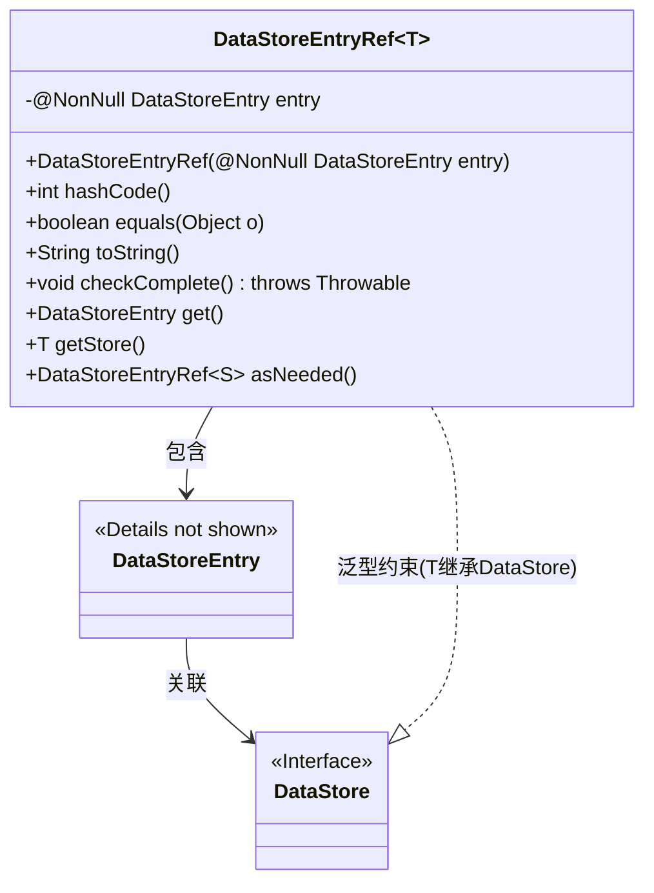
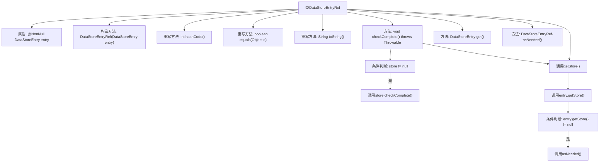

# 基础信息

|      |      |
|------|------|
| 名称 | DataStoreEntryRef |
| 编码语言 | .java |
| 代码路径 | xpipe/app/src/main/java/io/xpipe/app/storage/DataStoreEntryRef.java |
| 包名 | io.xpipe.app.storage |
| 依赖项 | ['io.xpipe.core.store.DataStore', 'lombok.NonNull', 'java.util.Objects'] |
| 概述说明 | DataStoreEntryRef类封装DataStoreEntry，提供UUID比较、存储检查和类型转换功能。 |

# 说明

DataStoreEntryRef是一个泛型类，用于引用DataStoreEntry对象，要求泛型参数T必须继承自DataStore。该类包含一个非空的DataStoreEntry成员变量，通过构造函数初始化。重写了hashCode、equals和toString方法，基于entry的UUID进行比较和字符串表示。提供了checkComplete方法检查存储是否完整，get方法获取entry对象，getStore方法获取关联的存储实例并转换为所需类型。asNeeded方法支持类型安全地转换为其他DataStore子类型的引用。

# 类列表 Class Summary

| 名称   | 类型  | 说明 |
|-------|------|-------------|
| DataStoreEntryRef | class | DataStoreEntryRef类封装DataStoreEntry，提供哈希、相等性检查及存储访问功能。 |

## 类 DataStoreEntryRef

|      |      |
|------|------|
| 访问范围 | public |
| 类型 | class |
| 名称 | DataStoreEntryRef |
| 说明 | DataStoreEntryRef类封装DataStoreEntry，提供哈希、相等性检查及存储访问功能。 |

### UML类图

这段代码定义了一个泛型类`DataStoreEntryRef<T>`，其中T必须继承自`DataStore`接口。该类封装了一个`DataStoreEntry`对象，提供了访问、比较和类型转换等方法。核心功能包括通过UUID比较对象相等性、检查存储完整性、获取存储条目和转换类型。类图展示了它与`DataStoreEntry`的包含关系，以及通过泛型与`DataStore`接口的约束关系，体现了类型安全的存储引用设计模式。

### 内部方法调用关系图

该流程图展示了DataStoreEntryRef泛型类的完整结构，包含核心属性和方法调用关系。重点描述了checkComplete()和getStore()方法的内部逻辑流程，其中checkComplete()会先获取store对象并进行非空校验，getStore()则通过entry.getStore()获取存储实例并可能调用asNeeded()转换。所有方法都围绕核心属性entry展开操作，体现了UUID比对、空值安全检查和类型转换等关键处理逻辑。

### 字段列表 Field List

| 名称  | 类型  | 说明 |
|-------|-------|------|
| entry | DataStoreEntry | 非空私有最终数据存储条目entry |

### 方法列表 Method List

| 名称  | 类型  | 说明 |
|-------|-------|------|
| toString | String | 重写toString方法，返回entry的UUID字符串。 |
| equals | boolean | 重写equals方法，检查对象类型和UUID是否相同。 |
| hashCode | int | 重写hashCode方法，返回entry的UUID哈希值。 |
| get | DataStoreEntry | 获取数据存储条目。 |
| getStore | T | 获取存储对象，非空时返回所需值，否则返回空。 |
| checkComplete | void | 检查存储完整性，非空时调用检查方法。 |
| asNeeded | DataStoreEntryRef<S> | 方法`asNeeded`将当前对象强制转换为泛型类型`DataStoreEntryRef<S>`并返回。 |

