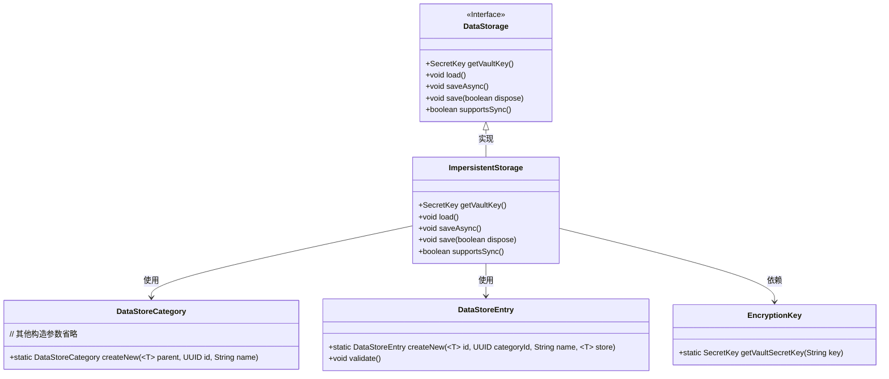
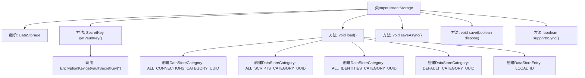

# 基础信息

|      |      |
|------|------|
| 名称 | ImpersistentStorage |
| 编码语言 | .java |
| 代码路径 | xpipe/app/src/main/java/io/xpipe/app/storage/ImpersistentStorage.java |
| 包名 | io.xpipe.app.storage |
| 依赖项 | ['io.xpipe.app.comp.store.StoreSortMode', 'io.xpipe.app.ext.LocalStore', 'io.xpipe.app.util.EncryptionKey', 'java.time.Instant', 'javax.crypto.SecretKey'] |
| 概述说明 | 非持久存储类，初始化默认分类和本地条目，不支持同步保存。 |

# 说明

该代码定义了一个名为ImpersistentStorage的类，继承自DataStorage。它重写了多个方法：getVaultKey返回加密密钥，load方法初始化四个默认数据存储类别（所有连接、所有脚本、所有身份和默认类别），并创建一个本地机器存储条目。saveAsync和save方法为空实现，supportsSync返回false表示不支持同步操作。

# 类列表 Class Summary

| 名称   | 类型  | 说明 |
|-------|------|-------------|
| ImpersistentStorage | class | 非持久存储类，初始化默认类别和本地条目，不支持同步保存。 |

## 类 ImpersistentStorage

|      |      |
|------|------|
| 访问范围 | public |
| 类型 | class |
| 名称 | ImpersistentStorage |
| 说明 | 非持久存储类，初始化默认类别和本地条目，不支持同步保存。 |

### UML类图

这段类图展示了ImpersistentStorage类实现了DataStorage接口，并依赖于DataStoreCategory、DataStoreEntry和EncryptionKey等类。ImpersistentStorage是一个非持久化存储实现，主要功能包括加载默认数据存储结构（如分类和条目）、获取加密密钥，以及提供空实现的保存方法。该类在加载时会创建四个默认分类（所有连接、所有脚本、所有身份和默认分类）和一个本地机器条目，但不支持同步操作。

### 内部方法调用关系图

这段代码展示了一个名为ImpersistentStorage的类，它继承自DataStorage类。主要功能包括：通过getVaultKey方法获取加密密钥，在load方法中初始化四个不同类别的数据存储项（包括连接、脚本、身份和默认类别）以及一个本地存储条目，并提供了空的异步/同步保存方法实现。该类明确表示不支持同步操作（supportsSync返回false），整体设计用于临时性数据存储场景。

### 字段列表 Field List

| 名称  | 类型  | 说明 |
|-------|-------|------|

### 方法列表 Method List

| 名称  | 类型  | 说明 |
|-------|-------|------|
| saveAsync | void | 异步保存方法重写 |
| load | void | 加载数据存储类别和条目，包括连接、脚本、身份和默认类别，并验证本地机器条目。 |
| getVaultKey | SecretKey | 重写方法，返回空字符串生成的密钥。 |
| save | void | 同步方法save，参数dispose控制是否释放资源。 |
| supportsSync | boolean | 方法声明不支持同步操作。 |

