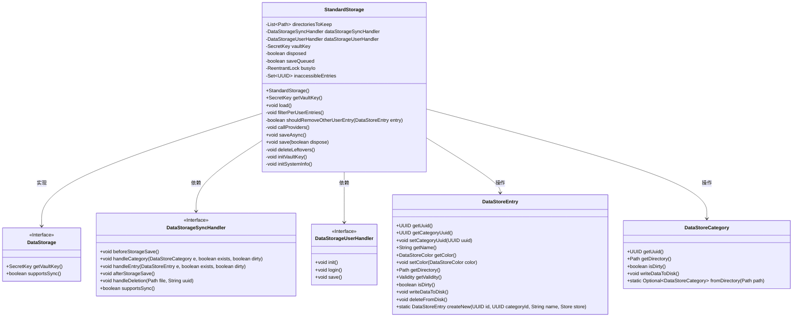

# 基础信息

|      |      |
|------|------|
| 名称 | StandardStorage |
| 编码语言 | .java |
| 代码路径 | xpipe/app/src/main/java/io/xpipe/app/storage/StandardStorage.java |
| 包名 | io.xpipe.app.storage |
| 依赖项 | ['io.xpipe.app.ext.DataStorageExtensionProvider', 'io.xpipe.app.ext.LocalStore', 'io.xpipe.app.issue.ErrorEvent', 'io.xpipe.app.issue.TrackEvent', 'io.xpipe.app.prefs.AppPrefs', 'io.xpipe.app.util.EncryptionKey', 'io.xpipe.app.util.ThreadHelper', 'io.xpipe.core.process.OsType', 'lombok.Getter', 'org.apache.commons.io.FileUtils', 'java.io.IOException', 'java.nio.charset.StandardCharsets', 'java.nio.file.Files', 'java.nio.file.Path', 'java.util', 'java.util.concurrent.TimeUnit', 'java.util.concurrent.atomic.AtomicReference', 'java.util.concurrent.locks.ReentrantLock', 'java.util.stream.Collectors', 'java.util.stream.Stream', 'javax.crypto.SecretKey'] |
| 概述说明 | StandardStorage类扩展DataStorage，管理数据存储、同步和用户处理，包含加载、保存和清理功能。 |

# 说明

StandardStorage类继承自DataStorage，用于管理数据存储的核心功能。它包含两个处理器：DataStorageSyncHandler和DataStorageUserHandler，分别处理同步和用户相关操作。类中维护了目录列表、密钥、状态标志及锁机制。主要方法包括load()用于初始化存储目录、加载系统信息和密钥、处理用户数据；save()用于保存数据到磁盘，支持异步和同步操作；deleteLeftovers()清理无效目录。还包含错误处理、数据验证、权限过滤等功能，确保数据完整性和安全性。通过ReentrantLock避免并发冲突，支持多线程操作。

# 类列表 Class Summary

| 名称   | 类型  | 说明 |
|-------|------|-------------|
| StandardStorage | class | StandardStorage类继承DataStorage，管理数据存储目录、密钥、用户权限及同步操作，包含加载、保存和清理功能。 |

## 类 StandardStorage

|      |      |
|------|------|
| 访问范围 | public |
| 类型 | class |
| 名称 | StandardStorage |
| 说明 | StandardStorage类继承DataStorage，管理数据存储目录、密钥、用户权限及同步操作，包含加载、保存和清理功能。 |

### UML类图

这段类图展示了StandardStorage类及其相关组件的关系。StandardStorage实现了DataStorage接口，负责数据存储的核心功能，包括加载、保存、同步和用户权限管理。它依赖于DataStorageSyncHandler和DataStorageUserHandler两个接口来处理同步和用户相关操作，同时操作DataStoreEntry和DataStoreCategory来管理具体的数据条目和分类。整个设计采用了清晰的职责分离，通过接口抽象实现松耦合，并包含完善的错误处理和并发控制机制。

### 内部方法调用关系图

这段代码展示了一个名为StandardStorage的类，它继承自DataStorage类，主要用于数据存储和管理。该类包含多个属性和方法，用于处理数据加载、保存、同步和清理等操作。流程图清晰地展示了类的结构，包括属性、构造方法和主要方法之间的关系。其中，load()方法是核心功能，负责初始化存储、加载数据和处理异常；save()方法用于数据持久化；filterPerUserEntries()和deleteLeftovers()方法则用于数据清理和维护。整个设计体现了对数据安全和完整性的高度关注，通过锁机制和异常处理确保操作的原子性和可靠性。

### 字段列表 Field List

| 名称  | 类型  | 说明 |
|-------|-------|------|
| dataStorageUserHandler | DataStorageUserHandler | 私有终态数据存储用户处理器。 |
| inaccessibleEntries = new HashSet<>() | Set<UUID> | 私有不可访问条目集合，存储UUID类型数据。 |
| vaultKey | SecretKey | 私有密钥变量vaultKey |
| dataStorageSyncHandler | DataStorageSyncHandler | 私有终态数据存储同步处理器 |
| directoriesToKeep = new ArrayList<>() | List<Path> | 私有列表变量，存储需保留的目录路径。 |
| saveQueued | boolean | 私有布尔变量，标记是否保存队列。 |
| busyIo = new ReentrantLock() | ReentrantLock | 私有可重入锁busyIo用于控制IO操作并发。 |
| disposed | boolean | 私有布尔变量disposed的Getter方法。 |

### 方法列表 Method List

| 名称  | 类型  | 说明 |
|-------|-------|------|
| save | void | 保存操作处理数据存储，包括目录创建、数据写入和异常处理，确保线程安全和异步保存。 |
| supportsSync | boolean | 重写方法，检查数据存储是否支持同步。 |
| deleteLeftovers | void | 删除stores和categories目录中无效UUID命名的遗留文件夹。 |
| shouldRemoveOtherUserEntry | boolean | 检查数据条目是否无访问权限或无父节点，决定是否移除。 |
| getVaultKey | SecretKey | 重写方法返回vaultKey密钥。 |
| callProviders | void | 调用所有数据存储扩展提供商的初始化方法，捕获并处理异常。 |
| load | void | 加载存储库，处理目录、用户、密钥和错误，初始化数据并刷新条目。 |
| saveAsync | void | 异步保存方法：若忙则标记待保存，否则启动异步保存线程。 |
| filterPerUserEntries | void | 过滤用户无关条目并更新保留目录和不可访问列表。 |
| initVaultKey | void | 初始化保险箱密钥：检查文件存在则读取解密，否则生成新UUID并加密存储。 |
| initSystemInfo | void | 检查系统信息文件，若存在且与当前系统不符则警告，否则创建或更新文件。 |

