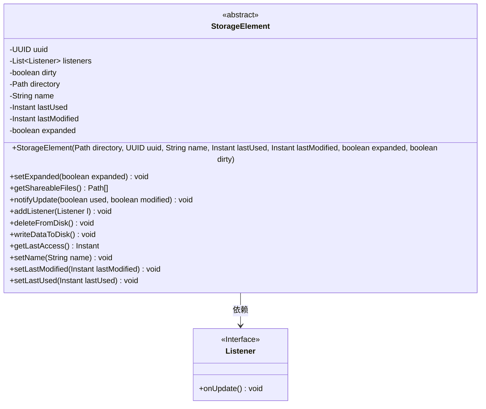

# 基础信息

|      |      |
|------|------|
| 名称 | StorageElement |
| 编码语言 | .java |
| 代码路径 | xpipe/app/src/main/java/io/xpipe/app/storage/StorageElement.java |
| 包名 | io.xpipe.app.storage |
| 依赖项 | ['lombok.Getter', 'lombok.Setter', 'lombok.experimental.NonFinal', 'org.apache.commons.io.FileUtils', 'java.io.IOException', 'java.nio.file.Path', 'java.time.Instant', 'java.util.ArrayList', 'java.util.List', 'java.util.UUID'] |
| 概述说明 | 抽象类StorageElement，含UUID、监听器、状态标记等属性，提供文件操作和更新通知功能。 |

# 说明

该抽象类StorageElement定义了存储元素的基础结构，包含UUID、目录路径、名称、最后使用时间、最后修改时间等属性。通过监听器机制通知状态更新，支持设置扩展状态、名称、时间标记等操作，并确保数据同步。提供抽象方法获取可共享文件路径及写入磁盘功能，包含删除磁盘数据的方法。最后访问时间由最后使用或修改时间决定，属性变更时会触发监听器回调。

# 类列表 Class Summary

| 名称   | 类型  | 说明 |
|-------|------|-------------|
| StorageElement | class | 抽象类StorageElement，含UUID、监听器、状态标记等属性，提供文件操作和更新通知功能。 |

## 类 StorageElement

|      |      |
|------|------|
| 访问范围 | public abstract |
| 类型 | class |
| 名称 | StorageElement |
| 说明 | 抽象类StorageElement，含UUID、监听器、状态标记等属性，提供文件操作和更新通知功能。 |

### UML类图

这段代码展示了一个抽象类`StorageElement`及其内部接口`Listener`的设计。`StorageElement`作为存储元素的基础类，封装了UUID、目录路径、名称、最后使用/修改时间等核心属性，并提供了文件操作、状态通知等抽象方法。通过`Listener`接口实现观察者模式，允许外部监听存储元素的更新事件。类中使用了同步控制来保证线程安全，并通过条件判断优化不必要的状态更新通知。整体设计体现了存储管理系统的核心功能，支持扩展和自定义存储行为。

### 内部方法调用关系图

```mermaid
graph TD
    A["抽象类StorageElement"]
    B["属性: UUID uuid"]
    C["属性: List<Listener> listeners"]
    D["属性: boolean dirty"]
    E["属性: Path directory"]
    F["属性: String name"]
    G["属性: Instant lastUsed"]
    H["属性: Instant lastModified"]
    I["属性: boolean expanded"]
    J["构造方法: StorageElement(Path,UUID,String,Instant,Instant,boolean,boolean)"]
    K["方法: setExpanded(boolean)"]
    L["抽象方法: getShareableFiles()"]
    M["方法: notifyUpdate(boolean,boolean)"]
    N["方法: addListener(Listener)"]
    O["方法: deleteFromDisk()"]
    P["抽象方法: writeDataToDisk()"]
    Q["方法: getLastAccess()"]
    R["方法: setName(String)"]
    S["方法: setLastModified(Instant)"]
    T["方法: setLastUsed(Instant)"]
    U["接口: Listener"]
    V["方法: onUpdate()"]

    A --> B
    A --> C
    A --> D
    A --> E
    A --> F
    A --> G
    A --> H
    A --> I
    A --> J
    A --> K
    A --> L
    A --> M
    A --> N
    A --> O
    A --> P
    A --> Q
    A --> R
    A --> S
    A --> T
    A --> U
    U --> V
    K -->|"changed=true时"| M
    R -->|"name变更时"| M
    S -->|"lastModified变更时"| M
    T -->|"lastUsed变更时"| M
    M -->|"同步块"| C
    M -->|"遍历listeners"| V
    N -->|"同步块"| C
```

这段代码描述了一个抽象类StorageElement，用于管理存储元素的基本属性和行为。类包含UUID、监听器列表、脏标记、目录路径等核心属性，提供了构造方法初始化这些属性。关键方法包括设置扩展状态(setExpanded)、通知更新(notifyUpdate)、添加监听器(addListener)、删除磁盘数据(deleteFromDisk)等，其中notifyUpdate方法会同步通知所有监听器。类还定义了Listener接口用于回调通知。流程图清晰展示了属性、方法间的调用关系，特别是状态变更时如何触发监听器通知的流程。

### 字段列表 Field List

| 名称  | 类型  | 说明 |
|-------|-------|------|
| uuid | UUID | 受保护的UUID只读字段 |
| lastUsed | Instant | Getter方法返回受保护的lastUsed时间戳。 |
| name | String | Getter方法保护的字符串属性name。 |
| lastModified | Instant | 获取最后修改时间的保护字段。 |
| directory | Path | 使用Lombok注解自动生成目录路径的getter和setter方法。 |
| dirty | boolean | 声明受保护的布尔类型脏标记变量。 |
| listeners = new ArrayList<>() | List<Listener> | 保护性监听器列表初始化。 |
| expanded | boolean | 非final保护布尔变量expanded，带Getter方法。 |

### 方法列表 Method List

| 名称  | 类型  | 说明 |
|-------|-------|------|
| writeDataToDisk | void | 抽象方法：写入磁盘数据，可能抛出异常。 |
| deleteFromDisk | void | 删除磁盘目录及其内容。 |
| setExpanded | void | 设置展开状态，若状态改变则通知更新。 |
| addListener | void | 同步添加监听器到列表。 |
| getShareableFiles | Path[] | 获取可共享文件路径的抽象方法。 |
| getLastAccess | Instant | 同步方法返回最后访问时间，优先取最后使用时间，若无则取最后修改时间。 |
| setName | void | 方法设置名称，不同时更新并通知。 |
| notifyUpdate | void | 方法notifyUpdate更新使用和修改时间，标记脏数据并通知监听器。 |
| setLastModified | void | 方法设置最后修改时间，若时间未变则返回，否则更新并通知。 |
| setLastUsed | void | 设置最后使用时间，若不同则更新并通知。 |

