# 基础信息

|      |      |
|------|------|
| 名称 | storage |
| 编码语言 | .java |
| 代码路径 | xpipe/app/src/main/java/io/xpipe/app/storage |
| 包名 | xpipe.app.src.main.java.io.xpipe.app.storage |
| 概述说明 | 数据存储相关Java类集合，包含查询、加密、同步、引用等功能模块，管理存储条目、类别及路径处理。 |

# 说明

```markdown
## 概述
该代码模块是一个数据存储管理系统，提供数据存储、查询、加密、同步和访问控制等核心功能。模块采用分层设计，包含抽象基类、具体实现类和辅助工具类，支持多种存储场景（如持久化/非持久化存储、用户级加密、远程同步等）。主要特点包括：
1. 支持多类型数据存储（连接、脚本、身份等）和分类管理
2. 提供完整的加密体系（用户密钥/保险库密钥）
3. 实现文件路径上下文处理和引用机制
4. 包含监听器模式的状态变更通知
5. 支持多线程操作和并发控制

## 主要业务场景
1. **数据存储管理**
   - 通过`DataStorage`抽象类及其子类(`StandardStorage`,`ImpersistentStorage`)实现存储目录管理
   - 使用`DataStoreEntry`和`DataStoreCategory`管理具体存储条目和分类
   - 通过`StorageElement`基类提供通用存储元素属性管理

2. **加密数据访问**
   - `DataStorageSecret`处理密钥管理和数据加解密
   - `DataStorageNode`实现加密节点解析和访问控制
   - 支持用户级加密(`encryptPerUser`)和全局加密

3. **查询与引用**
   - `DataStorageQuery`提供基于正则的存储条目查询
   - `DataStoreEntryRef`实现类型安全的存储条目引用
   - `ContextualFileReference`处理上下文相关的文件路径解析

4. **状态同步与通知**
   - `DataStorageSyncHandler`处理存储同步逻辑
   - `StorageListener`实现状态变更监听
   - `DataStateProviderImpl`管理持久化状态和缓存

5. **配置管理**
   - `DataStoreCategoryConfig`存储分类配置信息
   - `DataStoreColor`和`DataStoreEntryUserScope`提供辅助配置功能
```


### 包内部结构视图

```mermaid
graph TD
    storage --> StorageListener.java
    storage --> DataStorageQuery.java
    storage --> ContextualFileReference.java
    storage --> ImpersistentStorage.java
    storage --> DataStorageSecret.java
    storage --> DataStorageSyncHandler.java
    storage --> DataStoreEntryRef.java
    storage --> StandardStorage.java
    storage --> StorageElement.java
    storage --> DataStorageNode.java
    storage --> DataStoreCategory.java
    storage --> DataStorage.java
    storage --> DataStoreCategoryConfig.java
    storage --> DataStorageUserHandler.java
    storage --> DataStoreEntry.java
    storage --> DataStateProviderImpl.java
    storage --> DataStoreColor.java
    storage --> DataStoreEntryUserScope.java
```



该流程图展示了xpipe项目中storage目录下的文件结构，所有文件均直接隶属于storage目录，没有更深层级的子目录。这些文件主要涉及数据存储相关的功能实现，包括存储监听、查询、引用、同步处理、用户处理等组件，构成了一个完整的数据存储管理系统的基础架构。

# 文件列表 File List

| 名称   | 类型  | 说明 |
|-------|------|-------------|
| [DataStorageSyncHandler.java](DataStorageSyncHandler.md) | file | 请提供需要总结的具体内容，放在`{{}}`中，我会按要求生成简洁描述。 |
| [DataStorageSecret.java](DataStorageSecret.md) | file | DataStorageSecret类处理加密数据存储，支持序列化和反序列化，管理用户和保险库密钥的转换。 |
| [ImpersistentStorage.java](ImpersistentStorage.md) | file | 非持久存储类，初始化默认分类和本地条目，不支持同步保存。 |
| [ContextualFileReference.java](ContextualFileReference.md) | file | ContextualFileReference类处理文件路径，支持数据目录解析和序列化。 |
| [DataStoreColor.java](DataStoreColor.md) | file | 请提供需要总结的具体内容，我会按要求生成简洁描述。 |
| [DataStoreEntry.java](DataStoreEntry.md) | file | DataStoreEntry类，用于存储数据，包含缓存、状态、子项等属性，支持创建、读写和验证操作。 |
| [DataStorageUserHandler.java](DataStorageUserHandler.md) | file | 输入内容为空，无法生成概要描述。请提供具体信息以便总结。 |
| [DataStoreCategoryConfig.java](DataStoreCategoryConfig.md) | file | 数据存储配置类，含合并方法及空实例创建。 |
| [DataStorage.java](DataStorage.md) | file | 数据存储类，管理连接、脚本和身份的分类与条目操作。 |
| [DataStoreCategory.java](DataStoreCategory.md) | file | DataStoreCategory类，继承StorageElement，管理数据存储分类，含父分类UUID、排序模式和配置，支持创建、读取和写入磁盘操作。 |
| [DataStorageNode.java](DataStorageNode.md) | file | DataStorageNode类处理数据存储节点的加密、解密和访问控制逻辑。 |
| [StorageElement.java](StorageElement.md) | file | 抽象类StorageElement，含UUID、监听器、状态标记等属性，提供文件操作和更新通知功能。 |
| [StandardStorage.java](StandardStorage.md) | file | StandardStorage类扩展DataStorage，管理数据存储、同步和用户处理，包含加载、保存和清理功能。 |
| [DataStoreEntryUserScope.java](DataStoreEntryUserScope.md) | file | 输入为空，无法生成概要描述。 |
| [DataStateProviderImpl.java](DataStateProviderImpl.md) | file | DataStateProviderImpl实现数据存储状态和缓存的读写操作。 |
| [DataStoreEntryRef.java](DataStoreEntryRef.md) | file | DataStoreEntryRef类封装DataStoreEntry，提供UUID比较、存储检查和类型转换功能。 |
| [DataStorageQuery.java](DataStorageQuery.md) | file | 数据存储查询类，含模糊匹配和正则转换功能。 |
| [StorageListener.java](StorageListener.md) | file | 输入内容为空，无法生成概要描述。请提供具体信息以便总结。 |


