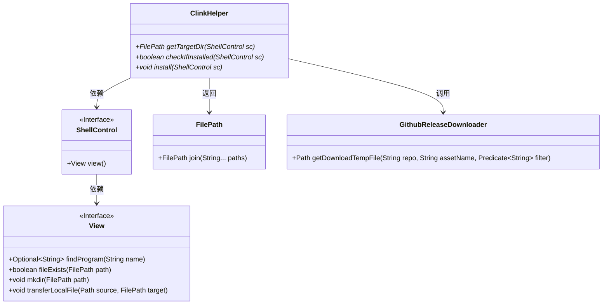
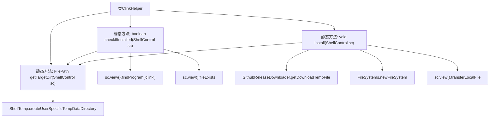

# 基础信息

|      |      |
|------|------|
| 名称 | ClinkHelper |
| 编码语言 | .java |
| 代码路径 | xpipe/app/src/main/java/io/xpipe/app/terminal/ClinkHelper.java |
| 包名 | io.xpipe.app.terminal |
| 依赖项 | ['io.xpipe.app.util.GithubReleaseDownloader', 'io.xpipe.app.util.ShellTemp', 'io.xpipe.core.process.ShellControl', 'io.xpipe.core.store.FilePath', 'java.nio.file.FileSystems'] |
| 概述说明 | ClinkHelper类提供安装检查Clink工具的方法，包括获取目录、检查安装状态及下载安装文件。 |

# 说明

ClinkHelper类提供三个静态方法：getTargetDir创建用户特定临时目录下的clink子目录；checkIfInstalled检查clink是否已安装，通过查找程序或目标目录下的clink_x64.exe；install方法下载chrisant996/clink的zip发布包，解压后将clink_x64.exe、clink.bat和clink_dll_x64.dll复制到目标目录完成安装。所有操作通过ShellControl接口执行。

# 类列表 Class Summary

| 名称   | 类型  | 说明 |
|-------|------|-------------|
| ClinkHelper | class | ClinkHelper类提供安装检查Clink工具的方法，包括获取目录、检查安装状态及下载安装文件。 |

## 类 ClinkHelper

|      |      |
|------|------|
| 访问范围 | public |
| 类型 | class |
| 名称 | ClinkHelper |
| 说明 | ClinkHelper类提供安装检查Clink工具的方法，包括获取目录、检查安装状态及下载安装文件。 |

### UML类图

类图描述：该图展示了ClinkHelper工具类的核心结构，它通过ShellControl接口与系统交互，主要功能包括获取目标目录、检查安装状态和执行安装操作。ShellControl依赖View接口实现文件操作和程序查找功能，FilePath处理路径拼接，GithubReleaseDownloader负责从GitHub下载资源。整个设计体现了清晰的职责分离和模块化思想。

### 内部方法调用关系图

这段代码流程图展示了ClinkHelper类的三个核心方法及其调用关系。getTargetDir方法创建临时目录路径，checkIfInstalled通过查找程序或文件验证安装状态，install方法通过下载GitHub资源并传输文件完成安装。图中清晰呈现了方法间的调用链，特别是install方法内部的多步骤文件操作流程，包括临时文件系统创建和三个关键文件的传输过程。

### 字段列表 Field List

| 名称  | 类型  | 说明 |
|-------|-------|------|

### 方法列表 Method List

| 名称  | 类型  | 说明 |
|-------|-------|------|
| install | void | 静态方法下载clink.zip，解压并复制exe、bat和dll文件到目标目录。 |
| checkIfInstalled | boolean | 检查是否安装clink程序，存在则返回真，否则检查目标目录文件。 |
| getTargetDir | FilePath | 静态方法获取目标目录路径，返回用户临时目录下的bin/clink子目录。 |

