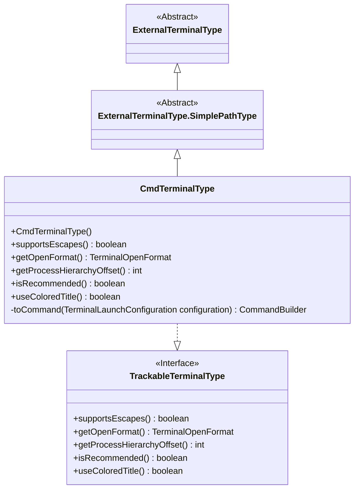
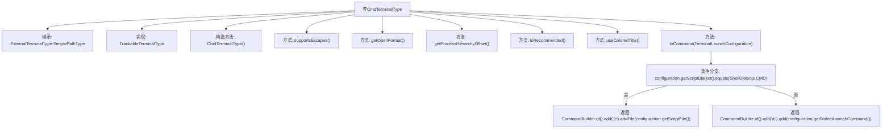

# 基础信息

|      |      |
|------|------|
| 名称 | CmdTerminalType |
| 编码语言 | .java |
| 代码路径 | xpipe/app/src/main/java/io/xpipe/app/terminal/CmdTerminalType.java |
| 包名 | io.xpipe.app.terminal |
| 依赖项 | ['io.xpipe.app.ext.ProcessControlProvider', 'io.xpipe.core.process.CommandBuilder', 'io.xpipe.core.process.ShellDialects'] |
| 概述说明 | CmdTerminalType类扩展ExternalTerminalType，实现cmd终端功能，不支持转义，新建窗口启动，根据脚本类型调整命令。 |

# 说明

该代码定义了一个名为CmdTerminalType的类，继承自ExternalTerminalType.SimplePathType并实现TrackableTerminalType接口。该类表示cmd.exe终端类型，初始化时设置标识符为app.cmd，可执行文件为cmd.exe。它不支持转义字符，采用新窗口打开格式。根据当前Shell方言是否为PowerShell调整进程层级偏移量。该类不被推荐使用，且不使用彩色标题。最后，根据配置的脚本方言生成相应命令：若为CMD则添加/c和脚本文件路径，否则添加/c和方言启动命令。

# 类列表 Class Summary

| 名称   | 类型  | 说明 |
|-------|------|-------------|
| CmdTerminalType | class | CmdTerminalType类扩展ExternalTerminalType，实现cmd终端功能，不支持转义，新建窗口启动，根据脚本类型构建命令。 |

## 类 CmdTerminalType

|      |      |
|------|------|
| 访问范围 | public |
| 类型 | class |
| 名称 | CmdTerminalType |
| 说明 | CmdTerminalType类扩展ExternalTerminalType，实现cmd终端功能，不支持转义，新建窗口启动，根据脚本类型构建命令。 |

### UML类图

这段代码展示了一个继承层次结构，其中CmdTerminalType类继承了ExternalTerminalType.SimplePathType抽象类，并实现了TrackableTerminalType接口。该类主要用于处理命令行终端配置，提供了关于终端特性（如转义支持、窗口打开格式、进程层次偏移等）的具体实现，并能根据不同的脚本方言生成相应的启动命令。代码体现了良好的面向对象设计，通过继承和接口实现来扩展基础功能。

### 内部方法调用关系图

这段代码描述了一个CmdTerminalType类，继承自ExternalTerminalType.SimplePathType并实现TrackableTerminalType接口。主要功能包括构造方法初始化、判断是否支持转义字符、获取终端打开格式、计算进程层级偏移量、推荐状态判断、彩色标题使用控制，以及根据脚本方言生成不同命令构建器的核心逻辑。其中getProcessHierarchyOffset()方法会动态检测当前是否为PowerShell方言，toCommand()方法则根据配置的脚本方言选择不同的命令构建路径。

### 字段列表 Field List

| 名称  | 类型  | 说明 |
|-------|-------|------|

### 方法列表 Method List

| 名称  | 类型  | 说明 |
|-------|-------|------|
| getProcessHierarchyOffset | int | 方法返回进程层次偏移量，PowerShell为0，其他为-1。 |
| supportsEscapes | boolean | Java方法：不支持转义字符。 |
| getOpenFormat | TerminalOpenFormat | 重写方法返回新窗口打开格式。 |
| useColoredTitle | boolean | 重写方法，返回false表示不使用彩色标题。 |
| isRecommended | boolean | 重写方法isRecommended，固定返回false。 |
| toCommand | CommandBuilder | 重写方法生成命令：CMD脚本用文件路径，其他用启动命令。 |

