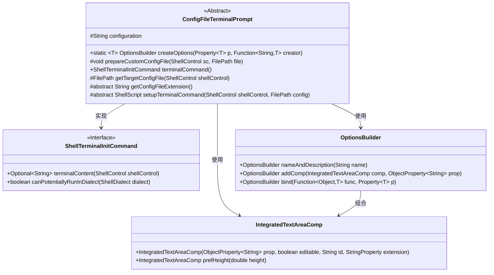
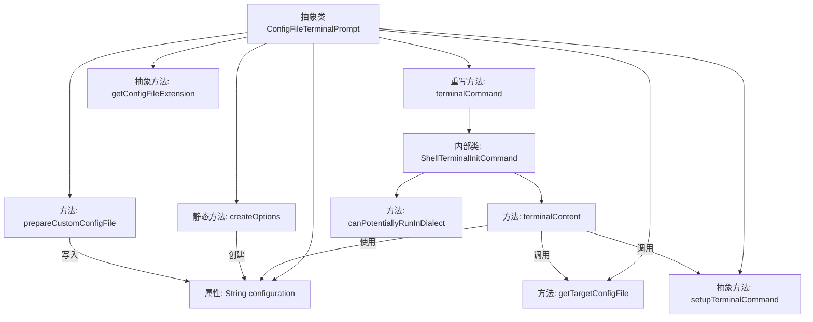

# 基础信息

|      |      |
|------|------|
| 名称 | ConfigFileTerminalPrompt |
| 编码语言 | .java |
| 代码路径 | xpipe/app/src/main/java/io/xpipe/app/terminal/ConfigFileTerminalPrompt.java |
| 包名 | io.xpipe.app.terminal |
| 依赖项 | ['io.xpipe.app.comp.base.IntegratedTextAreaComp', 'io.xpipe.app.util.OptionsBuilder', 'io.xpipe.core.process.ShellControl', 'io.xpipe.core.process.ShellDialect', 'io.xpipe.core.process.ShellScript', 'io.xpipe.core.process.ShellTerminalInitCommand', 'io.xpipe.core.store.FilePath', 'javafx.beans.property.Property', 'javafx.beans.property.SimpleObjectProperty', 'javafx.beans.property.SimpleStringProperty', 'lombok.experimental.SuperBuilder', 'java.util.List', 'java.util.Optional', 'java.util.function.Function'] |
| 概述说明 | 抽象类ConfigFileTerminalPrompt实现终端提示配置，支持自定义配置文件和命令初始化。 |

# 说明

该内容描述了一个抽象类ConfigFileTerminalPrompt，用于处理终端提示配置。类中包含创建配置选项的方法，通过绑定属性生成配置对象。提供了准备自定义配置文件的功能，可将配置内容写入指定文件。实现了终端命令的生成逻辑，包括检查安装、处理配置文件、设置环境变量等。抽象方法要求子类提供配置文件扩展名和终端命令设置的具体实现。整体设计支持不同Shell方言，通过继承扩展特定终端类型的配置处理。

# 类列表 Class Summary

| 名称   | 类型  | 说明 |
|-------|------|-------------|
| ConfigFileTerminalPrompt | class | 抽象类ConfigFileTerminalPrompt实现终端提示配置，支持自定义配置文件和初始化命令。 |

## 类 ConfigFileTerminalPrompt

|      |      |
|------|------|
| 访问范围 | @SuperBuilder;public abstract |
| 类型 | class |
| 名称 | ConfigFileTerminalPrompt |
| 说明 | 抽象类ConfigFileTerminalPrompt实现终端提示配置，支持自定义配置文件和初始化命令。 |

### UML类图

这段代码展示了一个抽象类`ConfigFileTerminalPrompt`及其相关组件，主要用于处理终端提示符的配置文件生成和命令初始化。抽象类通过模板方法模式定义了配置文件的扩展名获取和终端命令设置等抽象方法，具体实现由子类完成。类图中清晰展示了与`ShellTerminalInitCommand`接口的实现关系，以及与`OptionsBuilder`和`IntegratedTextAreaComp`的工具类协作关系，整体设计体现了良好的扩展性和模块化思想。

### 内部方法调用关系图

这段代码流程图展示了ConfigFileTerminalPrompt抽象类的核心结构和调用关系。该类主要负责处理终端提示符的配置文件操作，包含创建配置选项、准备自定义配置文件、生成终端命令等核心功能。通过ShellTerminalInitCommand内部类实现终端初始化逻辑，其中terminalContent方法会协调调用getTargetConfigFile和setupTerminalCommand等方法来生成完整的终端配置命令。整个设计采用模板方法模式，留出getConfigFileExtension和setupTerminalCommand等抽象方法供子类实现特定行为。

### 字段列表 Field List

| 名称  | 类型  | 说明 |
|-------|-------|------|
| configuration | String | 保护字符串配置项 |

### 方法列表 Method List

| 名称  | 类型  | 说明 |
|-------|-------|------|
| getTargetConfigFile | FilePath | 获取目标配置文件路径，返回拼接后的完整路径。 |
| terminalCommand | ShellTerminalInitCommand | 重写ShellTerminalInitCommand，检查安装并配置环境变量，支持特定Shell方言。 |
| prepareCustomConfigFile | void | 将配置写入指定文件。 |
| createOptions | OptionsBuilder | 创建配置选项构建器，集成文本区组件并绑定属性转换逻辑。 |
| getConfigFileExtension | String | 获取配置文件扩展名的抽象方法。 |
| setupTerminalCommand | ShellScript | 抽象方法：通过ShellControl和FilePath配置终端命令，可能抛出异常。 |

