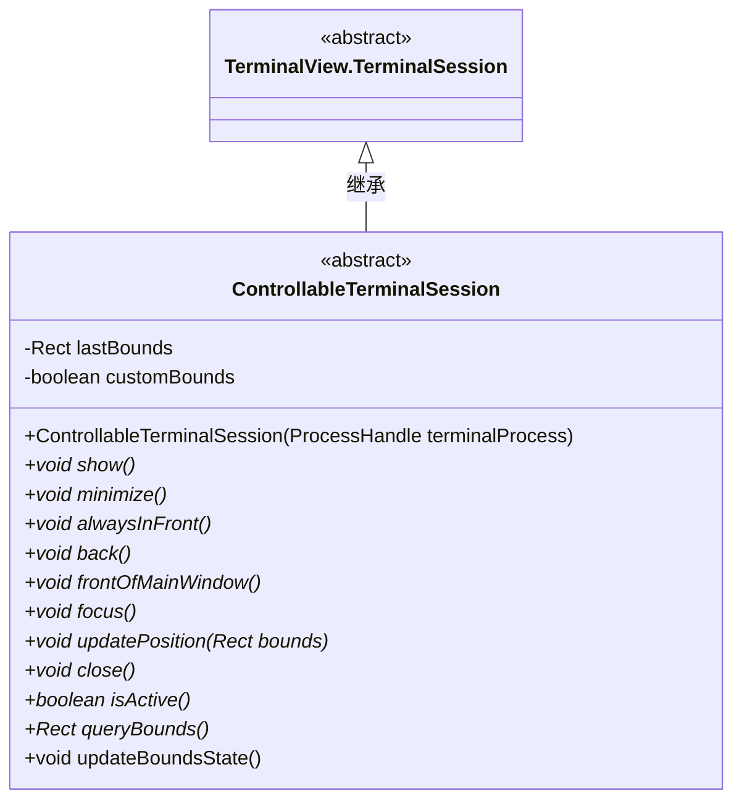
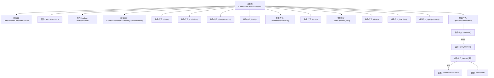

# 基础信息

|      |      |
|------|------|
| 名称 | ControllableTerminalSession |
| 编码语言 | .java |
| 代码路径 | xpipe/app/src/main/java/io/xpipe/app/terminal/ControllableTerminalSession.java |
| 包名 | io.xpipe.app.terminal |
| 依赖项 | ['io.xpipe.app.util.Rect', 'lombok.Getter'] |
| 概述说明 | 抽象类ControllableTerminalSession扩展TerminalSession，提供终端会话控制功能，包括显示、最小化、置顶、关闭等操作，并管理窗口位置状态。 |

# 说明

这是一个名为ControllableTerminalSession的抽象类，继承自TerminalView.TerminalSession。它用于控制终端会话的显示和行为，包含多个抽象方法如显示、最小化、置顶、前后移动、聚焦、更新位置、关闭等。类中维护了上次边界位置lastBounds和自定义边界标志customBounds，并通过updateBoundsState方法更新边界状态。当会话处于活动状态且边界变化时，会标记为自定义边界。

# 类列表 Class Summary

| 名称   | 类型  | 说明 |
|-------|------|-------------|
| ControllableTerminalSession | class | 抽象类ControllableTerminalSession继承TerminalSession，提供终端会话控制方法如显示、最小化、置顶、关闭等，并管理窗口位置状态。 |

## 类 ControllableTerminalSession

|      |      |
|------|------|
| 访问范围 | @Getter;public abstract |
| 类型 | class |
| 名称 | ControllableTerminalSession |
| 说明 | 抽象类ControllableTerminalSession继承TerminalSession，提供终端会话控制方法如显示、最小化、置顶、关闭等，并管理窗口位置状态。 |

### UML类图

这段代码描述了一个抽象类`ControllableTerminalSession`，它继承自`TerminalView.TerminalSession`。该类提供了对终端会话的可控操作接口，包括显示/最小化窗口、置顶/置底、焦点控制、位置更新和关闭等功能。通过`lastBounds`和`customBounds`跟踪窗口边界状态，`updateBoundsState()`方法实现了边界变化的自动检测。所有操作接口均为抽象方法，需要子类具体实现，体现了对终端会话控制的扩展性和多态性支持。

### 内部方法调用关系图

该流程图展示了ControllableTerminalSession抽象类的完整结构，包含12个抽象方法和1个具体方法updateBoundsState()的实现逻辑。updateBoundsState方法首先检查会话是否活跃，然后查询当前边界值，通过比较上次边界值判断是否需要更新customBounds标志位，最后更新lastBounds记录。所有抽象方法都需要子类实现，用于控制终端会话的显示、位置、焦点等行为。

### 字段列表 Field List

| 名称  | 类型  | 说明 |
|-------|-------|------|
| customBounds | boolean | 自定义边界保护布尔值。 |
| lastBounds | Rect | 保护矩形边界变量。 |

### 方法列表 Method List

| 名称  | 类型  | 说明 |
|-------|-------|------|
| focus | void | 抽象方法：focus()，无返回值。 |
| alwaysInFront | void | 抽象方法alwaysInFront，无参数无返回值。 |
| show | void | 抽象方法show()无参数无返回值。 |
| close | void | 抽象方法close，无返回值，无参数。 |
| isActive | boolean | 抽象方法isActive返回布尔值 |
| queryBounds | Rect | 查询边界矩形抽象方法 |
| updateBoundsState | void | 更新边界状态：检查活动状态，查询边界，若与上次不同则标记自定义边界，保存当前边界。 |
| back | void | 抽象方法：后退操作。 |
| minimize | void | 抽象方法：最小化操作 |
| updatePosition | void | 抽象方法：更新位置，参数为矩形边界。 |
| frontOfMainWindow | void | 抽象方法：主窗口前置操作。 |

