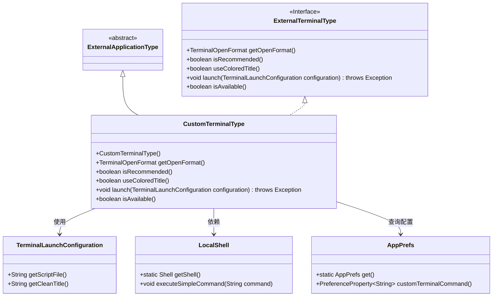
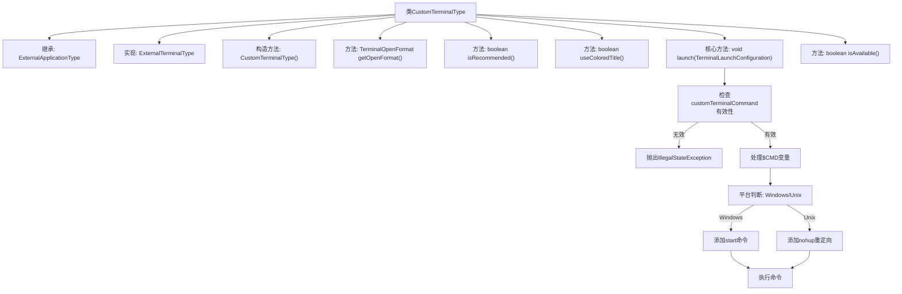

# 基础信息

|      |      |
|------|------|
| 名称 | CustomTerminalType |
| 编码语言 | .java |
| 代码路径 | xpipe/app/src/main/java/io/xpipe/app/terminal/CustomTerminalType.java |
| 包名 | io.xpipe.app.terminal |
| 依赖项 | ['io.xpipe.app.issue.ErrorEvent', 'io.xpipe.app.prefs.AppPrefs', 'io.xpipe.app.prefs.ExternalApplicationHelper', 'io.xpipe.app.prefs.ExternalApplicationType', 'io.xpipe.app.util.LocalShell', 'io.xpipe.core.process.OsType', 'java.util.Locale'] |
| 概述说明 | 自定义终端类，支持新窗口启动、彩色标题，通过配置命令执行脚本。 |

# 说明

这是一个名为CustomTerminalType的类，继承自ExternalApplicationType并实现ExternalTerminalType接口。该类用于自定义终端类型，主要功能包括：设置终端类型标识为"app.custom"；指定在新窗口中打开终端；标记为推荐类型；启用彩色标题显示。其核心方法launch负责执行终端启动逻辑：首先检查用户是否配置了自定义终端命令，未配置则抛出异常；然后处理命令格式，确保包含$CMD变量；最后根据不同操作系统（Windows或非Windows）执行相应格式的命令。该类始终标记为可用状态。

# 类列表 Class Summary

| 名称   | 类型  | 说明 |
|-------|------|-------------|
| CustomTerminalType | class | 自定义终端类，支持新窗口、彩色标题，通过命令启动脚本，跨平台兼容。 |

## 类 CustomTerminalType

|      |      |
|------|------|
| 访问范围 | public |
| 类型 | class |
| 名称 | CustomTerminalType |
| 说明 | 自定义终端类，支持新窗口、彩色标题，通过命令启动脚本，跨平台兼容。 |

### UML类图

这段代码展示了一个自定义终端类型`CustomTerminalType`的实现，它继承自`ExternalApplicationType`并实现了`ExternalTerminalType`接口。主要功能包括获取终端打开格式、检查可用性、执行终端启动命令等。通过`AppPrefs`获取用户配置的自定义命令，使用`LocalShell`执行命令，并处理不同操作系统下的命令格式差异。代码中包含了健壮的错误检查和处理机制，确保在无配置命令时抛出明确异常。

### 内部方法调用关系图

这段代码定义了一个自定义终端类型类，继承ExternalApplicationType并实现ExternalTerminalType接口。核心功能是通过launch方法执行自定义终端命令，包含命令有效性检查、平台适配处理和执行逻辑。流程图展示了从构造方法到各接口方法的实现路径，特别详细描述了launch方法中的命令处理流程，包括Windows和Unix平台的不同处理方式，最终通过LocalShell执行处理后的命令。

### 字段列表 Field List

| 名称  | 类型  | 说明 |
|-------|-------|------|

### 方法列表 Method List

| 名称  | 类型  | 说明 |
|-------|-------|------|
| isAvailable | boolean | 重写isAvailable方法，始终返回true。 |
| getOpenFormat | TerminalOpenFormat | 重写方法返回新窗口打开格式。 |
| isRecommended | boolean | 方法重写，返回推荐状态为真。 |
| launch | void | 重写终端启动方法，检查自定义命令并处理不同系统执行逻辑。 |
| useColoredTitle | boolean | 重写方法，返回真值启用彩色标题。 |

