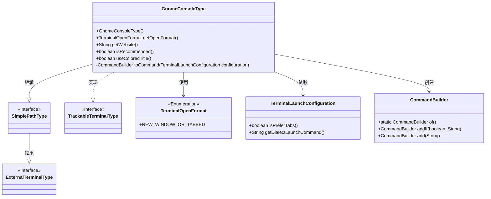
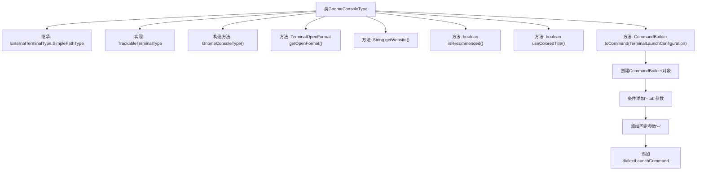

# 基础信息

|      |      |
|------|------|
| 名称 | GnomeConsoleType |
| 编码语言 | .java |
| 代码路径 | xpipe/app/src/main/java/io/xpipe/app/terminal/GnomeConsoleType.java |
| 包名 | io.xpipe.app.terminal |
| 依赖项 | ['io.xpipe.core.process.CommandBuilder'] |
| 概述说明 | GnomeConsoleType类扩展ExternalTerminalType，支持新窗口或标签页，推荐使用彩色标题，通过kgx命令启动。 |

# 说明

GnomeConsoleType是一个继承自ExternalTerminalType.SimplePathType的类，实现了TrackableTerminalType接口。该类通过构造函数初始化终端类型标识符和可执行文件扩展名。它支持在新窗口或标签页中打开终端，并提供了相关网站的URL链接。该类被标记为推荐使用的终端类型，支持彩色标题显示。在生成命令时，会根据配置决定是否添加标签页参数，并附加方言启动命令。

# 类列表 Class Summary

| 名称   | 类型  | 说明 |
|-------|------|-------------|
| GnomeConsoleType | class | GnomeConsoleType类扩展ExternalTerminalType，实现TrackableTerminalType接口，支持新窗口或标签页打开终端，推荐使用彩色标题。 |

## 类 GnomeConsoleType

|      |      |
|------|------|
| 访问范围 | public |
| 类型 | class |
| 名称 | GnomeConsoleType |
| 说明 | GnomeConsoleType类扩展ExternalTerminalType，实现TrackableTerminalType接口，支持新窗口或标签页打开终端，推荐使用彩色标题。 |

### UML类图

这段代码定义了一个GnomeConsoleType类，它继承自ExternalTerminalType.SimplePathType并实现了TrackableTerminalType接口。该类表示GNOME终端应用的配置类型，提供了新建窗口/标签页、获取官网链接、推荐状态等终端特性。核心功能是通过toCommand方法构建终端启动命令，根据配置决定是否使用标签页模式。类图中清晰地展示了继承、实现和依赖关系，包括与枚举类型TerminalOpenFormat、配置类TerminalLaunchConfiguration以及命令构建器CommandBuilder的交互。

### 内部方法调用关系图

这段代码流程图展示了GnomeConsoleType类的结构和主要方法调用关系。该类继承自ExternalTerminalType.SimplePathType并实现TrackableTerminalType接口，包含构造方法和多个重写方法。核心方法toCommand()通过CommandBuilder构建命令，先根据配置决定是否添加'--tab'参数，再添加固定参数'--'和dialectLaunchCommand。所有方法都围绕终端配置和命令构建展开，体现了终端类型的具体实现逻辑。

### 字段列表 Field List

| 名称  | 类型  | 说明 |
|-------|-------|------|

### 方法列表 Method List

| 名称  | 类型  | 说明 |
|-------|-------|------|
| useColoredTitle | boolean | 重写方法，返回真值启用彩色标题。 |
| toCommand | CommandBuilder | 生成终端启动命令，根据配置添加标签选项和方言命令。 |
| isRecommended | boolean | 方法isRecommended始终返回true。 |
| getOpenFormat | TerminalOpenFormat | 重写方法返回终端打开格式为新窗口或标签页。 |
| getWebsite | String | 重写getWebsite方法，返回Gnome应用商店的Console页面链接。 |

