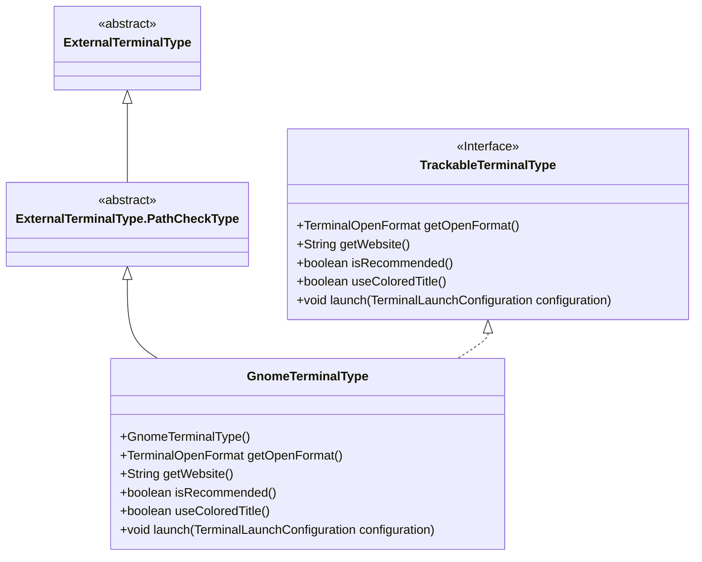
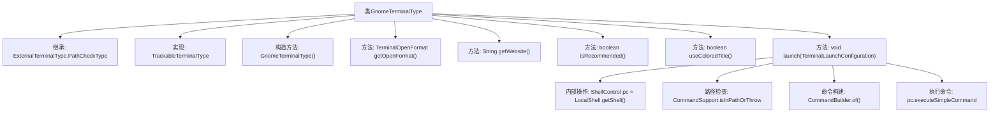

# 基础信息

|      |      |
|------|------|
| 名称 | GnomeTerminalType |
| 编码语言 | .java |
| 代码路径 | xpipe/app/src/main/java/io/xpipe/app/terminal/GnomeTerminalType.java |
| 包名 | io.xpipe.app.terminal |
| 依赖项 | ['io.xpipe.app.util.CommandSupport', 'io.xpipe.app.util.LocalShell', 'io.xpipe.core.process.CommandBuilder', 'io.xpipe.core.process.ShellControl'] |
| 概述说明 | GnomeTerminalType类实现终端类型接口，支持新窗口启动，非推荐终端。 |

# 说明

GnomeTerminalType是一个继承自ExternalTerminalType.PathCheckType的类，实现了TrackableTerminalType接口。它通过构造函数初始化终端类型标识、可执行文件名称及路径检查标志。该类定义了终端打开方式为新建窗口，提供了官方网站链接，并标明不推荐使用且不支持彩色标题。在启动方法中，它通过ShellControl执行命令，包括设置标题、脚本文件路径及环境变量GNOME_TERMINAL_SCREEN以避免已知问题。

# 类列表 Class Summary

| 名称   | 类型  | 说明 |
|-------|------|-------------|
| GnomeTerminalType | class | Gnome终端类，实现启动配置和路径检查，不支持彩色标题。 |

## 类 GnomeTerminalType

|      |      |
|------|------|
| 访问范围 | public |
| 类型 | class |
| 名称 | GnomeTerminalType |
| 说明 | Gnome终端类，实现启动配置和路径检查，不支持彩色标题。 |

### UML类图

这段代码定义了一个GnomeTerminalType类，它继承自ExternalTerminalType.PathCheckType抽象类并实现了TrackableTerminalType接口。该类主要用于处理GNOME终端相关的操作，包括检查路径、获取终端打开格式、获取官网链接、判断是否推荐使用、是否使用彩色标题以及启动终端等功能。其中launch方法实现了具体的终端启动逻辑，包括环境变量设置和命令构建，特别注意处理了GNOME终端的特定bug。整个设计体现了对终端类型的抽象和具体实现，适合作为终端管理系统的组成部分。

### 内部方法调用关系图

这段代码定义了一个GnomeTerminalType类，继承自ExternalTerminalType.PathCheckType并实现TrackableTerminalType接口。主要功能包括获取终端打开格式、网站链接、推荐状态等属性，核心是launch方法实现了GNOME终端的启动逻辑，包含路径检查、命令构建和环境变量设置等步骤，最后通过ShellControl执行构建好的命令。整个类完整封装了GNOME终端的功能配置和启动流程。

### 字段列表 Field List

| 名称  | 类型  | 说明 |
|-------|-------|------|

### 方法列表 Method List

| 名称  | 类型  | 说明 |
|-------|-------|------|
| getWebsite | String | 重写getWebsite方法，返回GNOME终端帮助文档URL。 |
| isRecommended | boolean | 重写方法isRecommended，固定返回false。 |
| useColoredTitle | boolean | 覆盖方法，返回false，禁用彩色标题。 |
| launch | void | 重写终端启动方法，检查路径并执行带参数的GNOME终端命令。 |
| getOpenFormat | TerminalOpenFormat | 重写方法返回新窗口打开格式。 |

