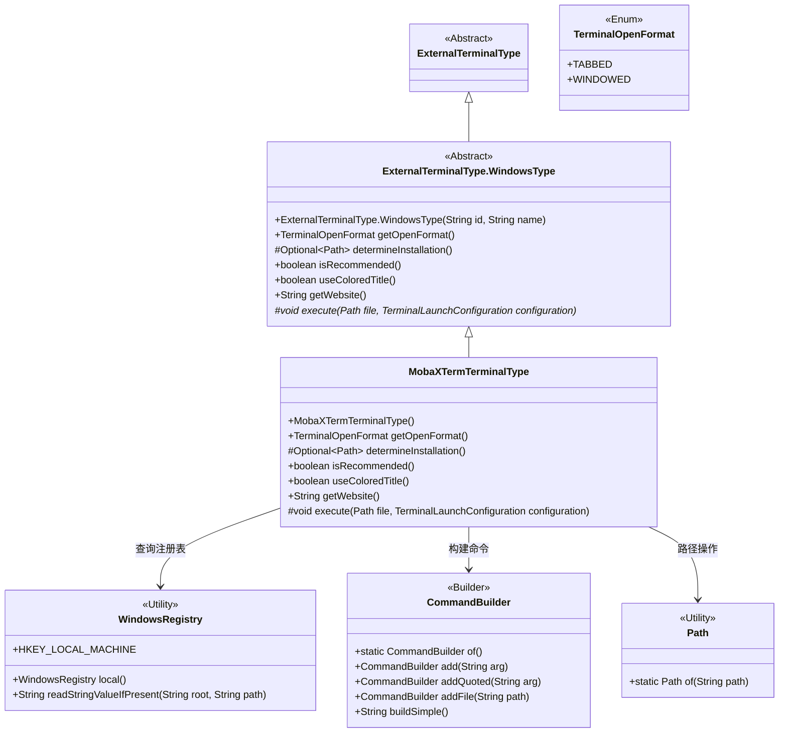
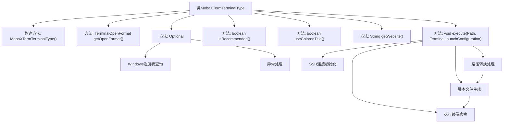

# 基础信息

|      |      |
|------|------|
| 名称 | MobaXTermTerminalType |
| 编码语言 | .java |
| 代码路径 | xpipe/app/src/main/java/io/xpipe/app/terminal/MobaXTermTerminalType.java |
| 包名 | io.xpipe.app.terminal |
| 依赖项 | ['io.xpipe.app.issue.ErrorEvent', 'io.xpipe.app.util', 'io.xpipe.core.process.CommandBuilder', 'java.nio.file.Files', 'java.nio.file.Path', 'java.util.Optional'] |
| 概述说明 | MobaXTerm终端类，支持标签页、彩色标题，通过注册表检测安装，执行SSH命令。 |

# 说明

该代码定义了一个名为MobaXTermTerminalType的类，继承自ExternalTerminalType.WindowsType，用于配置MobaXterm终端的行为。类中设置了终端名称、网站链接，并指定以标签页形式打开。通过Windows注册表检测安装路径，支持彩色标题但不推荐使用。核心功能是通过本地Shell执行SSH连接命令，处理路径转换并生成临时脚本文件，最终在MobaXterm新标签页中启动连接。异常处理会静默记录错误。

# 类列表 Class Summary

| 名称   | 类型  | 说明 |
|-------|------|-------------|
| MobaXTermTerminalType | class | MobaXTerm终端类型类，定义安装检测、执行命令等行为。 |

## 类 MobaXTermTerminalType

|      |      |
|------|------|
| 访问范围 | public |
| 类型 | class |
| 名称 | MobaXTermTerminalType |
| 说明 | MobaXTerm终端类型类，定义安装检测、执行命令等行为。 |

### UML类图

该类图展示了MobaXTermTerminalType继承自ExternalTerminalType.WindowsType的层级关系，及其与辅助类WindowsRegistry、CommandBuilder和Path的交互。MobaXTermTerminalType实现了终端类型的具体逻辑，包括通过Windows注册表检测安装路径、构建SSH连接命令、处理路径转换等核心功能。图中清晰呈现了抽象基类与具体实现类的关系，以及工具类的协作方式，完整反映了代码中终端类型配置和命令执行的完整流程。

### 内部方法调用关系图

该流程图展示了MobaXTermTerminalType类的核心结构和关键方法调用关系。类继承自ExternalTerminalType.WindowsType，主要功能包括终端类型配置、安装路径检测、SSH连接建立和命令执行。重点流程体现在execute方法中，包含SSH本地桥接初始化、路径格式转换、临时脚本生成和最终命令执行等步骤。determineInstallation方法通过Windows注册表查询实现软件安装路径检测，所有操作都包含完善的异常处理机制。

### 字段列表 Field List

| 名称  | 类型  | 说明 |
|-------|-------|------|

### 方法列表 Method List

| 名称  | 类型  | 说明 |
|-------|-------|------|
| isRecommended | boolean | 重写方法isRecommended，固定返回false。 |
| determineInstallation | Optional<Path> | 检查Windows注册表获取MobaXterm安装路径，失败返回空。 |
| getOpenFormat | TerminalOpenFormat | 重写方法返回TABBED格式。 |
| useColoredTitle | boolean | 重写方法，返回true启用彩色标题。 |
| getWebsite | String | 重写getWebsite方法，返回MobaXterm官网URL。 |
| execute | void | 方法通过SSH本地桥接执行命令，处理路径转换并生成脚本，最终在新标签页运行。 |

